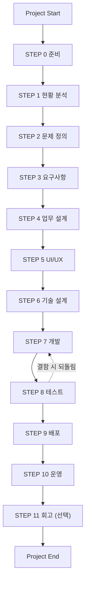

# AI Working Framework — 시작하기 (1-Page Onboarding)

> **이 문서는 요약본입니다.** 3분 안에 전체를 파악하고, 상세는 본편(AI Working Framework v1.0)을 참고하세요.

---

## 1. 한 줄 요약

프로젝트를 **사람과 AI가 같은 방식으로 협업**하도록 만드는 공통 기준.
"읽는 문서가 아니라, 일하면서 참고하는 문서."

---

## 2. 핵심 개념 3가지

| 개념 | 의미 |
| --- | --- |
| STEP | 프로젝트는 STEP 0~11의 정해진 순서로 진행된다. |
| Deliverable | 모든 STEP은 산출물을 만들고, 그 산출물이 **다음 STEP의 입력**이 된다. |
| 사람 · AI | AI가 초안·분석·제안을 만들고, **사람이 검토·결정**한다. |

---

## 3. 전체 흐름 (STEP 0~11)

> 각 STEP은 완료 기준(Done Criteria)을 못 채우면 **다음으로 넘어가지 않고 이전 STEP으로 되돌아간다.**

---

## 4. 하나의 STEP은 이렇게 굴러간다

모든 STEP은 동일한 7단계를 따른다.

**목적 → 입력 준비 → AI 질문 → AI 처리 → 산출물 → 검토 → 완료 판정**

> STEP별 상세(질문·완료 기준·산출물 양식)는 본편 **Appendix A**에 STEP마다 정리되어 있다.

---

## 5. 나는 어떻게 시작하나

1. 본편 **Chapter 2 (Overview)**로 전체 구조를 파악한다.
2. **Appendix A.2 (STEP 0)**를 펼쳐, 그 안내대로 프로젝트를 착수한다.
3. 각 STEP은 Appendix의 해당 항목을 **그대로 따라가며** 수행한다.
4. 막히면 각 STEP의 **AI Interview 질문**을 AI에게 던져 진행한다.

---

## 6. 상황별 적용

| 상황 | 적용 |
| --- | --- |
| 팀 프로젝트 | Framework v1.0 그대로 |
| 소규모 팀 + AI 에이전트 개발 | Framework + **Team Dev Mode Playbook** (`2-team-dev/`) |
| 1인 프로젝트 | Framework + **Solo Mode Playbook** (경량 모드) |
| 조직·모델 특화 | 별도 **Playbook**으로 확장 |

> Framework는 공통 기준(고정), Playbook은 상황별 적용(가변)이다. Framework는 하나, Playbook은 여럿.

---

## 7. 딱 3가지만 기억하면

1. **STEP 순서를 건너뛰지 않는다.**
2. **산출물은 다음 STEP의 입력이다** — 그래서 대충 만들면 다음이 무너진다.
3. **AI가 만들고, 사람이 결정한다.**
