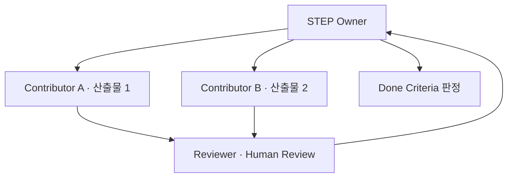
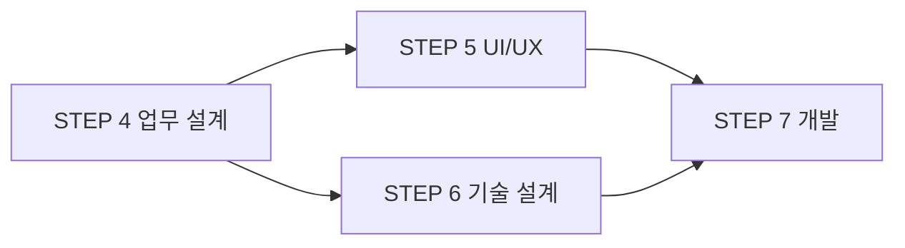

# AI Working Framework — Playbook: Scale Mode (대규모 프로젝트)

> **Type:** Playbook (Framework 확장)
> **Base:** AI Working Framework v1.0
> **적용 대상:** 여러 담당자·여러 팀이 참여하는 대규모 프로젝트

> 이 Playbook은 Framework를 **바꾸지 않는다.** STEP·원칙은 그대로 두고, 대규모에서 추가로 필요한 **조율·병렬·거버넌스**를 얹는다.
> Solo Mode가 무게를 **줄이는** 확장이라면, Scale Mode는 무게를 **더하는** 확장이다. (Framework Chapter 1.1)

---

## 1. 대규모에서 Framework가 압박받는 지점

Framework는 STEP이 **순차적**이고, 각 STEP을 **한 담당자**가 수행한다고 암묵적으로 전제한다.
대규모에서는 이 전제가 세 곳에서 깨진다.

| 압박 지점 | 증상 | Scale Mode의 대응 |
| --- | --- | --- |
| 조율 | 같은 STEP을 여러 명이 나눠 맡음 | STEP Owner + 분담 규칙 (2절) |
| 병렬 | STEP이 동시에 진행되거나 의존 | 병렬·의존 관리 (3절) |
| 거버넌스 | 산출물이 많아 추적 불가 | 버전·추적·승인 체계 (4절) |

---

## 2. 조율 — STEP Owner와 분담

Framework의 "담당자"를 대규모에서는 역할로 분리한다.

| 역할 | 책임 |
| --- | --- |
| STEP Owner | 해당 STEP의 완료(Done Criteria 판정)에 대한 단일 책임자 |
| Contributor | STEP 내 일부 산출물을 분담 작성 |
| Reviewer | Human Review 수행 (Contributor와 분리) |
| Framework Owner | Framework/Playbook 자체를 관리 (전 프로젝트 공통) |

> **핵심 규칙:** 한 STEP에 여러 명이 참여해도 **완료 판정 책임은 STEP Owner 1인**에게 있다.
> Framework의 "AI 생성 → 사람 검토·승인"에서 **생성(Contributor)과 검토(Reviewer)를 반드시 다른 사람**이 맡는다. (Solo Mode와 정반대 지점)

### 한 STEP 안의 분담 예시

---

## 3. 병렬 — STEP 동시 진행과 의존 관리

Framework는 STEP을 사슬(0→1→…→11)로 정의한다. 대규모에서는 일부 STEP이 **병렬로** 진행되지만, **Deliverable→Input 의존은 반드시 지킨다.**

| 관계 | 규칙 |
| --- | --- |
| 병렬 가능 | 서로의 Deliverable을 입력으로 쓰지 않는 STEP·작업은 동시 진행 가능 |
| 병렬 불가 | 입력 의존이 있는 STEP은 앞 STEP 완료 후 착수 (사슬 유지) |
| 부분 착수 | 앞 STEP의 일부 Deliverable만 확정돼도, 그 부분에 의존하는 작업은 시작 가능 |

**예시:** STEP 5(UI/UX)와 STEP 6(기술 설계)는 둘 다 STEP 4(업무 설계)를 입력으로 받는다. STEP 4가 끝나면 5·6은 **병렬 착수** 가능하다.

> **원칙은 유지된다:** 병렬은 허용하되, "완료된 Deliverable만 다음 STEP의 입력이 된다"(Framework Principle 2)는 절대 어기지 않는다. 병렬은 **속도**를 위한 것이지 **의존 무시**가 아니다.

---

## 4. 거버넌스 — 버전·추적·승인

산출물이 많아지면 "어느 버전이 최신인가, 누가 승인했나"가 관리의 핵심이 된다. Framework의 AI Metadata·버전 관리를 대규모용으로 강화한다.

| 항목 | Framework (기본) | Scale Mode (강화) |
| --- | --- | --- |
| 버전 관리 | 주요 Deliverable | **모든 Deliverable** 버전 필수 |
| 변경 이력 | 권장 | **필수** (변경자·사유 기록) |
| 승인 | 담당자 검토 | **다단계 승인** (Reviewer → STEP Owner) |
| 추적성 | 문제→요구 | **전 STEP 추적** (요구 → 설계 → 구현 → 테스트) |
| AI Metadata | 전부 기록 | 전부 기록 + **감사 가능하도록 보관** |

> **추적성 강화가 핵심이다.** 대규모에서는 "이 코드가 어느 요구사항에서 나왔나"를 STEP을 거꾸로 따라갈 수 있어야 한다. Framework의 STEP 간 Input–Deliverable 사슬이 그 추적의 뼈대가 된다.

---

## 5. 되돌림의 확대 — 되돌림이 다른 팀에 미치는 영향

Framework의 되돌림 루프(5.2)는 대규모에서 **여러 팀에 파급**된다.

- STEP 8(테스트) 실패로 STEP 7(개발)로 되돌아가면, STEP 7에 의존하던 **병렬 작업도 함께 영향**을 받는다.
- 따라서 Return Loop 발생 시 **영향 범위를 STEP Owner가 공지**하고, 관련 병렬 작업의 재조정 여부를 판단한다.

> Solo Mode에서 되돌림은 "나 혼자 다시"였지만, Scale Mode에서 되돌림은 **"영향받는 팀에 전파"**된다. 되돌림의 비용이 커지므로, Done Criteria 판정을 더 엄격히 한다.

---

## 6. Scale Mode 추가 체크리스트

Framework 기본 체크리스트에 더해 대규모에서 추가로 확인한다.

- [ ] 각 STEP에 **STEP Owner**(단일 책임자)가 지정되었다.
- [ ] Contributor(생성)와 Reviewer(검토)가 **분리**되었다.
- [ ] 병렬 진행하는 STEP·작업의 **의존 관계**가 확인되었다.
- [ ] 모든 Deliverable에 **버전·변경 이력**이 있다.
- [ ] 요구 → 설계 → 구현 → 테스트의 **추적성**이 유지된다.
- [ ] 되돌림 발생 시 **영향받는 팀에 공지**하는 절차가 있다.

---

## 7. 세 모드 비교

> 이 표 작성 후 **Team Dev Mode**가 추가됐다 — 네 모드 비교의 최신본은 `2-team-dev/AI_Working_Framework_Playbook_TeamDevMode.md` §14.
> ⚠️ **대체됨(2026-08-14)**: 그 §14 표의 Team Dev "기계 1차 + 고위험만 사람" 어감은 옛 체계 — 현행 고위험은 **경고 레인**(AI 경고 리뷰+증적 3종, 셀프 승인 표준·동료 승인 선택). 정본 = 킷(`3-starter-kit`) CLAUDE.md '머지 등급' 절.

| 구분 | Solo Mode | Framework (기본) | Scale Mode |
| --- | --- | --- | --- |
| 대상 | 1인 | 소~중 팀 | 대규모·다팀 |
| Deliverable | 메모 수준 | 공식 문서 | 전량 버전 관리 |
| Human Review | 자기 점검 | 타인 검토 | 다단계 승인 |
| STEP 진행 | 순차(합치기 가능) | 순차 | 병렬 허용(의존 유지) |
| 되돌림 | 나 혼자 | 자기/이전 STEP | 팀 전파 |

> 세 모드 모두 **같은 Framework**를 쓴다. STEP·원칙·Deliverable 사슬은 동일하고, **적용 무게만 다르다.**
> Framework는 하나, Playbook은 여럿. (Solo · Scale · 조직별 · 모델별 …)
