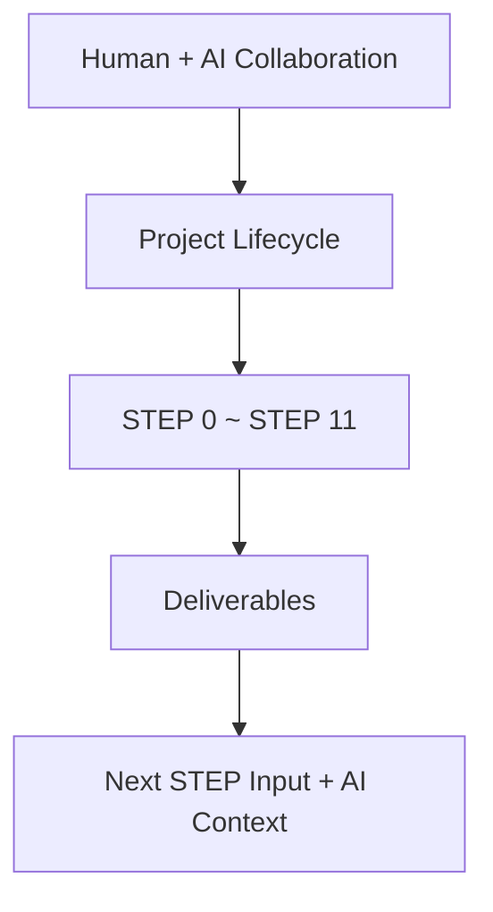
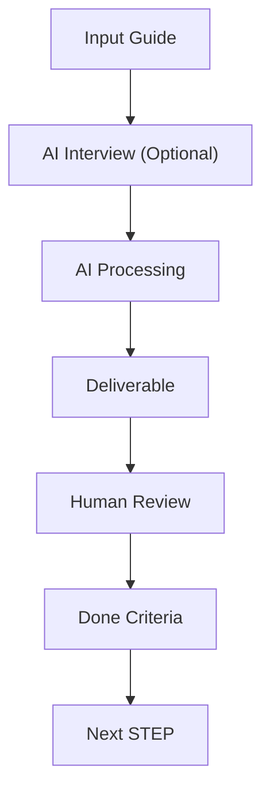
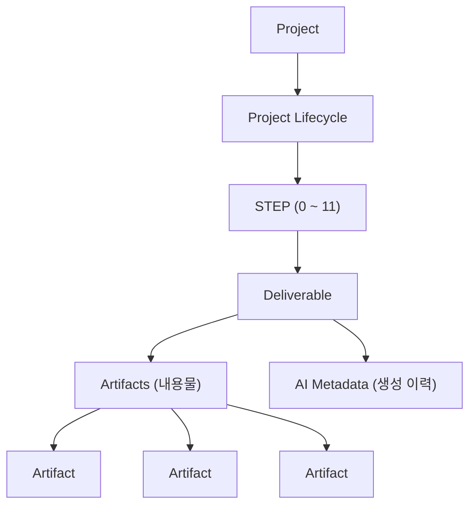
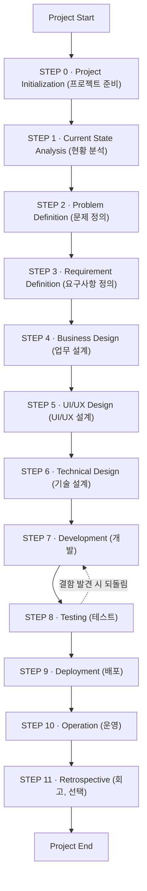
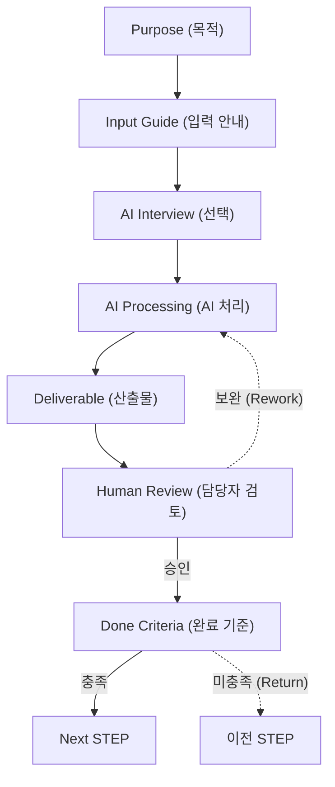

# AI Working Framework v1.0

> **Version:** v1.0  
> **Status:** Release  
> **Format:** Markdown (Diagrams: Mermaid)

---

## 목차 (Table of Contents)

- Chapter 1. Introduction (소개)
  - 1.1 Purpose (목적)
  - 1.2 Goals (목표)
  - 1.3 Scope (적용 범위)
  - 1.4 Target Audience (대상)
  - 1.5 Expected Outcome (기대 효과)
- Chapter 2. Framework Overview (Framework 개요)
  - 2.1 Framework Structure (Framework 구조)
  - 2.2 Human & AI Collaboration (사람과 AI 협업)
  - 2.3 Standard STEP Model (표준 STEP 모델)
- Chapter 3. Framework Vocabulary (Framework 용어 정의)
  - 3.1 Core Concepts (핵심 개념)
  - 3.2 AI Collaboration Vocabulary (AI 협업 용어)
  - 3.3 AI Metadata (AI 메타데이터)
  - 3.4 Working Document (작업 문서)
  - 3.5 Framework Model (Framework 구조)
- Chapter 4. Framework Principles (Framework 원칙)
  - 4.1 Core Principles (핵심 원칙)
  - 4.2 Operating Principles (운영 원칙)
  - 4.3 Principle Map (원칙 구성)
- Chapter 5. Project Lifecycle (프로젝트 생명주기)
  - 5.1 Lifecycle Overview (생명주기 개요)
  - 5.2 Standard STEP Model (표준 STEP 모델)
  - 5.3 Lifecycle Steps (프로젝트 단계)
- Chapter 6. Standards (표준)
  - 6.1 Document Standards (문서 표준)
  - 6.2 Quality Standards (품질 표준)
  - 6.3 Management Standards (관리 표준)
  - 6.4 AI Collaboration Standards (AI 협업 표준)
- Chapter 7. Templates (템플릿)
  - 7.1 Template Types (템플릿 종류)
  - 7.2 Project Initialization Templates (STEP 0)
  - 7.3 Analysis Templates (STEP 1~2)
  - 7.4 Design Templates (STEP 3~6)
  - 7.5 Implementation Templates (STEP 7~8)
  - 7.6 Deployment & Operation Templates (STEP 9~10)
  - 7.7 Retrospective Templates (STEP 11)
  - 7.8 Framework vs Playbook (구분 예시)
- Appendix A. STEP Definitions (부록 A. STEP 실행 정의)
  - A.1 공통 양식 (Common Skeleton)
  - A.2 STEP 0 — Project Initialization (프로젝트 준비)
  - A.3 STEP 1 — Current State Analysis (현황 분석)
  - A.4 STEP 2 — Problem Definition (문제 정의)
  - A.5 STEP 3 — Requirement Definition (요구사항 정의)
  - A.6 STEP 4 — Business Design (업무 설계)
  - A.7 STEP 5 — UI/UX Design (UI/UX 설계)
  - A.8 STEP 6 — Technical Design (기술 설계)
  - A.9 STEP 7 — Development (개발)
  - A.10 STEP 8 — Testing (테스트)
  - A.11 STEP 9 — Deployment (배포)
  - A.12 STEP 10 — Operation (운영)
  - A.13 STEP 11 — Retrospective (회고, 선택)

---

## Chapter 1. Introduction (소개)

### 1.1 Purpose (목적)

AI Working Framework는 프로젝트 수행 과정에서 **사람(Human)** 과 **AI**가 일관된 방식으로 협업하기 위한 표준 Framework를 정의한다.

프로젝트 유형이나 개발 방법론에 관계없이 적용 가능한 공통 기준을 제공하며, 프로젝트별 특성은 **Playbook**으로 확장하여 활용할 수 있도록 설계한다.

| 구분 | 역할 | 성격 |
| --- | --- | --- |
| Framework | 모든 프로젝트에 적용되는 공통 협업 기준 | 고정 |
| Playbook | 프로젝트 유형·조직에 맞춘 확장 규칙 | 가변 |

> Framework는 "무엇을 지켜야 하는가"를, Playbook은 "이 프로젝트에서는 어떻게 적용하는가"를 정의한다.

### 1.2 Goals (목표)

| 목표 | 설명 |
| --- | --- |
| 일관성 (Consistency) | 정의된 기준과 절차로 프로젝트를 수행한다. |
| 명확성 (Clarity) | 사람과 AI의 역할과 책임을 명확히 구분한다. |
| 협업성 (Collaboration) | 사람과 AI가 각자의 강점을 활용하여 협업한다. |
| 지속성 (Continuity) | 프로젝트 지식이 다음 단계와 다음 프로젝트로 이어진다. |

> 목표는 Framework가 **지향하는 상태**를 정의한다. 적용했을 때 실제로 나타나는 변화는 **1.5 기대 효과**에서 다룬다.

### 1.3 Scope (적용 범위)

#### 적용 대상 (In Scope)

본 Framework는 아래 Project Lifecycle 전체에 적용한다.

| STEP | 단계 |
| --- | --- |
| STEP 0 | Project Initialization (프로젝트 준비) |
| STEP 1 | Current State Analysis (현황 분석) |
| STEP 2 | Problem Definition (문제 정의) |
| STEP 3 | Requirement Definition (요구사항 정의) |
| STEP 4 | Business Design (업무 설계) |
| STEP 5 | UI/UX Design (UI/UX 설계) |
| STEP 6 | Technical Design (기술 설계) |
| STEP 7 | Development (개발) |
| STEP 8 | Testing (테스트) |
| STEP 9 | Deployment (배포) |
| STEP 10 | Operation (운영) |
| STEP 11 | Retrospective (회고, 선택) |

#### 적용 제외 (Out of Scope)

다음 영역은 본 Framework의 범위에 포함하지 않으며, 조직의 별도 기준을 따른다.

| 제외 영역 | 설명 |
| --- | --- |
| 포트폴리오 관리 | 조직 차원의 프로젝트 선정·우선순위 결정 |
| 계약·법무 절차 | 계약, 라이선스, 법적 검토 |
| 조직 인사·예산 | 인력 배치, 비용 승인 등 관리 행위 |

### 1.4 Target Audience (대상)

| 대상 | 활용 목적 |
| --- | --- |
| PM | 프로젝트 계획 및 관리 |
| Business Analyst | 업무 분석 및 요구사항 정의 |
| Designer | UI/UX 설계 |
| Developer | 기술 설계 및 개발 |
| QA | 테스트 및 품질 검증 |
| AI | 프로젝트 지원 및 산출물 생성 |

### 1.5 Expected Outcome (기대 효과)

| 기대 효과 | 현장에서 관찰되는 변화 |
| --- | --- |
| 프로젝트 착수 시간 단축 | Project Charter와 초기 작업 환경을 빠르게 준비한다. |
| 산출물 품질 향상 | AI와 담당자의 반복 검토를 통해 누락과 오류를 줄인다. |
| 협업 효율 향상 | 동일한 용어와 절차를 사용하여 의사소통 비용을 줄인다. |
| 지식 재사용 | 이전 STEP과 이전 프로젝트의 산출물을 다음 작업의 입력으로 활용한다. |
| AI 활용도 향상 | AI를 단순 생성 도구가 아니라 프로젝트 협업 파트너로 활용한다. |

---

## Chapter 2. Framework Overview (Framework 개요)

> 이 장의 목적은 하나다. **3분 안에 AI Working Framework 전체를 이해시키는 것.**

### 2.1 Framework Structure (Framework 구조)

### 2.2 Human & AI Collaboration (사람과 AI 협업)

#### 협업 흐름

#### 협업 원칙

각 행은 실제 작업 순서대로 짝을 이룬다. (AI가 먼저, 사람이 검토·결정)

| Human | AI |
| --- | --- |
| 목표 정의 | 정보 수집·질문 |
| 분석·제안 요청 | 분석 및 제안 |
| 초안 검토 | 초안 생성 |
| 의사결정·승인 | 반복 작업 수행 |
| 최종 책임 | — |

### 2.3 Standard STEP Model (표준 STEP 모델)

모든 STEP은 동일한 7개 요소로 구성된다.

**Purpose · Input Guide · AI Interview · AI Processing · Deliverable · Human Review · Done Criteria**

> 각 요소의 정의와 흐름 다이어그램은 **5.2 Standard STEP Model**을 정본으로 한다.

---

## Chapter 3. Framework Vocabulary (Framework 용어 정의)

> 이 Chapter의 목적은 하나다. **사람과 AI가 동일한 용어를 동일한 의미로 이해한다.**

| 구분 | 절 | 성격 |
| --- | --- | --- |
| 용어 정의 | 3.1 ~ 3.4 | 사전 (Dictionary) |
| 구조 정의 | 3.5 | 모델 (Framework Model) |

### 3.1 Core Concepts (핵심 개념)

| 용어 | 한글명 | 정의 |
| --- | --- | --- |
| AI Working | AI 협업 | 프로젝트 수행 과정에서 사람과 AI가 각자의 역할을 수행하며 협업하는 방식 |
| Project Lifecycle | 프로젝트 생명주기 | 프로젝트 시작부터 종료까지의 전체 수행 과정 |
| STEP | 단계 | Project Lifecycle을 구성하는 각각의 업무 단계 |
| Deliverable | 산출물 | 각 STEP 완료 시 생성되는 공식 결과물 |
| Artifact | 산출물 구성요소 | Deliverable을 구성하는 개별 결과물 |
| AI Metadata | AI 메타데이터 | Deliverable 생성에 사용된 AI 작업 이력 정보 |

> 위 정의가 각 용어의 **정본(正本)** 이다. 이후 절과 다른 Chapter에서는 이 정의를 그대로 따른다.

### 3.2 AI Collaboration Vocabulary (AI 협업 용어)

| 용어 | 한글명 | 정의 |
| --- | --- | --- |
| Input Guide | 입력 안내 | 담당자가 AI에게 제공해야 하는 정보 |
| AI Interview | AI 인터뷰 | AI가 필요한 정보를 확인하기 위해 담당자에게 질문하는 과정. 이전 STEP의 Deliverable이 충분한 경우 생략할 수 있다. |
| AI Processing | AI 처리 | AI가 입력 정보를 분석·생성·제안하는 과정 |
| Human Review | 담당자 검토 | 담당자가 AI 결과를 검토하고 수정·승인하는 과정 |
| Done Criteria | 완료 기준 | STEP이 완료되었다고 판단하는 기준 |

### 3.3 AI Metadata (AI 메타데이터)

> Deliverable이 **어떻게 생성되었는지**를 기록하는 정보. 산출물의 내용이 아니라 생성 이력이다.

| 항목 | 설명 |
| --- | --- |
| AI Tool | 사용한 AI 도구 |
| Model | 모델명 및 버전 |
| Prompt Version | 사용한 Prompt 버전 |
| Generated Date/Time | 생성 일시 |
| Reviewer | 검토자 |
| Review Date | 검토 일시 |

### 3.4 Working Document (작업 문서)

> AI와 사람이 함께 작업하는 기본 문서. **작업 중인 상태**의 문서를 가리킨다.

#### Artifact와의 관계

- 작업 중에는 **Working Document**로 다룬다.
- Human Review를 거쳐 확정되면 **Artifact**가 되어 Deliverable을 구성한다.

#### 원칙

- 사람이 읽기 쉬운 구조를 사용한다.
- AI가 이해하기 쉬운 구조를 사용한다.
- Markdown을 기본 형식으로 권장한다.
- 최종 Deliverable 형식은 프로젝트 특성에 따라 달라질 수 있다.

### 3.5 Framework Model (Framework 구조)

용어들은 다음과 같은 계층 구조로 연결된다.

> Artifact와 AI Metadata는 층은 같지만 성격이 다르다.
> **Artifact = 산출물의 내용물 / AI Metadata = 그 산출물이 만들어진 이력.**

#### Deliverable 예시

프로젝트에서 공식적으로 관리하는 산출물.

- Requirement Specification (요구사항 정의서)
- Business Design (업무 설계서)
- Technical Design (기술 설계서)

#### Artifact 예시

Deliverable을 구성하는 개별 결과물. (결과물과 형식을 함께 표기)

| 결과물 | 형식 |
| --- | --- |
| 요구사항 목록 | Markdown |
| 업무 흐름도 | Draw.io |
| 화면 설계 | Figma |
| API 명세 | OpenAPI |
| 데이터 정의 | SQL |
| 구현 코드 | Source Code |

---

## Chapter 4. Framework Principles (Framework 원칙)

> **목적:** AI Working Framework의 모든 STEP을 관통하는 **공통 원칙**을 정의한다. 원칙은 개별 STEP이 아니라 Framework 전체에 적용된다.
> 각 원칙에는 그 근거가 되는 Lifecycle 지점을 함께 표기한다. 원칙은 실행 구조에서 추출된 것이다.

### 4.1 Core Principles (핵심 원칙)

#### Principle 1 — Lifecycle Driven

프로젝트는 정의된 Project Lifecycle에 따라 수행한다.

> 근거: Chapter 5.1 — STEP 0 ~ STEP 11의 표준 생명주기.

#### Principle 2 — Deliverable Driven

모든 STEP은 공식 Deliverable을 생성한다.
Deliverable은 다음 STEP의 입력이 된다.

> 근거: Chapter 5.2 — STEP 모델의 Deliverable, 그리고 5.3의 Input–Deliverable 사슬.

#### Principle 3 — Human Accountability, AI Collaboration

AI는 전 STEP에서 정보 수집·초안·분석을 수행한다.
모든 의사결정과 최종 책임은 사람이 가진다.

> 근거: Chapter 5.2 — AI Processing → Human Review → Done Criteria로 이어지는 흐름.
> AI가 생성하고 사람이 검토·승인하는 구조가 모든 STEP에 반복된다.

#### Principle 4 — Human Readable, AI Readable

Working Document는 사람이 읽기 쉽고 AI가 이해하기 쉬운 구조를 기본으로 한다.

> 근거: Chapter 3.4 — Working Document 원칙. Framework의 공통 언어를 규정하는 원칙이다.

### 4.2 Operating Principles (운영 원칙)

#### Principle 5 — Standard First

프로젝트는 공통 Framework를 우선 적용한다.

> 근거: Chapter 5.2 — 모든 STEP이 동일한 표준 STEP 모델을 따른다.

#### Principle 6 — Project Adaptability

표준만으로 부족한 경우, 프로젝트 특성에 따라 Playbook으로 확장한다.

> 근거: Chapter 1.1 — Framework(공통)와 Playbook(확장)의 관계.
> Chapter 5.3 STEP 11의 선택 조건처럼, 표준을 벗어나는 예외는 명시된 기준에 따른다.

#### Principle 7 — Tool Independence

Framework는 특정 도구에 종속되지 않으며, 기존 프로젝트 관리도구와 연계하여 활용한다.

> 근거: Chapter 3.5 — Artifact는 Markdown·Draw.io·Figma 등 다양한 형식으로 존재하며, 형식에 종속되지 않는다.

### 4.3 Principle Map (원칙 구성)

| 구분 | 원칙 | 규정 대상 |
| --- | --- | --- |
| 핵심 원칙 | 1 Lifecycle Driven | 수행 절차 |
| 핵심 원칙 | 2 Deliverable Driven | 산출물 연결 |
| 핵심 원칙 | 3 Human Accountability, AI Collaboration | 사람·AI 역할 |
| 핵심 원칙 | 4 Human Readable, AI Readable | 문서 형식 |
| 운영 원칙 | 5 Standard First | 표준 우선 |
| 운영 원칙 | 6 Project Adaptability | 확장 규칙 |
| 운영 원칙 | 7 Tool Independence | 도구 연계 |

> 핵심 원칙(1~4)은 **일하는 방식**을, 운영 원칙(5~7)은 **적용·확장 방식**을 규정한다.

---

## Chapter 5. Project Lifecycle (프로젝트 생명주기)

> **목적:** 프로젝트를 **일관된 기준과 절차**에 따라 수행하기 위한 표준 생명주기를 정의한다.

### 5.1 Lifecycle Overview (생명주기 개요)

> 위 흐름은 기본 진행 방향이다. 각 STEP은 Done Criteria를 충족하지 못하면 이전 STEP으로 되돌아갈 수 있다(Return Loop, 5.2 참조). 점선은 대표 예시(Testing → Development)이며, 되돌림은 특정 STEP에 한정되지 않는다.

### 5.2 Standard STEP Model (표준 STEP 모델)

모든 STEP은 동일한 7개 요소로 구성되며, 동일한 순서로 흐른다.
**구조와 흐름을 하나의 모델로 표현한다.**

| 구성 | 설명 |
| --- | --- |
| Purpose (목적) | STEP의 목표 |
| Input Guide (입력 안내) | AI 수행을 위해 필요한 입력 |
| AI Interview (AI 인터뷰) | 필요한 경우 AI가 추가 정보를 확인 (이전 STEP의 Deliverable이 충분하면 생략) |
| AI Processing (AI 처리) | AI 분석 및 산출물 생성 |
| Deliverable (산출물) | STEP의 공식 결과물 |
| Human Review (담당자 검토) | 담당자 검토 및 승인 |
| Done Criteria (완료 기준) | STEP 종료 기준 |

> STEP의 Deliverable은 다음 STEP의 Input이 된다. 이 연결이 Lifecycle을 하나의 사슬로 만든다.

#### 되돌림 (Rework & Return)

STEP은 항상 앞으로만 진행하지 않는다. 검토·완료 판정 결과에 따라 두 가지 되돌림이 있다.

| 유형 | 조건 | 되돌아가는 곳 | 예 |
| --- | --- | --- | --- |
| Rework Loop (자기 STEP 반복) | Human Review 결과가 "보완" | 같은 STEP의 AI Processing | 산출물 보완 |
| Return Loop (이전 STEP 되돌림) | Done Criteria 미충족 | 원인이 된 이전 STEP | STEP 8 Testing 심각 결함 → STEP 7 Development |

> Return Loop가 발생하면 다음 STEP으로 진행하지 않는다. 이전 STEP을 다시 완료한 뒤 재진입한다.

### 5.3 Lifecycle Steps (프로젝트 단계)

| STEP | 목적 | 주요 Input | 주요 Deliverable |
| --- | --- | --- | --- |
| STEP 0 Project Initialization (프로젝트 준비) | 프로젝트 기본 정보 정의 및 착수 준비 | 프로젝트 요청·배경 | Project Charter |
| STEP 1 Current State Analysis (현황 분석) | 문제 정의를 위한 객관적 근거 확보 | Project Charter | Current State Analysis |
| STEP 2 Problem Definition (문제 정의) | 해결해야 할 핵심 문제 정의 | Current State Analysis | Problem Definition |
| STEP 3 Requirement Definition (요구사항 정의) | 문제 해결을 위해 무엇을 만들어야 하는지 정의 | Problem Definition | Requirement Specification |
| STEP 4 Business Design (업무 설계) | 업무 프로세스, 기능 흐름, 업무 규칙 설계 | Requirement Specification | Business Design |
| STEP 5 UI/UX Design (UI/UX 설계) | 사용자가 사용할 화면과 UX 설계 | Business Design | UI/UX Design |
| STEP 6 Technical Design (기술 설계) | 개발자가 코드 작성을 시작할 수 있도록 기술 구현 방안 설계 | Business Design, UI/UX Design | Technical Design |
| STEP 7 Development (개발) | 기능 구현 및 실행 가능한 결과물 생성 | Technical Design | Implementation Package |
| STEP 8 Testing (테스트) | 요구사항과 설계 기준에 따라 기능 및 품질 검증 | Implementation Package | Test Result Report |
| STEP 9 Deployment (배포) | 운영 환경에 안정적으로 배포 | Test Result Report | Deployment Guide, Release Note |
| STEP 10 Operation (운영) | 배포된 시스템 운영 및 유지관리 | Release Note | Operation Guide |
| STEP 11 Retrospective (회고, 선택) | 프로젝트 개선사항 도출 | 전체 STEP Deliverable | Retrospective Report |

> **STEP 7 참고:** Deliverable은 Implementation Package(공식 결과물)이며, Source Code·Build Package는 이를 구성하는 **Artifact**다. (Chapter 3 Deliverable / Artifact 정의 참조)

> **STEP 11 참고:** Retrospective는 선택 STEP이다. 일정 규모 이상 또는 조직이 지정한 프로젝트에서 수행한다.

---

## Chapter 6. Standards (표준)

> **목적:** Framework를 사용하는 모든 프로젝트가 동일한 기준과 방식으로 문서·산출물·AI 협업을 수행하기 위한 공통 표준을 정의한다.
> 본 표준은 **Chapter 4 원칙을 실제 작성 규칙으로 구체화한 것**이다.
> 원칙이 "무엇을 지키는가"라면, 표준은 "어떻게 작성하는가"를 정의한다.

---

### 6.1 Document Standards (문서 표준)

#### 6.1.1 Working Document

| Rule | Example |
| --- | --- |
| Working Document는 사람이 읽기 쉽고 AI가 이해하기 쉬운 구조를 사용한다. | Markdown (.md) |
| 최종 Deliverable 형식은 프로젝트 특성에 따라 결정한다. | PPT, PDF, DOCX, Figma 등 |

#### 6.1.2 Terminology Rules (용어 표준)

> 용어의 **정의**는 Chapter 3에서 관리하며, 본 절은 용어 **사용 규칙**만 정의한다.

| Rule | Example |
| --- | --- |
| 모든 공통 용어는 Chapter 3 Vocabulary를 따른다. | Deliverable, Artifact |
| 신규 공통 용어는 Vocabulary에 등록한 후 사용한다. | 신규 용어 등록 → 사용 |
| 문서에서는 영문과 한글을 함께 표기한다. | Deliverable (산출물) |

#### 6.1.3 Deliverable Rules (산출물 표준)

> Deliverable · Artifact · AI Metadata의 관계는 Chapter 3.5 Framework Model을 따른다.

**Deliverable**

| Rule | Example |
| --- | --- |
| 모든 STEP은 하나 이상의 공식 Deliverable을 생성한다. | Project Charter |
| Deliverable은 다음 STEP의 Input으로 활용된다. | Requirement → Business Design |

**Artifact**

| Rule | Example |
| --- | --- |
| Deliverable은 하나 이상의 Artifact로 구성될 수 있다. | 요구사항 목록, 업무 흐름도 |
| Artifact는 Deliverable의 실제 내용을 구성한다. | Requirement.md, Flow.drawio |

**AI Metadata**

| Rule | Example |
| --- | --- |
| 모든 AI 생성 Deliverable은 Metadata를 포함한다. | AI Tool, Model |
| Human Review 이력을 함께 관리한다. | Reviewer, Review Date |

#### 6.1.4 Diagram & Table Standards (다이어그램 및 표 표준)

| Rule | Example |
| --- | --- |
| 흐름은 Flow Diagram으로 표현한다. | STEP Flow |
| 계층은 Tree 구조로 표현한다. | Deliverable Structure |
| 비교는 Table을 기본으로 사용한다. | Vocabulary |

---

### 6.2 Quality Standards (품질 표준)

> 모든 STEP은 두 개의 품질 관문(Human Review · Done Criteria)을 통과해야 한다. (Chapter 5.2 표준 STEP 모델)

#### 6.2.1 Human Review

| Rule | Example |
| --- | --- |
| 모든 Deliverable은 담당자의 검토를 거친다. | PM Review |
| AI 결과는 검토 없이 공식 Deliverable이 될 수 없다. | Approval Required |

#### 6.2.2 Done Criteria

| Rule | Example |
| --- | --- |
| STEP별 Done Criteria를 만족해야 완료로 인정한다. | Review Complete |
| 완료된 Deliverable만 다음 STEP의 Input이 된다. | Approved Requirement |
| Done Criteria 미충족 시 다음 STEP으로 진행하지 않고 이전 STEP으로 되돌린다. | Testing 실패 → Development |

---

### 6.3 Management Standards (관리 표준)

#### 6.3.1 Folder Structure

| Rule | Example |
| --- | --- |
| STEP별 표준 폴더 구조를 사용한다. | 00_Project / 01_CurrentState |
| 폴더 번호는 STEP 번호와 일치시킨다. | 00 = STEP 0, 01 = STEP 1 |

#### 6.3.2 File Naming

| Rule | Example |
| --- | --- |
| Deliverable은 공통 파일명을 사용한다. | ProjectCharter.md |
| 파일명은 영문 PascalCase를 권장한다. | TechnicalDesign.md |

#### 6.3.3 Version Management

| Rule | Example |
| --- | --- |
| 주요 Deliverable은 버전을 관리한다. | v1.0 |
| 변경 이력을 함께 관리한다. | Revision History |

#### 6.3.4 Repository Integration (권장)

| Rule | Example |
| --- | --- |
| 프로젝트 저장소와 연계하여 관리하는 것을 권장한다. | Git |
| Framework는 특정 저장소 도구에 종속되지 않는다. | GitHub, GitLab 등 |

---

### 6.4 AI Collaboration Standards (AI 협업 표준)

#### 6.4.1 Input Guide

| Rule | Example |
| --- | --- |
| AI 작업 전 Input Guide를 준비한다. | Project Information |
| 필수 입력과 추천 입력을 구분한다. | Required / Recommended |

#### 6.4.2 Prompt Management

| Rule | Example |
| --- | --- |
| 반복 사용하는 Prompt는 템플릿으로 관리한다. | Prompt Library |
| Prompt 변경 시 버전을 관리한다. | Prompt v2.0 |

#### 6.4.3 AI Usage Rules

| Rule | Example |
| --- | --- |
| AI는 분석·생성·제안을 수행한다. | Requirement Draft |
| AI는 전 STEP에서 협업 파트너로 참여한다. | 정보 수집·초안·분석 |

> 최종 의사결정과 승인은 사람이 수행한다. (검토·완료 규칙은 6.2 Quality Standards 참조)

## Chapter 7. Templates (템플릿)

> **목적:** Framework에서 사용하는 표준 템플릿을 정의한다. 모든 STEP은 해당 템플릿을 기반으로 수행하는 것을 권장한다.
> 템플릿은 **빈 양식(고정)** 이다. 양식을 채우는 실제 내용(특히 Prompt)은 프로젝트·모델에 따라 달라지므로 **Playbook**에서 관리한다. (Chapter 1.1 Framework / Playbook 구분)

---

### 7.1 Template Types (템플릿 종류)

Framework는 다음 4종류의 템플릿을 제공한다. STEP별 실제 템플릿(7.2~7.7)은 모두 이 4종류 중 하나에 속한다.

| 종류 | 용도 | 관리 위치 |
| --- | --- | --- |
| Input Template | 담당자가 AI에게 제공할 입력 양식 | Framework |
| Output Template | Deliverable 산출 양식 | Framework |
| Prompt Template | AI 실행을 위한 빈 Prompt 양식 | Framework (양식) / Playbook (실제 Prompt) |
| Review Checklist | Human Review·Done Criteria 점검 양식 | Framework |

> **표 읽는 법:** 아래 7.2~7.7의 각 템플릿은 STEP과 주 작성 주체(담당자 / AI)를 함께 표기한다.
> AI가 생성하는 템플릿도 모두 Human Review를 거친다. (Chapter 6.2 Quality Standards)

---

### 7.2 Project Initialization Templates (STEP 0)

| Template | STEP | 주 작성 | 파일명 |
| --- | --- | --- | --- |
| Project Input Template | STEP 0 | 담당자 | ProjectInput.md |
| Project Charter Template | STEP 0 | AI | ProjectCharter.md |
| Folder Structure Template | STEP 0 | 담당자 (셋업) | (폴더 구조) |

---

### 7.3 Analysis Templates (STEP 1~2)

| Template | STEP | 주 작성 | 파일명 |
| --- | --- | --- | --- |
| Current State Analysis | STEP 1 | AI | CurrentStateAnalysis.md |
| Problem Definition | STEP 2 | AI | ProblemDefinition.md |

---

### 7.4 Design Templates (STEP 3~6)

| Template | STEP | 주 작성 | 파일명 |
| --- | --- | --- | --- |
| Requirement Specification | STEP 3 | AI | RequirementSpecification.md |
| Business Design | STEP 4 | AI | BusinessDesign.md |
| UI/UX Design | STEP 5 | AI | UIUXDesign.md |
| Technical Design | STEP 6 | AI | TechnicalDesign.md |

---

### 7.5 Implementation Templates (STEP 7~8)

| Template | STEP | 주 작성 | 파일명 |
| --- | --- | --- | --- |
| Development Checklist | STEP 7 | 담당자 | DevelopmentChecklist.md |
| Test Report | STEP 8 | AI | TestReport.md |

---

### 7.6 Deployment & Operation Templates (STEP 9~10)

| Template | STEP | 주 작성 | 파일명 |
| --- | --- | --- | --- |
| Deployment Guide | STEP 9 | AI | DeploymentGuide.md |
| Operation Guide | STEP 10 | AI | OperationGuide.md |

---

### 7.7 Retrospective Templates (STEP 11)

| Template | STEP | 주 작성 | 파일명 |
| --- | --- | --- | --- |
| Retrospective Report | STEP 11 | AI | RetrospectiveReport.md |

---

### 7.8 Framework vs Playbook (구분 예시)

Chapter 7은 Framework와 Playbook의 차이가 **처음으로 실물로 구분되는 지점**이다.
동일한 STEP 0을 예로 들면 다음과 같다.

| 구분 | 대상 | 성격 | 관리 |
| --- | --- | --- | --- |
| Framework | Project Charter Template | 몇 년이 지나도 거의 바뀌지 않는 양식 | 공통 |
| Playbook | GPT / Claude / Gemini 용 Charter 생성 Prompt | 모델·프로젝트에 따라 계속 바뀌는 실제 Prompt | 프로젝트·모델별 |

> 양식(Template)은 고정이므로 Framework, 실제 Prompt는 가변이므로 Playbook.
> 이 한 쌍이 Framework와 Playbook의 관계를 가장 명확하게 보여준다.

---

## Appendix A. STEP Definitions (부록 A. STEP 실행 정의)

> 본 부록은 각 STEP을 **5.2 표준 STEP 모델의 7요소**로 완전히 정의한다.
> 각 STEP 정의 하나만으로 해당 STEP을 착수·수행·완료할 수 있도록, Input Guide·AI Interview·Done Criteria까지 포함한다.
> Deliverable 항목(요소 5)이 곧 Chapter 7의 Output 템플릿이다.
> 아래 질문·기준은 **범용 초안**이며, 실제 적용 시 조직·프로젝트 성격에 맞게 조정한다. Prompt는 모델·프로젝트에 따라 달라지므로 여기 두지 않고 **Playbook**에서 관리한다.

### A.1 공통 양식 (Common Skeleton)

모든 Deliverable 문서는 다음 **메타데이터 헤더**로 시작한다. (Chapter 3.3 · 6.3.3)

| 항목 | 값 |
| --- | --- |
| Deliverable | (산출물명) |
| STEP | (STEP 번호) |
| Version | v1.0 |
| Status | Draft / Reviewed / Approved |
| AI Tool / Model | |
| Prompt Version | |
| Generated Date | |
| Reviewer / Review Date | |

그리고 다음 **검토·완료 블록**으로 끝난다. (Chapter 6.2)

- **Human Review:** 검토자 ( ) / 검토일 ( ) / 결과 ( 승인 · 보완 )
- **Done Criteria:** STEP별 완료 기준(각 STEP의 요소 7)을 모두 충족

> A.2~A.13의 각 Deliverable은 상단에 이 헤더, 하단에 이 검토·완료 블록을 붙인다.
> **되돌림(5.2):** Human Review "보완" → 자기 STEP 반복(Rework), Done Criteria 미충족 → 이전 STEP 되돌림(Return).

### A.2 STEP 0 — Project Initialization (프로젝트 준비)

**1. Purpose** — 프로젝트의 기본 정보를 정의하고 착수 준비를 완료한다.

**2. Input Guide**

| 구분 | 입력 항목 |
| --- | --- |
| 필수 | 프로젝트 요청·배경, 목표 |
| 추천 | 이해관계자, 예상 기간, 참고 자료 |

**3. AI Interview**
- 배경: 왜 이 프로젝트를 시작하나요? 무엇을 해결하려 하나요?
- 목표·범위: 성공 기준은? 포함/제외 범위는?
- 이해관계자: 주요 관계자와 역할은? 의사결정자는 누구인가요?
- 제약: 기간·예산·기술 제약이 있나요?

**4. AI Processing**
- 입력·인터뷰를 종합해 Project Charter 초안 생성
- 범위를 In / Out으로 구분, 리스크·제약 식별
- 표준 폴더 구조(00~11) 생성 제안

**5. Deliverable — Project Charter** (ProjectCharter.md)

| 본문 항목 | 내용 |
| --- | --- |
| 프로젝트 개요 | 배경, 목적 |
| 범위 | In Scope / Out of Scope |
| 이해관계자·역할 | 관계자, 의사결정자 |
| 주요 마일스톤 | 일정 개요 |
| 제약·리스크 | 전제와 위험 |

**6. Human Review** — 목적·범위의 명확성 / 이해관계자 합의 / 제약·리스크 반영 여부

**7. Done Criteria**
- [ ] 프로젝트 목적·범위가 정의됨
- [ ] 이해관계자·역할이 확인됨
- [ ] 표준 폴더 구조가 생성됨
- [ ] 담당자 승인 / STEP 1 Input으로 사용 가능

> 되돌림: 최초 STEP이므로 Return 대상 없음. 보완 시 자기 반복만.

### A.3 STEP 1 — Current State Analysis (현황 분석)

**1. Purpose** — 현재의 업무와 시스템을 객관적으로 파악한다. 사실만 수집하고 해석은 STEP 2로 미룬다.

**2. Input Guide**

| 구분 | 입력 항목 |
| --- | --- |
| 필수 | Project Charter (STEP 0), 분석 대상 업무 범위 |
| 추천 | 현행 자료(매뉴얼·화면·데이터), 인터뷰 대상자 |

**3. AI Interview**
- 업무 흐름: 업무 순서는? 각 단계 담당자는? 수작업 지점은?
- 시스템: 사용 시스템은? 데이터 연계는? 시스템 밖 처리는?
- 데이터: 어떤 데이터가 생성·보관되나요? 양·주기는?
- 문제 인식(사실): 가장 오래 걸리는 지점은? 오류·재작업이 잦은 지점은?

**4. AI Processing**
- 답변을 업무 흐름 / 시스템 / 데이터 / 문제점 4축으로 분류
- 현행 업무 흐름을 Flow 다이어그램으로 구조화
- 사실과 의견을 구분, 누락·모순은 검토 질문으로 남김

**5. Deliverable — Current State Analysis** (CurrentStateAnalysis.md)

| 본문 항목 | 내용 |
| --- | --- |
| 현행 업무 흐름 | 순서, 담당자, 수작업 지점 (Flow 포함) |
| 현행 시스템 구성 | 시스템, 연계, 시스템 외 처리 |
| 데이터 현황 | 주요 데이터, 양·주기 |
| 관찰된 문제점 | 시간·오류·재작업 지점 (사실 수준) |

**6. Human Review** — 정확성 / 완전성 / 사실성(해석 배제) / 근거 여부

**7. Done Criteria**
- [ ] 분석 범위의 업무·시스템이 모두 기록됨
- [ ] 현행 흐름이 다이어그램으로 표현됨
- [ ] 문제점이 사실 수준으로 정리됨 (해석 배제)
- [ ] 담당자 승인 / STEP 2 Input으로 사용 가능

> 되돌림: 근거 부족 시 자기 반복. Return 대상 STEP 0(범위 불명확 시).

### A.4 STEP 2 — Problem Definition (문제 정의)

**1. Purpose** — 현황을 근거로 해결할 핵심 문제를 정의한다. 해결책은 STEP 3으로 미룬다.

**2. Input Guide**

| 구분 | 입력 항목 |
| --- | --- |
| 필수 | Current State Analysis (STEP 1), Project Charter 목표 (STEP 0) |
| 추천 | 이해관계자 문제 인식 |

**3. AI Interview**
- 문제 식별: 현황에서 핵심 문제는? 여러 문제 중 우선순위는?
- 원인: 근본 원인은 무엇이라고 보나요?
- 영향: 누구에게 어떤 영향을 주나요?
- 목표: 해결 성공을 어떻게 측정하나요?

**4. AI Processing**
- 현황에서 문제 후보 추출·우선순위화
- 문제–원인 구조화(근본 원인), 영향 범위 정리
- 측정 가능한 해결 목표 설정

**5. Deliverable — Problem Definition** (ProblemDefinition.md)

| 본문 항목 | 내용 |
| --- | --- |
| 핵심 문제 정의 | 해결 대상 문제 |
| 원인 분석 | 근본 원인 |
| 영향 범위 | 영향 대상·정도 |
| 해결 목표 | 측정 지표 |

**6. Human Review** — 현황 근거 기반 여부 / 핵심 문제 선정 타당성 / 목표의 측정 가능성

**7. Done Criteria**
- [ ] 핵심 문제가 근거와 함께 정의됨
- [ ] 원인·영향이 정리됨
- [ ] 측정 가능한 목표가 설정됨
- [ ] 담당자 승인

> 되돌림: 근거 부족 시 Return → STEP 1.

### A.5 STEP 3 — Requirement Definition (요구사항 정의)

**1. Purpose** — 문제 해결을 위해 무엇을 만들지 요구사항으로 정의한다.

**2. Input Guide**

| 구분 | 입력 항목 |
| --- | --- |
| 필수 | Problem Definition (STEP 2) |
| 추천 | 현황(STEP 1), 이해관계자 요구 |

**3. AI Interview**
- 기능: 필요한 기능은? 필수와 선택은?
- 비기능: 성능·보안·규정 요구는?
- 우선순위: 우선순위 기준은?
- 제약: 기술·정책 제약은?

**4. AI Processing**
- 문제 → 요구사항 도출(추적성), 기능/비기능 분류
- 우선순위 부여, ID 부여, 중복·모순 점검

**5. Deliverable — Requirement Specification** (RequirementSpecification.md)

| 본문 항목 | 내용 |
| --- | --- |
| 기능 요구사항 | ID · 설명 · 우선순위 |
| 비기능 요구사항 | 성능 · 보안 · 운영 |
| 제약사항 | 기술·정책 제약 |
| 추적성 | 문제 → 요구사항 |

**6. Human Review** — 문제 추적성 / 완전성 / 구현 가능한 명확성

**7. Done Criteria**
- [ ] 기능·비기능 요구사항이 정의됨
- [ ] 문제→요구사항 추적성 확보
- [ ] 우선순위 부여됨
- [ ] 담당자 승인

> 되돌림: 문제 불명확 시 Return → STEP 2.

### A.6 STEP 4 — Business Design (업무 설계)

**1. Purpose** — 요구사항을 충족하는 업무 프로세스와 규칙을 설계한다. 화면·기술은 STEP 5·6으로 미룬다.

**2. Input Guide**

| 구분 | 입력 항목 |
| --- | --- |
| 필수 | Requirement Specification (STEP 3) |
| 추천 | 현행 업무 흐름 (STEP 1) |

**3. AI Interview**
- 프로세스: 요구를 반영한 업무 순서는? 현행 대비 변경점은?
- 규칙: 업무 처리 규칙·정책은? (승인 단계·조건)
- 예외: 예외·오류 처리 방침은?

**4. AI Processing**
- To-Be 프로세스 설계(Flow), 규칙·정책 정리
- 예외 처리 정의, 요구사항 → 업무 매핑

**5. Deliverable — Business Design** (BusinessDesign.md)

| 본문 항목 | 내용 |
| --- | --- |
| 업무 프로세스 | To-Be 흐름 |
| 업무 규칙·정책 | 처리 규칙 |
| 기능 흐름 | 단계별 흐름 |
| 예외·오류 처리 | 예외 정책 |

**6. Human Review** — 요구 반영 여부 / 실행 가능성 / 예외 포함 여부

**7. Done Criteria**
- [ ] To-Be 프로세스·규칙이 정의됨
- [ ] 예외 처리가 포함됨
- [ ] 요구사항과 매핑됨
- [ ] 담당자 승인

> 되돌림: 요구 불명확 시 Return → STEP 3.

### A.7 STEP 5 — UI/UX Design (UI/UX 설계)

**1. Purpose** — 사용자가 업무를 수행할 화면과 UX를 설계한다.

**2. Input Guide**

| 구분 | 입력 항목 |
| --- | --- |
| 필수 | Business Design (STEP 4) |
| 추천 | 요구사항(STEP 3), 사용자 특성 |

**3. AI Interview**
- 사용자: 주요 사용자·사용 환경은? (PC/모바일)
- 화면: 필요한 주요 화면은? 화면 간 이동은?
- UX: 지킬 UX 원칙·디자인 가이드가 있나요?

**4. AI Processing**
- 업무 흐름 → 화면 목록 도출, 화면 흐름 설계
- 주요 화면 레이아웃 구성, UX 원칙 정리

**5. Deliverable — UI/UX Design** (UIUXDesign.md)

| 본문 항목 | 내용 |
| --- | --- |
| 화면 목록 | 화면 인벤토리 |
| 화면 흐름 | Flow |
| 주요 화면 레이아웃 | 핵심 화면 구성 |
| UX 원칙·가이드 | 디자인 기준 |

**6. Human Review** — 업무 흐름의 화면 구현 여부 / 사용성 / 화면 누락 여부

**7. Done Criteria**
- [ ] 화면 목록·흐름이 정의됨
- [ ] 주요 화면이 설계됨
- [ ] 업무 흐름과 연결됨
- [ ] 담당자 승인

> 되돌림: 업무 설계 불명확 시 Return → STEP 4.

### A.8 STEP 6 — Technical Design (기술 설계)

**1. Purpose** — 개발자가 구현을 시작할 수 있도록 기술 구현 방안을 설계한다.

**2. Input Guide**

| 구분 | 입력 항목 |
| --- | --- |
| 필수 | Business Design (STEP 4), UI/UX Design (STEP 5) |
| 추천 | 비기능 요구사항 (STEP 3) |

**3. AI Interview**
- 아키텍처: 기술 스택·아키텍처 방향은?
- 데이터: 주요 데이터 구조·저장 방식은?
- 연계: 외부 시스템·API 연계는?
- 비기능: 성능·보안·배포 요건은?

**4. AI Processing**
- 시스템 아키텍처 설계, 데이터 모델(ERD) 설계
- API 명세 작성, 기술 스택·배포 구조 정의

**5. Deliverable — Technical Design** (TechnicalDesign.md)

| 본문 항목 | 내용 |
| --- | --- |
| 시스템 아키텍처 | 구성·구조 |
| 데이터 모델 | ERD |
| API 명세 | OpenAPI 권장 |
| 기술 스택·배포 구조 | 스택, 배포 방식 |

**6. Human Review** — 개발 착수 가능성 / 업무·화면·비기능 지원 여부 / 데이터·API 일관성

**7. Done Criteria**
- [ ] 아키텍처·데이터·API가 정의됨
- [ ] 개발 착수 가능한 수준
- [ ] 설계 간 일관성 확인
- [ ] 담당자 승인

> 되돌림: 업무·화면 설계 불명확 시 Return → STEP 4 / 5.

### A.9 STEP 7 — Development (개발)

**1. Purpose** — 기술 설계에 따라 기능을 구현하고 실행 가능한 결과물을 만든다.

**2. Input Guide**

| 구분 | 입력 항목 |
| --- | --- |
| 필수 | Technical Design (STEP 6), 개발 환경 |
| 추천 | 요구사항 (STEP 3, 완료 확인용) |

**3. AI Interview** (실행형 — 비중 작음)
- 범위: 이번 개발 범위는? (전체/일부)
- 기준: 코딩 컨벤션·완료 정의가 있나요?

**4. AI Processing**
- 설계 기반 구현 (AI는 코드 생성·리뷰 지원)
- 요구사항 → 구현 항목 매핑·체크리스트화, 단위 테스트 작성 지원

**5. Deliverable — Implementation Package** (Source Code·Build Package는 Artifact)

| 본문 항목 | 내용 |
| --- | --- |
| 구현 항목 체크리스트 | 기능 → 완료 여부 |
| 코드 리뷰 | 수행 여부 |
| 단위 테스트 | 수행 여부 |

**6. Human Review** — 설계·요구 충족 / 코드 리뷰·단위 테스트 수행 여부

**7. Done Criteria**
- [ ] 구현 항목이 완료됨
- [ ] 코드 리뷰·단위 테스트 수행
- [ ] 실행 가능한 빌드 생성
- [ ] 담당자 승인

> 되돌림: 설계 불명확 시 Return → STEP 6.

### A.10 STEP 8 — Testing (테스트)

**1. Purpose** — 구현 결과가 요구사항·설계 기준을 충족하는지 검증하고 배포 가부를 판정한다. 결함 수정은 STEP 7로 되돌린다.

**2. Input Guide**

| 구분 | 입력 항목 |
| --- | --- |
| 필수 | Implementation Package (STEP 7), Requirement Specification (STEP 3), 테스트 환경 |
| 추천 | Technical Design (STEP 6), 테스트 데이터 |

**3. AI Interview** (실행형 — 대부분 요구사항서에서 자동 도출)
- 범위: 테스트 범위는? 제외 항목·사유는?
- 판정 기준: 배포 가능 최소 기준은? (예: 심각 결함 0건) 비기능 기준은?
- 환경: 운영/테스트 환경 차이는?

**4. AI Processing**
- 요구사항 → 테스트 케이스 도출(추적성), 정상·비정상·경계 구분
- 결과(Pass/Fail) 집계, 실패를 결함으로 구조화, 커버리지 계산

**5. Deliverable — Test Result Report** (TestReport.md)

| 본문 항목 | 내용 |
| --- | --- |
| 테스트 범위 | 대상·제외 |
| 케이스 결과 | Pass/Fail, 요구사항 추적 |
| 결함 목록 | ID·심각도·재현·상태 |
| 커버리지 | 검증 비율, 미검증 항목 |
| 품질 판정 | 배포 가부 및 근거 |

**6. Human Review** — 커버리지 / 결함 심각도 판단 / 배포 가부 판정 타당성 / 재현성

**7. Done Criteria**
- [ ] 범위의 케이스가 모두 실행됨
- [ ] 모든 실패가 결함으로 기록됨 (재현 포함)
- [ ] 심각도 기준 충족 (예: Critical 0건)
- [ ] 품질 판정이 근거와 함께 명시됨
- [ ] 담당자 승인

> 되돌림: 배포 불가 판정 시 Return → STEP 7. 배포 가능 시에만 STEP 9로 진행.

### A.11 STEP 9 — Deployment (배포)

**1. Purpose** — 검증된 결과물을 운영 환경에 안정적으로 배포한다.

**2. Input Guide**

| 구분 | 입력 항목 |
| --- | --- |
| 필수 | Test Result Report(배포 가능 판정, STEP 8), Implementation Package, 운영 환경 정보 |
| 추천 | 배포 절차 기준 |

**3. AI Interview**
- 대상: 배포 대상 환경·방식은? (수동/자동)
- 일정: 배포 시점·다운타임 허용은?
- 롤백: 실패 시 롤백 방침은?

**4. AI Processing**
- 배포 절차 정리(단계별), 롤백 계획 수립
- Release Note 생성(변경사항)

**5. Deliverable — Deployment Guide, Release Note**

| 본문 항목 | 내용 |
| --- | --- |
| 배포 대상·환경 | 대상 시스템 |
| 배포 절차 | 단계별 절차 |
| 롤백 계획 | 실패 대응 |
| Release Note | 변경사항 |

**6. Human Review** — 배포 절차·롤백 준비 여부 / 배포 가능 판정(STEP 8) 전제 확인

**7. Done Criteria**
- [ ] 배포 절차·롤백 계획 수립
- [ ] Release Note 작성
- [ ] 운영 환경 배포 완료
- [ ] 담당자 승인

> 되돌림: 배포 실패 시 롤백 후 원인 STEP으로 Return.

### A.12 STEP 10 — Operation (운영)

**1. Purpose** — 배포된 시스템을 운영하고 유지관리한다.

**2. Input Guide**

| 구분 | 입력 항목 |
| --- | --- |
| 필수 | Release Note (STEP 9), Deployment Guide |
| 추천 | 운영 조직·모니터링 도구 |

**3. AI Interview**
- 운영: 운영 주체·모니터링 방식은?
- 점검: 정기 점검 항목·주기는?
- 장애: 장애 대응 절차·연락 체계는?

**4. AI Processing**
- 운영 구성·모니터링 항목 정리
- 정기 점검 체크리스트, 장애 대응 절차 정리

**5. Deliverable — Operation Guide** (OperationGuide.md)

| 본문 항목 | 내용 |
| --- | --- |
| 운영 구성·모니터링 | 구성, 모니터링 대상 |
| 정기 점검 항목 | 점검표·주기 |
| 장애 대응 절차 | 대응 단계 |
| 연락 체계 | 담당·에스컬레이션 |

**6. Human Review** — 운영 주체의 운영 가능성 / 장애 대응 실행 가능성

**7. Done Criteria**
- [ ] 운영·모니터링 체계 정의
- [ ] 장애 대응 절차 수립
- [ ] 운영 이관 완료
- [ ] 담당자 승인

> 운영은 지속 단계다. 재발 문제는 개선 과제로 회수한다.

### A.13 STEP 11 — Retrospective (회고, 선택)

**1. Purpose** — 프로젝트 수행을 돌아보고 개선사항을 도출한다.
선택 STEP이며, 일정 규모 이상 또는 조직이 지정한 프로젝트에서 수행한다. (5.3)

**2. Input Guide**

| 구분 | 입력 항목 |
| --- | --- |
| 필수 | 전체 STEP Deliverable |
| 추천 | 참여자 피드백 |

**3. AI Interview**
- 회고: 잘된 점은? 아쉬운 점은? 다음에 바꿀 점은?
- 근거: 각 항목의 구체적 사례는?

**4. AI Processing**
- Keep / Problem / Try로 구조화
- 개선 제안 정리, 다음 프로젝트 반영 사항 도출

**5. Deliverable — Retrospective Report** (RetrospectiveReport.md)

| 본문 항목 | 내용 |
| --- | --- |
| 잘된 점 (Keep) | 유지할 것 |
| 아쉬운 점 (Problem) | 문제 |
| 개선 제안 (Try) | 다음 시도 |
| 다음 반영 사항 | 지식 이전 |

**6. Human Review** — 성과·문제의 균형 / 개선 제안의 실행 가능성

**7. Done Criteria**
- [ ] Keep / Problem / Try가 정리됨
- [ ] 개선 제안이 도출됨
- [ ] 담당자 승인

> 최종 STEP. 도출된 개선사항은 다음 프로젝트로 이전되어 지식으로 축적된다. (Chapter 1.2 지속성)
