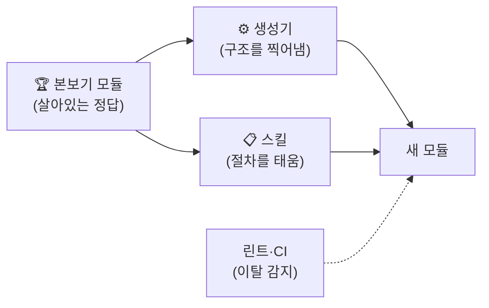

# 골든 패스 가이드 — 본보기 모듈 + 스킬 체계

> **Type:** Guide (Team Dev Mode Playbook의 별책)
> **대상:** 공통 개발자(설계·구축) + 개발자(사용법 이해)
> **위치:** 공통 개발자 가이드 Day 1~5(골격) **이후, 팀 착수 전**에 하는 일
> **근거:** Spotify/Netflix의 Golden Path 실천 + Anthropic 공식 스킬 작성 가이드 + 팀 단위 스킬 운영 실사례 조사 (출처는 각 절에)

---

## 0. 개념 — 왜 "본보기 하나"가 문서 열 장보다 센가

**골든 패스 = "우리 팀은 이렇게 만든다"의 정석을, 설명 문서가 아니라 *따라 하기 가장 쉬운 실물*로 제공하는 것.**
Spotify가 팀마다 제각각 만드는 문제("소문 기반 개발" — 어떻게 하는지 옆사람한테 물어봐야 아는 상태)를 풀려고 만든 방식이고, Netflix는 "모범 사례를 체크리스트가 아니라 **기본값**으로" 만들었다.

우리 버전은 3종 세트다:



| 요소 | 역할 |
| --- | --- |
| **본보기 모듈** | 진짜 기능 하나를 공통 개발자가 끝까지 완성한 것 — 모두가 "이걸 보고 베낀다" |
| **생성기** (`npm run gen:module`) | 본보기의 구조를 이름만 바꿔 찍어냄 — 손으로 베끼다 생기는 변형 차단 |
| **스킬** (`/dev` 등) | "이거 해줘, 저거 해줘"가 아니라 정해진 절차로 AI가 일하게 함 |

> **핵심 통찰 (조사 3갈래가 수렴한 결론):** 본보기가 권위를 유지하는 유일한 조건은 **"따르는 것이 가장 저항이 적은 길"일 때**다. 생성기가 구조를 찍고 → 린트가 위반을 즉시 잡고 → 스킬·CLAUDE.md가 AI에게 패턴을 재생산시킨다. 이 셋이 없으면 **AI의 생산 속도가 곧 발산(제각각) 속도**가 된다 — 실제로 10만 줄 monorepo에서 AI에게 말로만 패턴을 설명하다 "같은 패턴의 변종이 수십 개" 생긴 실증 사례가 있다.

---

## 1. 공통 개발자의 구축 순서 (Day 5 이후)

| 순서 | 만드는 것 | 완료 기준 |
| --- | --- | --- |
| 1 | (Day 1~5의 골격 — walking skeleton) | 완료됨 |
| 2 | **본보기 모듈 1개** — 아래 §2 체크리스트 전부 | 공통 개발자 본인이 그 기능을 실제로 화면에서 씀 |
| 3 | **생성기** — 본보기에서 템플릿 추출 (§3) | `npm run gen:module test-x` → 빌드·테스트 통과하는 빈 모듈이 나옴 |
| 4 | **스킬 세트** (§4 — 최신 목록의 정본은 킷 스킬 파일·repo README 표) | `/dev`로 본보기 모듈의 작은 기능 하나를 처음부터 끝까지 |
| 5 | **첫 팔로워와 공동 검증** | ★두 번째 모듈은 **다른 개발자가** 본보기를 따라 만든다. 그 사람의 **모든 질문 = 본보기·문서의 결함**으로 취급해 즉시 보완 |

> 5번이 골든 패스 실천의 정수다(Jellyfish·Spotify 공통 권고). 공통 개발자 혼자 "완벽하다" 판단하지 말고, 첫 사용자를 붙여 막히는 곳을 전부 수확한 뒤에 나머지 팀을 태운다. Spotify는 신입에게 튜토리얼을 그대로 따라 하게 시켜 썩은 부분을 찾는다 — "맹점이 없는 사람"이 최고의 검증자.

**⚠️ 본보기는 "예제용 가짜"가 아니라 실제 서비스될 기능이어야 한다.** 가짜 예제는 아무도 유지보수하지 않아 반드시 썩는다. 4개 모듈 중 가장 대표적인(CRUD가 다 있는) 것을 공통 개발자가 맡아 본보기를 겸하게 하라.

---

## 2. 본보기 모듈 체크리스트 — 이게 다 들어 있어야 "베낄 가치"가 있다

수직 슬라이스(화면+API+DB) 참조 구현들의 공통 구성을 종합한 목록:

**화면 (3원형 — 대부분의 화면은 이 셋의 변형)**
- [ ] 목록 화면: 페이지네이션 + 검색/필터 + 빈 상태(0건일 때)
- [ ] 상세 화면
- [ ] 작성·수정 폼: 입력 검증 + 에러 표시 + 저장 중 상태(즉시 반응 UX)

**API**
- [ ] 라우트 명명 규약 + 입력 검증 + **팀 표준 에러 응답 형식**(envelope)
- [ ] 권한 체크 — `shared/auth`를 실제로 사용
- [ ] **실패 경로 포함**: 검증 실패·권한 없음·404 (해피패스만 있는 본보기는 반쪽)

**DB**
- [ ] `schema.ts` + 마이그레이션 + 멱등 시드

**테스트 (층마다 최소 1개 — "이 층은 이렇게 테스트한다"의 견본)**
- [ ] 도메인 로직 단위 테스트 / API 통합 테스트 / 화면 테스트 1개

**연결**
- [ ] shared의 공통 컴포넌트(버튼·모달·레이아웃)와 DB 클라이언트를 **실제로 사용** — 본보기가 곧 shared의 사용설명서
- [ ] `index.ts` 공개 인터페이스는 최소로 (나머지는 비공개)
- [ ] **모듈 README**: "복사할 것 / 이름 바꿀 것 / 지울 것" 3줄 안내
- [ ] **본보기도 docs 요구사항에 1절을 가진다** — "구현 전 docs를 읽어라" 규칙의 사각을 만들지 않기 위해 (드라이런 발견: 본보기만 정본 없는 코드가 됨). `.claude/rules/module-<본보기>.md`도 채워서 소유자 rule의 견본이 되게
- [ ] **생성기 산출물 점검**: 생성된 README가 본보기 문구의 단순 치환(거짓 문서)이 아니라 소유자 기입 템플릿인지, 스캐폴드 라우트가 주석 처리돼 있는지(스펙에 없는 기능이 기본 활성이면 안 됨)

---

## 3. 생성기 — 본보기를 템플릿으로 찍어내기

- **도구: Plop 또는 Hygen** (단일 repo 폴더 구조엔 이거면 충분 — Nx 생성기는 우리 규모에 과잉이라는 게 2026 비교 글들의 공통 결론).
- **방식**: 본보기 모듈에서 템플릿을 추출하고 `{{name}}` 치환자만 심는다. "본보기 → 템플릿 → 새 모듈"이라 본보기가 바뀌면 템플릿도 같이 고친다(둘이 어긋나면 생성기가 거짓말을 하게 됨).
- **생성기가 마무리까지**: 모듈 자리에 "아직 생성 전" 예약 README를 두는 구조라면 생성기가 그것을 **자동 제거**해야 한다 (드라이런 실증: 안 지우면 팀원마다 처리 방식이 갈린다). 테스트 러너의 대상 지정은 디렉터리 인자보다 **글롭**(`node --test "src/**/*.test.js"` 류)이 환경 간 이식성이 좋다.
- **★패턴 헤더**: 템플릿 파일 상단에 규칙 주석을 심는다 — 생성 직후 AI가 편집할 때 이 주석이 조향한다(실증된 기법):

```ts
// [팀 규칙] 이 파일의 라우트는 반드시 shared/api의 defineRoute()로 정의한다.
// [팀 규칙] 에러는 직접 throw하지 말고 shared/api의 ApiError를 쓴다.
```

- **분업 원칙**: "재현성은 생성기가, 맥락 이해는 AI가" — 생성기가 구조·이름·배선을 확정하고, AI는 그 안에서 비즈니스 로직만 채운다.

---

## 4. 스킬 체계 — "이거 해줘 저거 해줘"를 절차로 바꾸기

### 4.1 팀 스킬 목록 (현재 18종: 13 개발 + 5 공통 개발자 — 아래 표는 초기 스냅샷이라 일부가 빠졌을 수 있다. **최신 목록·설명의 정본 = repo README §4 표.** 최소로 시작해 실제 필요가 생긴 것만 추가된 결과)

| 스킬 | 하는 일 | 사람 게이트 |
| --- | --- | --- |
| `/start` | 튜토리얼·길잡이 — 역할(개발자/공통 개발자/기획·검수)별로 환경·구축 상태를 진단해 다음 한 걸음 안내 (첫날·막막할 때. AI가 "뭐부터 해?"에 자동 실행) | 없음 (안내만) |
| `/todo` | 내 카드·멘션 브리핑 | 착수 선택 |
| `/card <한 줄>` | 카드 등록 — 양식(정본 참조·수용 기준·검수 방법)대로. 가장 잦은 자유 지시("카드로 등록해줘")를 절차로 승격 | 없음 (필드 못 채울 때만 질문) |
| **`/dev <카드>`** | 기능 개발 전체 파이프라인 (아래 4.2) | 스펙 승인 · 계획 go |
| **`/fix <카드>`** | 작은 수정용 경량판 — 스펙·계획 단계 생략, 바로 구현→테스트→검증 | 없음 |
| `/inspect <카드>` | **화면 검사 묶음** — 정적·인터랙션·이상 입력·반응형·넘침을 한 번에 (하네스 `npm run inspect` 있으면 실행, 없으면 수동 배터리). "0건=완료"가 아니라 "검사 N종 소진"으로 보고 | 없음 (검사) |
| `/done <카드>` | 마무리 루틴 (화면 확인 단계가 /inspect 를 사용) | 없음 (CI가 게이트) |
| **`/module <이름>`** | 생성기 실행 + 본보기 읽기 안내 (모듈 신설 시 1회) | 없음 |
| `/docs <파일>` (웹 직접 커밋이면 인자 없이) | 받은 문서를 정본(docs/) 배치 + STEP digest·진행지도 갱신 | 배치 확인 |
| `/change <요약>` | 요구사항 변경의 영향 분석 + 카드 정리(신규/수정/무효) | 실행 확인 |
| `/log <대상>` | 변경 이력 조회 — 누가 언제 무엇을 왜 | 없음 (조회) |

> `/fix`가 있어야 하는 이유: 스펙 주도 프레임워크들(spec-kit·BMAD 등)의 공통 비판이 **"4시간짜리 버그 수정에 기획서를 쓰게 한다"**는 과잉 절차다. 큰 기능만 `/dev`, 작은 건 `/fix` — "실패 비용이 클수록 게이트를 엄격히, 변경 속도가 중요할수록 절차를 가볍게".

> **운영 원칙 — 일은 스킬로만 진입한다** (건별 자연어 지시로 진행하지 않는다 — 그래야 전원이 같은 절차를 탄다). 이를 위해 스킬은 두 등급으로 설계돼 있다: **자동 실행 가능**(/start /todo /card /log /inspect /ui, 6종 — 실물 기준)은 AI가 자연어 지시를 받아 *스스로 실행 가능* — "카드로 등록해줘"라고 말해도 자동으로 스킬 절차를 탄다. **사람 입력 전용**(`disable-model-invocation: true` — /dev /fix /done /module /docs /change /metrics /design /scaffold /setup-gitlab /assign-module 등 — 정확한 실물은 각 스킬 frontmatter)은 머지·구현처럼 상태를 크게 바꾸는 절차라 사람의 명시적 명령이 트리거여야 하고, AI가 절차를 임의로 흉내 내는 것은 CLAUDE.md가 금지한다. (/adr은 /dev·/change 절차 중 AI가 이어 실행 가능.) 자연어는 질문·탐색·장애 진단에만 남는다.

### 4.2 `/dev` 파이프라인


- **사람 게이트는 딱 2개** (스펙 승인·계획 go) — 그 사이는 연속 실행. 성공 사례들의 공통 교훈: *"'계속할까요?' 남발이 시간을 죽인다. 게이트는 명시된 곳에만, 나머지는 끝까지."*
- docs/의 요구사항이 이미 충분하면 스펙 단계는 "이렇게 이해했다" 확인으로 축소된다 — 우리 구조(기획자가 docs 작성)에선 대부분 이 경로.
- 구현 단계의 첫 지시는 항상 **"본보기 모듈을 먼저 읽어라"** — "가장 가까운 기존 예를 템플릿으로 삼는" 것이 문서 설명보다 신뢰성이 높다는 게 스캐폴딩 스킬들의 공통 설계.

### 4.3 스킬 파일 구조 (Anthropic 공식 작성 가이드 반영)

```
.claude/skills/dev/
├── SKILL.md              # 500줄 이하(공식 상한), disable-model-invocation: true,
│                         # arguments: [issue], allowed-tools: Bash(glab *) Bash(npm *)
│                         # 첫머리: !`glab issue view $issue`  ← 이슈 본문 자동 주입
├── checklist.md          # AI가 응답에 복사해 체크해가는 진행표 (공식 패턴)
└── references/
    ├── exemplar.md       # "src/modules/<본보기>를 먼저 읽어라" + 핵심 코드 형태
    └── spec-template.md  # 스펙 양식: 맥락 / 데이터 계약 / 실패 모드 / 범위 밖
```

**작성 규칙 (조사에서 수렴된 것):**
- **자유도를 단계별로 조절**: 생성기 실행 단계는 저자유도("정확히 이 명령만 실행, 수정 금지") / 구현 단계는 고자유도(본보기 + 원칙 제시). 공식 가이드의 "degrees of freedom" 원칙.
- **"권장(prefer)"이 아니라 "금지(Never)·필수(MUST)"로** — "prefer는 예외를 부른다"가 실사례의 교훈.
- 마지막에 **❌ 금지 목록**을 명시하되, 가능하면 **"핑계 + 반박" 쌍의 표**로 쓴다 — AI가 단계를 건너뛸 때 실제로 대는 핑계("이건 단순해서 스펙 불필요", "테스트는 나중에")를 미리 반박해 두는 것이 금지 나열보다 준수율이 높다 (agent-skills의 Common Rationalizations 표준절 — `evidence/agent-skills-analysis.md` §3(배포 `_reference/` 기준). 킷의 /dev·/done에 적용됨).
- 스펙 확인 단계에는 **가정 표면화 형식**을 넣는다: "가정: 1)…2)…3)… — 고쳐주거나, 이대로 진행" — 질문이 없어도 가정은 드러내게 (같은 분석 §4).
- 긴 내용은 참조 파일로 (progressive disclosure) — 참조는 SKILL.md에서 **1단계 깊이까지만**(더 깊으면 AI가 일부만 읽음).
- 스킬을 다듬는 방법: **사람이 교정한 것을 그때그때 SKILL.md에 반영** — 지적 하나 = 스킬 개선 하나.

### 4.4 안티패턴 (하지 말 것)

| 안티패턴 | 처방 |
| --- | --- |
| 처음부터 스킬 수십 개 | **핵심 세트로 시작.** "같은 지시를 세 번 반복하면 그때 스킬로" — 마찰이 실제로 생긴 것만 추가 (현재 세트도 이 원칙으로 자란 결과 — /card 는 "카드로 등록해줘"가 가장 잦은 자유 지시라, /start 는 "뭘 해야 할지 모르는 진입"이 절차 밖이라 승격) |
| 스킬 하나가 500줄 초과 | 참조 파일로 분리 — 비대한 스킬은 오히려 준수율을 떨어뜨림 |
| 스킬로 강제하려 함 | 스킬은 권고 층 — 반드시 지켜야 하는 건 훅·CI로 (예: 스펙 참조 없이 소스 수정 시 차단하는 PreToolUse 게이트 사례 있음) |
| 전면 스펙주의 | 모든 작업에 스펙·계획을 요구하면 팀이 절차를 우회하기 시작 — `/fix` 탈출구 유지 |
| 사람 게이트 제거 | 성공 사례 전부가 스펙 승인·go 게이트는 남김 — "AI가 스스로 착수 결정"은 우리 원칙과도 어긋남 |

---

## 5. 시간이 지나도 안 무너지게

| 층 | 장치 |
| --- | --- |
| 경계 | eslint-plugin-boundaries / dependency-cruiser (기존 계획 그대로) — "모듈은 자신과 shared만 import" |
| 구조 | 각 모듈 폴더가 본보기의 필수 파일 세트를 갖췄는지 검사하는 작은 스크립트 → CI (구조 이탈은 import 린트로 못 잡음) |
| 사람 | 새 팀원 합류 시 **첫 과제 = 본보기 튜토리얼을 그대로 따라 하기** — 썩은 곳을 가장 잘 찾는 검증자 (Spotify 방식) |
| 갱신 | 패턴을 바꾸기로 했으면 **본보기를 먼저 고치고 공지** — 본보기·템플릿·스킬이 함께 움직여야 "늙은 예제" 문제가 안 생긴다 |
| 스킬 | 스킬이 10종 이상으로 자라면 **설명·트리거 충돌을 기계로 검사** (서로 트리거를 잠식하기 시작함) — agent-skills의 evals Tier 2 스크립트(MIT)를 가져다 쓰면 됨 (`evidence/agent-skills-analysis.md` §6(배포 `_reference/` 기준)). **현재 18종** — 단 충돌이 문제 되는 건 *AI가 자동 실행할 수 있는* 스킬 사이인데 그건 **6종**(/start /todo /log /card /inspect + /ui — 단 /ui는 사실상 `/dev`가 명시 호출이라 자연어 트리거 충돌면은 좁다)이고, 인접쌍은 /start↔/todo("다음 작업?" — /start가 /todo로 이어줘 무해)뿐이다. **다음 자동 실행 스킬이 추가되는 시점에 evals 도입** |

## 6. 과축조 경계 (공통 개발자가 반드시 읽을 것)

- **Thinnest Viable Platform**: 팀을 가속하는 **최소한**만 만든다. shared 컴포넌트를 미리 만들어두지 말 것 — **2개 이상 모듈이 실제로 필요로 할 때 추출**한다 (Playbook §5의 승격 기준과 동일).
- 본보기 모듈은 **며칠 안에** 배포 가능해야 한다. 몇 주가 걸리고 있다면 너무 많이 만들고 있는 것 (walking skeleton 원칙).
- 골든 패스의 실패 요인 1위는 과축조·경직(우회로가 없어서 팀이 포크함): 정당한 예외는 허용하되 "왜 벗어났는지"를 기록하게 한다.

---

**출처(핵심만):** Spotify Golden Paths(engineering.atspotify.com) · Jellyfish Golden Paths 구축 가이드 · incident.io Pattern Parties · Milan Jovanović 수직 슬라이스 · Anthropic 공식 스킬 문서(code.claude.com/docs/en/skills) + Agent Skills 엔지니어링 블로그 · obra/superpowers(브레인스톰→계획→구현→리뷰 스킬 파이프라인) · Josh McDonald 소규모 팀 spec-driven 운영기 · spec-kit/BMAD/OpenSpec 비교 리뷰 · Vuong Ngo "Scaffolding + AI" · codewithmukesh 스캐폴드 스킬 · Team Topologies TVP.
