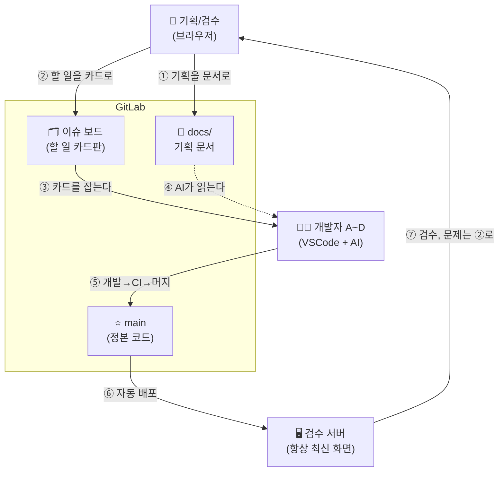
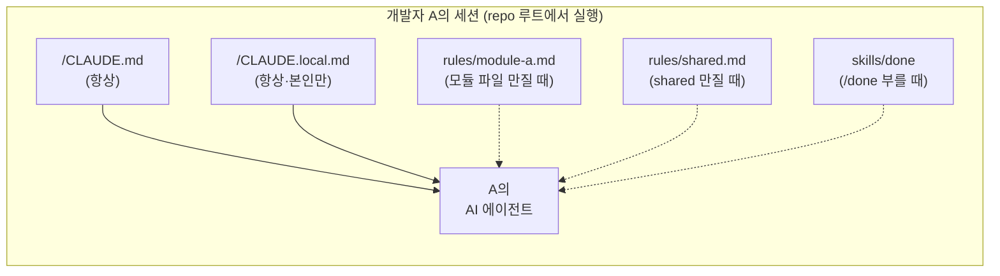
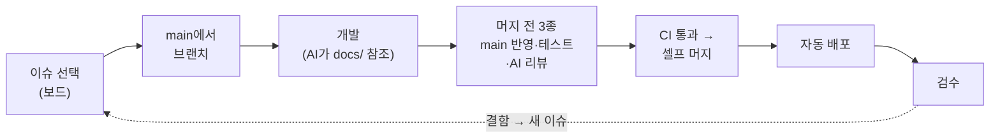
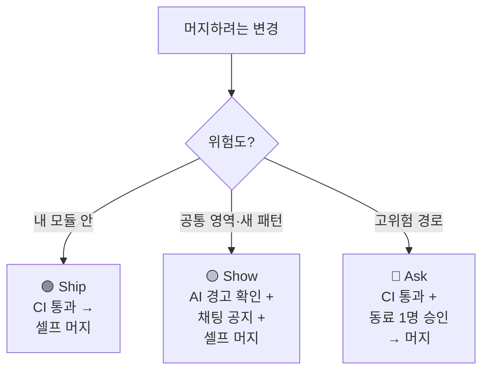
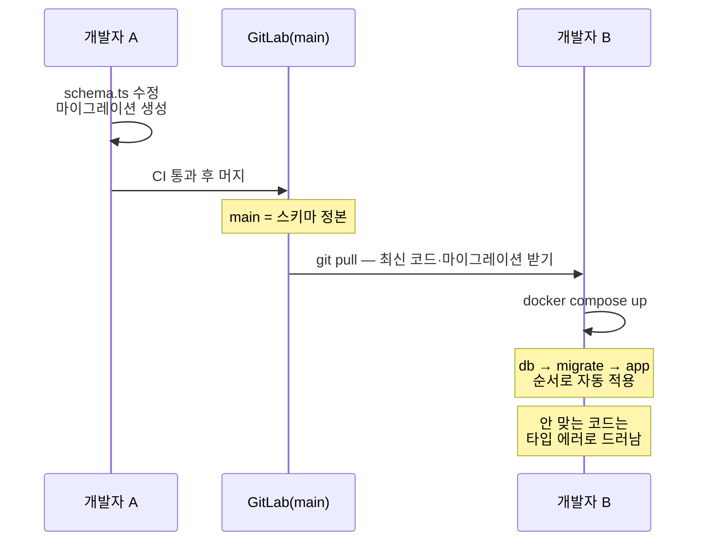
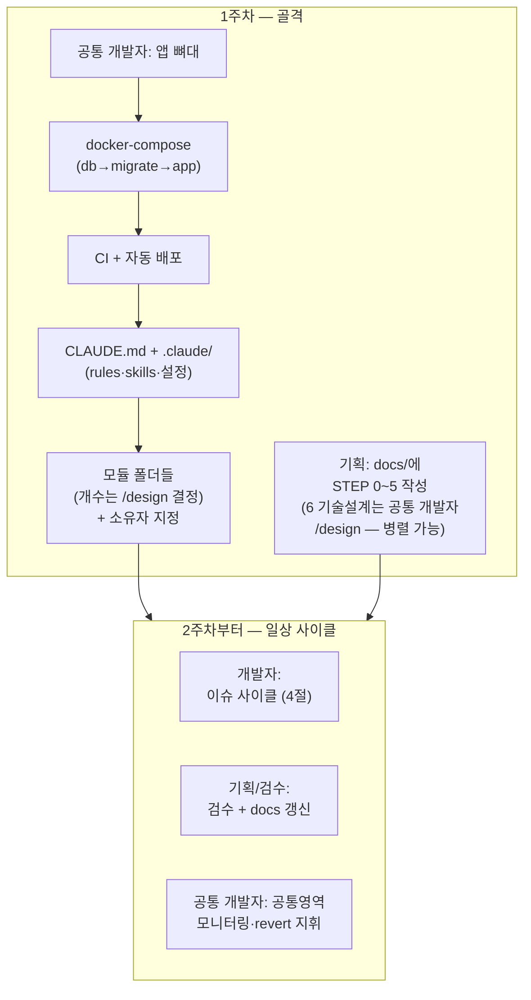

# AI Working Framework — Playbook: Team Dev Mode (소규모 팀 + AI 에이전트 개발)

> **Type:** Playbook (Framework 확장)
> **Base:** AI Working Framework v1.0
> **적용 대상:** 개발자 4~5인 + 기획/검수 1인(비개발자)이 각자 AI 에이전트(Claude Code 등)를 사용하여 하나의 앱을 함께 개발하는 프로젝트
> **적용 구간:** 주로 STEP 7(개발) ~ STEP 10(운영). STEP 0~6 산출물은 `docs/`에 두고 기획 담당이 관리한다.
> **저장소:** GitLab 기준 (9절). GitHub도 동일 구조로 적용 가능.

> 이 Playbook은 Framework의 원칙을 유지하되, **두 곳을 명시적으로 조정한다** (사유는 11절에 기록).
> ① 개발 구간의 STEP 7→8→9는 문서 단위 순차 진행이 아니라 **이슈 단위 미니 사이클**로 돈다.
> ② Human Review는 전 산출물이 아니라 **기계 검토(CI + AI 리뷰)가 머지 전을, 사람(검수)이 배포 후를** 맡는 구조로 배치한다 — 머지를 기다리게 하는 사람 승인 관문은 **고위험 경로(Ask)에만** 두고, 대다수는 셀프 머지한다.
> ⚠️ **대체됨(2026-08-14)**: "고위험 = 동료 1명 승인(Ask)"은 옛 체계 — 현행 고위험은 **경고 레인**(AI 경고 리뷰+증적 3종, 셀프 승인 표준·동료 승인 선택). 정본 = 킷(`3-starter-kit`) CLAUDE.md '머지 등급' 절(2026-08-07 오너 결정).

---

## 0. 누가 무엇을 읽나 — 전부 읽을 필요 없다

| 역할 | 꼭 읽을 것 | 참고 |
| --- | --- | --- |
| 📘 기획/검수 (비개발자) | [GitLab 실전 가이드](AI_Working_Framework_Guide_GitLab.md) 하나 (10분) | 나머지는 안 읽어도 됨 |
| 👩‍💻 개발자 | 이 문서 2절(전체 그림) + GitLab 가이드 3절(개발자 절) | 규칙은 CLAUDE.md가 AI에게 자동 적용되므로 외울 필요 없음 |
| 🛡️ 공통 개발자 | 이 문서 전체 + [공통 개발자 실전 가이드](AI_Working_Framework_Guide_Leader.md) | 설계를 이해해야 하는 유일한 사람 |

> 팀 소개 자리에서는 문서를 설명하지 말고 **파일럿 시연 한 번**(카드 등록 → "마무리해줘" → 자동 배포 → 검수요청 멘션)을 보여주는 것이 가장 효과적이다.

---

## 1. 이 모드가 해결하는 문제

여러 개발자가 각자 AI 에이전트를 쓰면 코드 생산 속도가 사람 팀보다 훨씬 빠르다.
그 속도에서 기존 방식(큰 브랜치 + 사람 리뷰 대기)은 두 가지로 무너진다.

| 문제 | 증상 |
| --- | --- |
| 충돌 | 오래 끈 브랜치끼리 대규모 머지 충돌, 같은 파일 동시 수정 |
| 병목 | 리뷰 대기가 AI의 생산 속도를 따라가지 못해 작업이 적체 |

**Team Dev Mode의 답:** 충돌은 **소유권 구조**로 예방하고, 리뷰는 **기계 관문**으로 대체하되 위험한 경로에만 사람을 남긴다.

---

## 2. 전체 그림 — 한 장으로 보는 협업 구조

### 2.1 GitLab이 처음이라면 — 우리가 쓰는 건 딱 4가지

GitLab은 "개발자용 복잡한 도구"처럼 보이지만, 이 프로젝트에서 쓰는 기능은 4가지뿐이다.

| 기능 | 쉽게 말하면 | 누가 쓰나 |
| --- | --- | --- |
| **저장소 (Repo)** | 코드와 문서가 들어 있는 **팀 공유 폴더**. 모든 변경이 "누가 언제 무엇을"까지 기록됨 | 전원 |
| **이슈 (Issue)** | **할 일 카드 한 장.** "게시판 목록 화면 만들기", "로그인 버튼이 안 눌림" 같은 작업·문제 하나 = 카드 하나. 담당자를 지정할 수 있음 | 전원 |
| **이슈 보드 (Board)** | 그 카드들을 붙여 놓은 **화이트보드.** `대기 → 진행 → 검수 → 완료` 열 사이로 카드를 옮김. **"지금 누가 뭘 하고 있나"가 이 화면 하나로 보임** | 전원 (주로 보는 용도) |
| **MR (Merge Request)** | 개발자가 "내 작업을 main(정본)에 합쳐주세요"라고 내는 요청. 자동 검사(CI)가 붙어서, **검사 통과 전엔 합치기 버튼이 안 눌림** | 개발자 |

> 비개발자 기준: **이슈 = 포스트잇, 보드 = 포스트잇 붙이는 벽.** 이 두 개만 알면 협업에 참여할 수 있다. MR·CI는 개발자 쪽 장치라 몰라도 된다.
> 🖱️ **어느 메뉴에서 어떻게 클릭하는지**는 별책 **[GitLab 실전 가이드](AI_Working_Framework_Guide_GitLab.md)** 에 카드 등록 → 개발 → 검수 → 완료까지 순서대로 정리되어 있다.

### 2.2 사람마다 "일하는 장소"가 다르다

같은 repo를 쓰지만, 각자 편한 문으로 들어간다. **개발자는 GitLab 웹사이트에서 문서 작업을 할 필요가 없고, 기획자는 프로그램 설치가 필요 없다.**

| 사람 | 주 작업 장소 | GitLab 웹사이트에서는 이것만 |
| --- | --- | --- |
| 👩‍💻 개발자 A~D | **자기 PC** (VSCode + Claude). `docs/` 문서도 repo 파일이므로 코드처럼 로컬에서 읽고 편집 | 이슈 카드 확인, MR 머지 버튼 |
| 📘 기획/검수 | **브라우저만(`Maintainer` 권한).** ① `docs/`를 웹에서 **읽고 직접 편집**(변경은 본인이 커밋·셀프 머지) ② 이슈 카드 관리 ③ 검수 서버 화면 사용 | 이것이 전부 (git·터미널·로컬 설치 불필요) |
| 🛡️ 공통 개발자 | 자기 PC + GitLab 설정 화면 | 프로젝트 설정, 공통 영역 변경 모니터링 |

> 핵심: `docs/` 폴더는 기획의 **정본**이자 곧 AI의 입력이다. 기획자는 브라우저로 **읽고 `docs/`는 직접 편집**한다(길 A — 개발자 병목 없이 본인이 반영·셀프 머지). 개발자(와 AI)는 그 정본을 로컬 파일로 읽어 구현한다. 비개발자는 `docs/`만 만지고 코드는 건드리지 않는다(안전장치: §7·GitLab 가이드 §8·`docs/adr/0001`).

### 2.3 일이 도는 순서 — ①부터 ⑦까지



각 단계의 뜻:

| 단계 | 풀어서 |
| --- | --- |
| ① | 기획/검수가 기획을 **`docs/` 에 직접 문서로 작성·수정**한다 (웹에서 직접 — §7). 이 문서가 곧 개발의 정본이다 |
| ② | 할 일·결함을 이슈 카드로 등록한다 (보드 열: 대기→진행→검수→완료) |
| ③ | 개발자가 대기 열의 카드 하나를 집는다 |
| ④ | 개발자의 AI가 `docs/`의 요구사항을 입력으로 읽는다 |
| ⑤ | 개발 → 자동 검사(CI) 통과 → 본인이 main에 합친다 (고위험 카드만 동료 1명 승인 후 — §5 Ask) |
| ⑥ | main에 합쳐지면 검수 서버로 자동 배포된다 (사람 손 안 탐) |
| ⑦ | **카드에 배정된 검수 담당**(비면 작성자 — 기획/검수 또는 다른 개발자)이 화면을 써보고, 문제는 다시 ②의 카드로 등록한다. 검수 전담자는 없다 |

> 이 ①~⑦이 하루에도 여러 번 도는 바퀴다. 포인트 세 가지:
> - **말로 전달하는 구간이 없다.** 기획은 문서(①)와 카드(②)로, 결함도 카드(⑦)로 — 채팅으로 전하면 흘러가고, AI에게도 닿지 않는다.
> - **합치기 전 품질은 기계(CI)가, 합쳐진 결과는 사람(검수)이** 본다. 역할이 겹치지 않는다.
> - 검수자는 개발자 PC나 브랜치를 볼 필요가 전혀 없다. **항상 검수 서버 하나만** 보면 된다.

---

## 3. 저장소 구조 — 파일 위치의 정본

기능(모듈) 하나의 **화면·API·DB 스키마를 한 폴더에** 모으고, 그 폴더를 한 사람이 소유한다.

```
our-app/                              ← GitLab repo 루트
│
├── CLAUDE.md                     🔵 팀 공통 규칙 — 전원의 AI가 매 세션 자동으로 읽음 (수정 = Show: 공지 후)
├── CLAUDE.local.md               🟡 개인 설정 — .gitignore 등록, 각자 자유 (커밋 안 됨)
├── AGENTS.md                         (선택) 다른 AI 도구 혼용 시의 정본 — CLAUDE.md 첫 줄이 @AGENTS.md 로 가져옴
│
├── .claude/                      🤖 팀 AI 설정 (전부 커밋 — clone + 신뢰 수락 1회면 전원 동일 세팅)
│   ├── settings.json                 권한 허용목록(git·glab·npm·docker) + 훅 등록 + 플러그인 활성화
│   ├── rules/                        ★경로별 규칙 — 그 경로 파일을 만질 때 자동 로드 (읽기·쓰기 모두)
│   │   ├── module-a.md               paths: src/modules/module-a/** — 모듈 A의 데이터·화면 규칙 (소유자 관리)
│   │   ├── module-b.md ~ module-d.md
│   │   ├── shared.md                 paths: src/shared/** — 공통 코드 규칙·변경 절차 (공통 개발자 관리)
│   │   ├── migrations.md             paths: db/migrations/** — 스키마 규칙
│   │   └── docs.md                   paths: docs/** — 문서 양식·용어 (기획 담당 관리)
│   ├── skills/                       팀 공용 절차 = 슬래시 명령 (부를 때만 로드) — 목록 정본은 repo README §4 표
│   │   ├── todo/ dev/ fix/ done/     브리핑 · 개발 · 작은수정 · 마무리
│   │   └── module/ docs/ change/ log/  모듈생성 · 문서수신 · 변경반영 · 이력조회
│   └── hooks/                        훅 스크립트 (경로 검사·설정변경 감사)
│
├── .gitattributes                    package-lock 충돌 안전판(`merge=binary` — 자동 머지 드라이버 금지, 8절)
├── .gitignore                        CLAUDE.local.md, .env 포함
├── .gitlab-ci.yml                    CI(테스트·검사) + main 자동 배포
├── docker-compose.yml                db → migrate → app 순서 기동 (5절)
├── package.json
│
├── docs/                         📘 기획/검수 담당 소유 (비개발자, 웹에서 편집 — 규칙은 .claude/rules/docs.md)
│   ├── 00_Project/ProjectCharter.md
│   ├── 03_Requirement/RequirementSpecification.md   ← 개발자 AI가 읽는 요구사항 정본
│   ├── 05_UIUX/
│   │   ├── UIUXDesign.md                  화면 목록·화면 흐름 (문서)
│   │   ├── screens/<화면이름>/            ← 화면별 시안 (HTML/CSS 권장, 이미지 가능 + notes.md)
│   │   └── assets/                        로고·아이콘·색상표 등 공통 디자인 자원
│   └── 06_Technical/TechnicalDesign.md
│       (폴더 번호 = Framework STEP 번호. 필요한 STEP만 만들면 된다)
│
├── src/
│   ├── shared/                   🛡️ 공통 개발자 소유 (변경 = Show — 규칙은 .claude/rules/shared.md)
│   │   ├── auth/                     로그인·세션·권한
│   │   ├── ui/                       공통 컴포넌트 (버튼·모달·레이아웃)
│   │   ├── db/                       DB 연결·클라이언트 (연결은 여기 한 곳뿐)
│   │   └── nav/                      메뉴·라우팅 뼈대 (모듈이 자신을 등록하는 방식)
│   │
│   └── modules/
│       ├── module-a/             👩‍💻 개발자 A 소유 — 이 기능의 전부가 이 안에 (규칙은 .claude/rules/module-a.md)
│       │   ├── index.ts          ⭐ 공개 인터페이스 — 다른 모듈은 이 파일만 import 가능
│       │   ├── ui/                   화면 (페이지·컴포넌트)
│       │   ├── api/                  서버 로직 (라우트·서비스)
│       │   ├── schema.ts             이 모듈의 테이블 정의 (스키마-as-코드, 5절)
│       │   └── tests/                이 모듈의 테스트
│       ├── module-b/                 (동일 구조, 개발자 B)
│       ├── module-c/                 (동일 구조, 개발자 C)
│       └── module-d/                 (동일 구조, 개발자 D)
│
└── db/
    └── migrations/               ⚠️ 전원 공용 — 파일명은 날짜시각 (5절)
        ├── 20260707_143005_create_module_a_tables.sql
        └── 20260708_091012_create_module_b_tables.sql
```

> ⚠️ **대체됨(2026-08-14)**: 위 구조도의 스킬·rules 열거(스킬 8종 등)는 작성 당시 예시 — 현행 목록 정본 = repo README(킷 `repo-README.md`) §4 표(**스킬 19종**).
> ⚠️ **대체됨(2026-08-14)**: 위 구조도 hooks의 '설정변경 감사'(ConfigChange 훅)는 **미구현·대체됨** — 현행 방어 = CI 게이트가 `CLAUDE.md`·`.claude/**` 변경에 발동(킷 `.gitlab-ci.yml`).

### 규칙·설정 파일 요약 — 무엇이 언제 적용되나

| 파일 | 언제 적용되나 | 누가 관리 | 커밋 |
| --- | --- | --- | --- |
| `/CLAUDE.md` | 매 세션 시작 시 항상 (팀 공통 규칙) | 공통 개발자 (변경은 Show) | ✅ |
| `/CLAUDE.local.md` | 매 세션, 본인 PC에서만 | 각자 | ❌ (.gitignore) |
| `.claude/rules/*.md` | 파일 상단 `paths:` 글롭에 맞는 파일을 **만질 때 자동** (읽기·쓰기 모두) | 각 영역 소유자 | ✅ |
| `.claude/skills/*` | `/명령`으로 부를 때만 (절차 정의) | 공통 개발자 + 팀 제안 | ✅ |
| `.claude/settings.json` | 항상 — 단 AI가 "읽는" 규칙이 아니라 **기계가 강제하는 설정**(권한·훅) | 공통 개발자 | ✅ |

### AI 에이전트에게 규칙이 로드되는 방식



> **★ 실행 위치 규칙: Claude는 항상 repo 루트에서 켠다.** 팀 설정(`.claude/settings.json`의 권한·훅)은 **켠 폴더의 것만 적용**되기 때문 — 모듈 폴더에서 켜면 팀 훅·권한이 통째로 빠진다.
> **왜 모듈 폴더 CLAUDE.md가 아니라 `.claude/rules/`인가:** 폴더 CLAUDE.md는 그 폴더 파일을 *읽을 때만* 로드된다 — 쓰기만 하는 세션엔 안 뜨고, 컨텍스트 압축 후 재주입도 안 된다. rules의 `paths:` 글롭은 읽기·쓰기 모두에서 트리거되고 실행 위치와도 무관해, 같은 목적을 구멍 없이 달성한다 (공식 문서 확인).
> 소유 규칙 3줄: **남의 모듈은 수정하지 않는다 · 다른 모듈은 `index.ts`(공개 인터페이스)만 import한다 · 공통 영역(shared/ 등) 변경은 AI 경고 확인 + 채팅 공지 후.**
> **모듈 간 연동**: 필요한 기능이 상대 `index.ts`에 없으면 소유자 앞으로 카드(원하는 시그니처 명시) → 소유자가 노출 → 이어서 개발. 두 모듈에 걸친 기능은 **인터페이스를 먼저 합의**하고 카드를 모듈별로 쪼개 병렬 진행 — 계약만 지키면 서로 기다리지 않는다.

---

## 4. 진행 — 이슈 단위 미니 사이클 (Framework 조정 ①)

STEP 0~6에서 확정된 요구사항·설계를 **이슈(작업 단위)로 분해**한 뒤, 개발 구간은 이슈마다 아래 사이클을 돈다.



- **Deliverable→Input 사슬은 유지된다.** 단위가 "STEP 문서 1개"에서 "이슈 1개"로 바뀔 뿐이다.
  이슈의 Input = `docs/`의 해당 요구사항, 이슈의 Deliverable = 머지된 코드 + 통과한 테스트.
- **이 사이클의 각 단계는 개발자의 AI가 대신 수행한다.** "이슈 #12 마무리해줘" 한마디면: 최신 main 합치기(남들의 코드·스키마 변경을 받아 **내 로컬 DB에 적용**까지) → 테스트 → AI 리뷰 → push → MR + auto-merge. 이 루틴은 팀 CLAUDE.md에 기록하고, 가능하면 **스크립트 하나**(예: `npm run ship`)로 만들어 AI가 그것을 실행하게 한다 — 순서 재구성 실수가 0이 되고, 사람이 직접 쳐도 같은 결과가 나온다.
- 브랜치 수명은 **반나절~이틀**. 길어지면 이슈를 쪼갠다. (작게 자주 머지가 리뷰 없는 방식의 핵심 안전장치)
- 되돌림(Return Loop)은 "검수 결함 이슈 → 개발"로 상시 동작한다.
- **개발 중 더 나은 방안을 발견해 스펙(요구사항·시안)과 다르게 만들 때**: 최악은 말없이 어긋난 채 머지하는 것 — 문서는 옛말, 구현은 딴말이 되어 다음 사람과 AI가 옛 문서로 일하게 된다. 규칙: **같은 MR에 docs 수정을 동봉 + 카드 댓글에 "스펙과 달라진 점·이유" + @기획자 멘션** (ship 루틴이 구현↔docs 불일치를 감지해 이 처리를 대신한다 — 개발자는 신경 쓸 것이 거의 없다). 기획자는 검수 때 화면과 문서 변경을 함께 보고 **승인하거나 되돌린다** — 구현이 문서를 자동으로 덮어쓰는 게 아니라, 문서 정본의 판단은 기획자 몫으로 남는다.

---

## 5. 품질 관문 — 위험도별 배치 (Framework 조정 ②, Ship/Show/Ask)

> ⚠️ **대체됨(2026-08-14)**: 이 절의 **Ask(동료 1명 승인) 체계 전체는 옛 설계**다. 현행: 고위험 = **경고 레인** — CI 통과 + AI 경고 리뷰 + 증적 3종 후 **본인이 게이트를 실행·머지**(셀프 승인 표준, 동료 승인 선택). 정본 = 킷(`3-starter-kit`) CLAUDE.md '머지 등급' 절(2026-08-07 오너 결정).
> ⚠️ **대체됨(2026-08-14)**: 아래 표의 "무료 티어는 규율, 유료는 승인 규칙으로 기계 강제"도 옛말 — 현행은 무료 티어에서도 **CI manual 잡(`high-risk-gate`)으로 기계 강제**된다(킷 `.gitlab-ci.yml`).

**대다수 변경은 사람 승인 없이 셀프 머지한다.** 바꾼 파일의 위치·위험도에 따라 세 등급으로 갈린다 — 대부분은 Ship, 공통 영역은 Show(알림만), **고위험 경로만 Ask(동료 1명 승인)**.



> "공통 영역" = `shared/` · 공용 테이블 · 팀 CLAUDE.md · 패키지 추가. "새 패턴" = 내 모듈이지만 전례 없는 방식을 처음 쓸 때.
> "고위험 경로" = 인증·인가·세션·비밀값 / 결제·과금성 / DB 마이그레이션 / shared 승격 / 라우팅·설정·lockfile 핫스팟.
> **Show의 공지는 알림이지 허락이 아니다** — 답을 기다리지 않고 머지한다. **Ask만 승인을 기다린다**(전담 승인자가 아니라 손 빈 동료 아무나 1명, 자기 승인 금지).
>
> ★**승인자 규칙 — 정본은 repo `CLAUDE.md` '머지 등급' 절**(2026-08-06 갱신분 반영):
> - **승인자는 개발자끼리 서로 — 공통 개발자는 승인자가 아니다**(개발자 1명뿐일 때만 예외). 공통 개발자에게 몰리면 그가 전담 리뷰어가 되어, 이 등급이 막으려던 병목 구조가 그대로 생긴다(2026-08-06 실측).
> - **셀프 승인은 증적 3종을 남길 때만 인정**(동료 승인 불가: 혼자 골격 작업·전원 부재·긴급): ①fresh-context AI 리뷰(`/code-review`, 새 입력 표면이면 `/security-review`도) ②본인이 diff 직접 확인 ③카드 댓글에 "셀프 승인"+사유+리뷰 결과+확인한 diff 범위. **셋이 다 남아야 승인 — 조용히 머지 = 무승인.** 동료가 있으면 동료 승인이 우선이고, 셀프가 반복되면 `/metrics` 주간 점검에서 센다.

| 등급 | 관문 | 강제 방식 |
| --- | --- | --- |
| Ship | CI(빌드+테스트+타입+모듈 경계검사 + 보안·중복·변조 스캔) | GitLab "Pipelines must succeed" (기계) |
| Show | Ship과 동일 + **AI 경고 확인 + 채팅 공지(사전)** — 승인 대기 없음 | AI의 경로 검사(CLAUDE.md 규칙 + pre-push 훅) + CI 경로감지 경고(9절) |
| Ask | Ship과 동일 + **동료 1명 MR 승인** | `고위험` 라벨 + `/done`이 auto-merge 대신 승인 요청(무료 티어는 규율, 유료는 승인 규칙으로 기계 강제) |

> **왜 Ask를 두는가**(원래 2등급이었다가 추가): 전면 무리뷰의 성공 선례가 외부에 없고, 고위험 경로만은 사람 확인을 두라는 게 증거의 일치된 권고다(Anthropic·Google도 사람 리뷰층 유지, 무리뷰와 결함률 급증의 상관). 다만 대다수 카드의 속도를 지키려 **고위험에만** 한정한다. 근거: `4-reference/team-ai-collab-evidence.md`(프레임워크 홈 — 킷에 동봉되지 않는다) §2-1.

> ⚠️ **대체됨(2026-08-14)**: 아래 "공통 영역 = 경고 + 전 모듈 테스트 확대(차단 아님)"는 옛 설계 — 현행 `src/shared/**` 변경은 **차단형 수동 게이트**(킷 `.gitlab-ci.yml` `high-risk-gate`)를 거친다.

- 공통 영역을 지키는 건 승인이 아니라 **검사다**: 공통 영역 변경 MR은 CI가 **전 모듈의 테스트·타입 검사**를 돌려 파급을 기계로 확인한다 (모듈만 바꾼 MR보다 검사 범위가 넓어짐).
- **shared/는 "추가는 자유, 삭제·변경은 기계가 잡는다"**: 공개 API 스냅샷 테스트를 둔다 — shared/가 노출하는 함수·컴포넌트 시그니처가 *없어지거나 바뀌면* CI 실패. 의도적 변경이면 스냅샷 갱신 커밋으로 명시(= 파괴적 변경이 조용히 못 들어감). 승인 없는 셀프 머지가 안전한 것은 이 additive 규율이 전제다 — revert가 항상 가능한 것도 마찬가지.
- **요구사항이 '추가'가 아니라 '변경'일 때**: ① 가능하면 새 버전을 옆에 추가 → 호출부 이전 → 구버전 제거 (확장→이전→축소, 스키마와 같은 원리). ② 한 번에 바꿔야 하면 **바꾸는 사람이 같은 MR에서 전 모듈의 호출부를 함께 수정**한다 ("깨뜨린 사람이 고친다" — 이 기계적 호출부 수정만 '남의 모듈 수정 금지'의 예외, 해당 소유자 @멘션 필수). 조건: 스냅샷 갱신 커밋 + 전 모듈 테스트 통과.
- **shared 승격 기준**: **2개 이상 모듈이 실제로 쓸 때만** shared에 올린다. 하나만 쓰면 자기 모듈 안에 둔다 — 전원이 고칠 수 있는 공간일수록 *넣는* 기준이 엄격해야 일관성이 유지된다(승인 없는 shared의 숨은 비용 = 비슷한 컴포넌트 중복·스타일 표류).
- AI 리뷰(`/code-review` 등)는 **머지 전 필수 루틴**이되 차단 관문이 아닌 보조 — 차단은 CI가 한다.
- **main이 깨지면 모든 것보다 우선:** 즉시 고치거나, 못 고치면 그 머지를 되돌린다(revert). 원인 분석은 되돌린 다음에.
- **랜덤 실패(flaky) 테스트는 발견 즉시 격리:** 같은 코드인데 어떤 땐 통과·어떤 땐 실패하는 테스트 하나가 **전원의 머지를 막는다** (CI 통과가 머지 조건이므로). 발견하면 그 자리에서 skip 처리 + 고치는 이슈 등록 — "다시 돌리면 통과하니까"로 넘기지 않는다.

### 개발자 체감 — "머지 버튼 누르는 사람"은 따로 없다

Ship 등급(대부분의 작업)은 개발자 본인이 터미널에서 **명령 한 번으로** 끝낸다.

1. **`/done 12`** (팀 스킬) → 머지 전 3종 실행 → push → MR 생성 + **auto-merge**("파이프라인 통과 시 자동 머지") 설정까지 한 번에. 스킬에 `disable-model-invocation`(사람만 호출 가능)이 걸려 있어 **AI가 "코드가 다 된 것 같으니" 스스로 머지를 결정하는 일이 구조적으로 불가능**하고, 도구 사전승인(`allowed-tools`) 덕에 실행 중 권한 프롬프트도 없다
2. CI가 초록불이 되는 순간 **사람 손 없이 자동으로 main에 합쳐지고 배포**된다 — 기다리는 사람도, 승인하는 사람도 없다

| 층 | 역할 | 구현 |
| --- | --- | --- |
| 로컬 경고 (1차, 빠름) | push 전에 변경 경로를 검사 — shared/·남의 모듈·공용 테이블을 건드렸으면 **심각도와 함께 경고**하고, 공지했는지 확인받음 | **Claude Code `PreToolUse` 훅**(킷의 `check-push.sh` — repo에 커밋해 전원 상속). ⚠️**이 스크립트를 husky pre-push에 그대로 붙이면 무음 통과한다**(Claude Code의 JSON 입력 전용 — husky 입력·빈 stdin 모두 출력 없이 exit 0, 2026-08-03 실측). git 훅으로도 걸려면 **별도 래퍼**를 만들어야 한다. 래퍼가 없으면 이 층은 **대화형 Claude Code 세션에서만** 작동하는 리마인더이고, 진짜 백스톱은 아래 CI 경로감지다 |
| 서버 강제 (2차, 최종) | 깨진 코드·경계 위반 차단 + 공통 영역 변경 경고 표시 | CI + 보호 브랜치 — 로컬 훅은 각자 환경이라 우회될 수 있으므로 **신뢰의 최종선은 서버** |

> main **직접 push**를 열지 않는 이유: 직접 push면 CI가 사후 검사가 되어, 깨진 코드가 이미 main에 들어가 전원에게 전파(pull·자동배포)된 뒤에야 발견된다. MR은 사람 승인 장치가 아니라 **기계 검사가 main보다 먼저 서게 하는 지점**이며, auto-merge를 쓰면 직접 push와 체감 차이가 없다.

### 소유로 못 막는 공용 파일 — package-lock.json 충돌

패키지 잠금 파일(package-lock.json)은 전원이 공유하는 **자동 생성 파일**이라, 두 명이 동시에 패키지를 추가하면 모듈을 나눠도 충돌한다. 규칙 세 줄로 끝난다:

| 규칙 | 내용 |
| --- | --- |
| ① 손으로 고치지 않는다 | 충돌 마커를 수동 편집하는 것은 오류 유발 — `package.json` 쪽 충돌만 해결한 뒤 **`npm install --package-lock-only`** 를 실행하면 npm이 양쪽 변경을 자동 병합해 잠금 파일을 재생성한다 |
| ② 안전판을 repo에 커밋 (⚠️자동 머지 드라이버가 아니다) | `.gitattributes`에 **`package-lock.json merge=binary`** 한 줄. 이러면 git이 lock을 자동 병합하지 *않고* **시끄러운 충돌**로 세워서 ①의 재생성 경로로 몰아준다 — 전원이 같은 동작을 상속. ⛔**`npm-merge-driver`(6년 미유지)든 자체 스크립트든 자동 머지 드라이버는 두지 마라**: git merge 도중 `package.json`이 해결되기 *전에* lock을 재생성해 **한쪽 의존성이 조용히 누락된 valid-but-wrong lock**을 만든다(2026-07-27 파일럿 실측). 킷·`/scaffold`·공통 개발자 가이드가 모두 이 방식으로 통일돼 있다 |
| ③ AI 루틴에 내장 | ship 루틴(4절)에 "잠금 파일 충돌 시 ①로 재생성"을 포함 — 개발자는 충돌을 인지할 필요도 없어진다. 패키지 추가 자체는 Show 등급(공지) |

> Framework와의 정합: "AI가 생성하고 사람이 검토한다"(Principle 3)는 유지된다.
> 검토 주체가 위험도에 따라 **기계(CI) → AI 리뷰 → 사람** 순으로 배치될 뿐이며, 최종 책임은 여전히 사람(모듈 소유자)에게 있다.

---

## 6. 스키마 전파 — "pull 받고 켜면 내 DB가 최신"

한 사람의 테이블 변경이 팀원 전체 환경에 **자동으로** 적용되게 처음부터 배선한다.



| 장치 | 내용 |
| --- | --- |
| 자동 적용 | docker-compose에 마이그레이션 전용 서비스: **db → migrate → app** 순서 기동. `git pull` + `compose up`이면 끝 |
| 파일명 | 순번(001, 002…) 금지, **날짜시각 초 단위**(`20260707_143005_create_x.sql`) — ★분 단위(HHMM)로는 부족: 드라이런에서 AI 개발자 둘이 실제로 같은 분에 파일을 만들어 적용 순서가 우연(사전순)에 맡겨졌다 |
| 타입 동기화 | 스키마를 코드로 관리(각 모듈의 `schema.ts`, Prisma/Drizzle 등) — **남의 스키마 변경이 내 코드를 깨면 컴파일 에러**로 드러남 (CI가 잡음) |
| CI 검증 | 매 MR마다 빈 DB에 전체 마이그레이션 적용 → 실패하면 머지 불가 |
| 공용 테이블 | 자기 모듈 테이블은 자유(추가 위주). users 등 공용 테이블의 이름변경·삭제는 **확장→이전→축소** 3단계 + Show(공지) |
| 시드(기준 데이터) | **시드도 코드로**: 각 모듈 폴더에 시드 파일(`modules/*/seed`) — **스키마를 바꾸는 MR에 시드 갱신을 같이 포함**한다 (AI의 ship 루틴에 내장 — 스키마 변경을 감지하면 시드도 함께 갱신). 시드는 **멱등**(있으면 갱신·없으면 생성)으로 작성해 몇 번 적용돼도 안전하게 |

### 잘못된 스키마 되돌리기 — down 자동 실행이 아니라 "앞으로 고치기"

"revert하면 원복(down) 마이그레이션이 자동으로 돌게 하면 되지 않나" 싶지만, **업계 표준은 반대(forward-only, 앞으로만)** 다. 이유: ①컬럼·테이블 삭제를 되돌려도 **데이터는 돌아오지 않고** ②down이 중간에 실패하면 DB가 어정쩡한 상태로 남으며 ③팀원마다 적용 상태가 달라 같은 down이 사람마다 다른 결과를 낸다. 대신:

| 상황 | 처방 |
| --- | --- |
| 머지된 스키마가 잘못됨 | down이 아니라 **"되돌리는 내용의 새 마이그레이션"을 추가**해 앞으로 고친다 — 새 마이그레이션이므로 기존 자동 전파 경로(pull → compose up)를 타고 **전원의 DB에 알아서 적용**된다. "원복도 자동으로"는 정확히 이 방식으로 이뤄진다 |
| 내 로컬 DB가 꼬임 | 로컬 DB는 **일회용** — `docker compose down -v && docker compose up`(초기화 → 전체 마이그레이션 → 시드)이 리셋 한 방. 고치려고 애쓰지 않는다 |
| 파일 규율 | 한 번 main에 머지된 마이그레이션 파일은 **수정·삭제 금지(불변)** — 고칠 것도 새 파일로. 이 불변성이 "전원의 DB가 같은 이력을 밟는다"의 전제다 |

### 검수 서버의 데이터 — 시드도 자동 전파, 리셋은 온디맨드

검수 서버는 배포 시 **마이그레이션 + 멱등 시드**가 자동 적용된다 (로컬과 같은 경로 — 개발자가 스키마와 함께 넣은 기준 데이터가 검수 화면에도 알아서 나타난다). 단, 구분이 하나 필요하다:

| 데이터 | 처리 |
| --- | --- |
| 구조 + 기준 데이터 (스키마·카테고리·데모 계정 등) | 매 배포 **자동 반영** (마이그레이션 + 멱등 시드) |
| 검수자가 화면에서 만든 테스트 데이터 | **유지** — 하루 여러 번 배포되므로 배포마다 초기화하면 검수 중이던 데이터가 계속 사라진다 |
| 데이터가 지저분해졌거나 큰 구조 변경 후 | **온디맨드 전체 리셋** — 카드(또는 채팅)로 요청하면 초기화 스크립트 실행(초기 스키마 + 시드 상태로). 주기 리셋이 필요해지면 그때 예약 작업으로 승격 |

---

## 7. 기획/검수(비개발자)의 일하는 방식 — 로컬 환경 불필요

**온보딩은 즐겨찾기 3개로 끝난다.** 공통 개발자가 첫날 아래 URL 3개를 브라우저 즐겨찾기로 잡아주면, 비개발자는 그날부터 협업에 참여할 수 있다. (클릭 단위 사용법: 별책 [GitLab 실전 가이드](AI_Working_Framework_Guide_GitLab.md))

> 이 절은 **비개발자가 검수를 맡은 경우**다. 검수 전담자는 따로 없다 — 검수는 카드마다 배정되며(카드 "검수" 필드, 비면 작성자), 개발자가 낸 카드는 다른 개발자가 검수하기도 한다. 비개발자는 주로 화면·기능·UX 카드의 검수를 맡는다.

| 즐겨찾기 | 하는 일 |
| --- | --- |
| ① 이슈 보드 | 할 일 카드 등록·확인 ("지금 누가 뭘 하나"도 여기서) |
| ② docs/ 폴더 (읽기·편집) | 기획 정본을 읽고, 바꿀 것은 **웹에서 직접 편집**(§7) |
| ③ 검수 서버 | 항상 최신 상태의 앱 화면 — 여기서 써보고 문제는 ①에 카드로 |

| 활동 | 방법 |
| --- | --- |
| 문서 작성·수정 | `docs/`를 웹에서 **직접 편집**(Edit → Commit → main이 보호돼 있으면 셀프 머지, GitLab 가이드 §7). 큰 변경·논의는 카드도 함께 남긴다. git·터미널·로컬 설치 불필요 |
| 검수 | main이 자동 배포된 URL을 브라우저로 사용해 보고, 문제는 **이슈로 등록** (채팅 금지 — 흘러가서 누락됨) |
| 이슈 양식 | 어느 화면 / 무엇을 했더니 / 기대 / 실제 / 스크린샷 + 화면 하단의 버전 표시 값 |
| 기획 변경 → 개발 연결 | **docs 정본을 웹에서 직접 고치고**(§7) + 영향받는 진행 카드/모듈이 있으면 **카드 등록**(소유자 지정) → 개발자의 AI가 바뀐 문서를 읽고 구현 |
| 디자인 시안 | `docs/05_UIUX/screens/<화면이름>/`에 파일로 업로드 — **repo 밖(Figma 링크만·채팅 첨부)은 금지, AI가 못 읽는다.** HTML/CSS 시안 권장(기계 대조 가능), 이미지면 색상값·간격 등 스펙을 `notes.md`에 텍스트로 병기. 시안 교체도 문서 변경과 동일: **파일을 웹에서 직접 교체**(+ 진행 중 작업에 영향이면 카드). **화면 후보를 만들어 고르는 절차(시안 허브·요청/선택 카드)의 정본 = GitLab 가이드 §5-1** |
| 디자인 원본 파일 | 포토샵(psd)·Figma 원본 같은 **큰 파일(대략 10MB 이상)은 repo에 올리지 않는다** — repo가 무거워져 전원의 clone·pull이 느려진다. 원본은 공유 드라이브에 두고, repo에는 **내보낸 결과물(HTML·PNG)만** |

**검수 원칙 세 가지:**
- 검수자는 **최신 main 화면만** 본다. 개발자 브랜치는 보지 않는다 (머지 전 품질은 CI·AI 리뷰 담당 — 역할이 겹치지 않는다).
- 검수는 **건별 즉시 대응이 아니어도 된다** — 검수요청은 머지를 막지 않으므로, 하루 1~2번 몰아서 봐도 개발 흐름이 안 막힌다. 검수요청이 5장 이상 쌓이기 시작하면 공통 개발자와 배치 시간 지정·개발자 교차 검수 중 하나를 정한다.
- 검수자가 **같은 유형**의 결함을 반복해서 잡으면, 그 유형은 사람이 계속 잡을 게 아니라 **CI 자동 검사로 승격**한다. 이것이 팀 속도의 복리이며, 검수자를 영구 버그탐지기로 두지 않는 장치다.

> 화면 하단(footer)에 커밋 해시·배포 시각을 표시해 둔다 — "내가 본 버전"을 특정할 수 있어 "그거 방금 고쳤는데요" 같은 헛바퀴가 사라진다. 골격 제작 시 포함(5분 작업).

---

## 8. AI 에이전트 운영 규칙 (이 모드 고유)

Framework의 Playbook은 사람이 읽는 문서였다. AI 에이전트 팀에서는 **Playbook의 실행 규칙이 곧 에이전트가 기계적으로 읽는 파일**(CLAUDE.md)이어야 한다.

> ⚠️ **대체됨(2026-08-14)**: 아래 표 '카드 상태 자동화'의 "완료(Closed) 처리만은 사람이 직접"은 옛 서술 — 현행: **화면을 직접 본 사람의 확답 후 그 세션의 AI가 close를 대행**한다(정본 = 킷 CLAUDE.md '카드 상태 전이' 표, 2026-08-12 개정).
> ⚠️ **대체됨(2026-08-14)**: 아래 표 '설정 무결성'의 **ConfigChange 훅은 미구현·대체됨** — 현행 방어 = CI 게이트가 `CLAUDE.md`·`.claude/**` 변경에 발동(킷 `.gitlab-ci.yml`).

| 장치 | 내용 |
| --- | --- |
| 팀 CLAUDE.md | 항상 알아야 할 것(소유 경계·스키마 원칙·실행/테스트 방법·금지)만 루트 CLAUDE.md에 기록 — 전원의 에이전트가 자동 상속. **절차(ship·브리핑)는 스킬로 분리** |
| 배치 | 3절 구조를 따른다: 루트 CLAUDE.md(항상) + `.claude/rules/`(경로별 자동) + `.claude/skills/`(절차, 호출 시) + `.claude/settings.json`(기계 강제). 루트·rules 수정은 Show 등급. **세션은 항상 repo 루트에서 켠다** |
| 작성 원칙 | **짧게(공식 권고: 파일당 200줄 이하), 파일끼리 중복 없이**: 루트 = 전역 사실·경계·금지, rules = 그 영역의 사실. **절차(단계가 있는 워크플로)는 CLAUDE.md 산문이 아니라 스킬로** — 공식 가이드: "CLAUDE.md의 한 절이 절차로 자라면 스킬로 옮겨라"(스킬은 부를 때만 로드되어 규칙 희석이 없다). 일반 md(docs/ 등)는 자동 로드되지 않으므로 문서가 많아져도 규칙은 오염 안 됨 |
| 세션 위생 | **이슈 하나 = 세션 하나**(필수 — 시작은 그냥 `claude`). 이어갈 이슈만 선택적으로 `claude -n issue-12` 이름 → 다음 날 `claude --resume issue-12`로 복귀. **세션 목록에 GitLab MR 주소를 붙여넣으면 그 MR을 만든 세션을 찾아준다**(self-hosted 지원). 긴 세션일수록 로드된 규칙을 참조 않고 넘어갈 확률이 올라간다("로드됨 ≠ 따름") — 압축(compact) 후에는 SessionStart 훅이 핵심 규칙을 자동 재주입 |
| 다른 AI 도구 혼용 | CLAUDE.md는 Claude Code 전용 — Cursor·Codex 등은 `AGENTS.md`(업계 표준)를 읽는다. 혼용 시 공식 패턴: **내용은 AGENTS.md에 두고, CLAUDE.md 첫 줄에 `@AGENTS.md`(임포트 문법) 한 줄** — Claude가 그 파일을 통째로 가져온다. Windows에서 심볼릭 링크가 안 되는 문제도 이 방식이면 없다. **훅(husky)·CI·보호 브랜치는 어떤 도구를 쓰든 동일하게 작동** |
| 훅·명령 공유 | "매번 반드시 일어나야 하는 것"(포맷·머지 전 검사)은 프롬프트가 아니라 **훅**으로, 반복 절차는 커스텀 명령으로 만들어 repo에 커밋 — 팀 전체가 같은 자동화를 상속 |
| 프롬프트 자산 | 잘 동작한 프롬프트·명령은 개인 보관하지 않고 repo에 커밋 (Framework 6.4.2의 실행형) |
| 이슈 자동 브리핑 | **`/todo` 스킬**로 구현: 스킬 본문의 `` !`glab …` `` 줄은 **AI가 읽기 전에 자동 실행되어 결과가 통째로 주입**된다 — "AI가 glab을 돌려주길 기대"가 아니라 기계 보장. 세션 시작 시(SessionStart 훅이 자동 호출)·이슈 마무리 후·"다음 뭐 하지" 때 실행 → "① 새 멘션 #12 확인(권장) ② 다음 이슈 #15 ③ 보류" 번호 선택지로 제시. 착수 결정은 사람이 한다 (Framework Principle 3) |
| 작업 중간의 변경 유입 | 진행중인 작업에 영향을 주는 이슈·기획 변경은 **진행중 카드의 댓글 @멘션**으로 남긴다 — AI가 브리핑 시점(세션 시작·이슈 마무리)에 멘션을 확인하므로 몇 시간 안에 닿는다. **그걸 못 기다릴 만큼 급한 것만 팀 채팅으로 사람이 직접 호출.** 하던 일을 멈출지는 개발자가 결정하고, 반영 시 AI에게 "카드 #12 댓글과 바뀐 docs를 다시 읽고 반영해줘"라고 지시한다 |
| 카드 상태 자동화 | 개발자는 GitLab 웹에서 카드를 직접 만질 일이 없다 — 이슈 마무리 루틴의 마지막 단계로 AI가 `glab`으로 **카드를 검수요청 상태로 변경 + 댓글에 `@카드 작성자`와 `@검수자` 멘션**(다르면 둘 다, 같으면 한 명 — "머지됨, 검수 서버에서 확인 가능"). 단 **완료(Closed) 처리만은 사람(검수자/작성자)이 직접** 한다 — AI가 자기 작업을 자기가 완료 처리하면 검수 없는 통과가 생긴다 (유일 예외: **화면 없는 카드의 셀프완료** — 증거 댓글+`셀프완료` 표식 후 AI 대행 가능, 킷 CLAUDE.md 전이표) |
| 검수요청 전 자가 확인 | **AI의 "완료됐습니다"를 믿지 않는다** — 검수요청으로 넘기기 전, 개발자 본인이 **배포된 화면을 1분이라도 직접 열어** 그 기능을 눌러본다. 테스트 통과 ≠ 동작함. 이 1분을 생략하면 뻔한 버그가 검수자에게 흘러가 검수 병목과 신뢰 하락이 온다. 〔P2 승격 경로〕 공식 **Stop 훅**으로 "검증 스크립트 통과 전엔 AI가 완료 선언을 못 하게" 기계화 가능 |
| 보안 리뷰 자동화 | 공식 **security-guidance 플러그인**을 `.claude/settings.json`의 `enabledPlugins`로 커밋 — AI가 자기 코드 변경을 **별도의 새 컨텍스트로** 보안 리뷰(편집 시 패턴검사 → 턴 끝 diff 리뷰 → 커밋 시 심층)하고 발견 즉시 스스로 고친다. 사람 리뷰가 없는 이 구조의 저비용 보안 층 |
| 설정 무결성 | 커밋된 settings.json의 허용 규칙은 각자 **최초 1회 "워크스페이스 신뢰" 수락** 후 발효(온보딩 단계에 포함). 세션 중 설정 변경 시도는 **ConfigChange 훅**으로 감사/차단. 개발자가 로컬에서 훅을 끌 수는 있으므로 **최종선은 언제나 CI** |
| Windows 주의 | 팀 랩탑이 Windows인 경우 3가지: ①네이티브 샌드박스가 없어 **권한 규칙(settings.json)이 로컬의 유일한 강제층** — 반드시 커밋 ②`bypassPermissions`(전체 무확인 모드)는 컨테이너 전용, 절대 금지 ③Claude Code를 최신 버전으로 유지(구버전에 워크트리 삭제 관련 Windows 버그) |
| 멘션 실시간화 〔P3〕 | 브리핑 폴링으로 부족해지면: 플러그인 **background monitor**에 glab 폴링 스크립트를 등록 — 새 멘션이 열려 있는 세션에 알림으로 자동 유입(공식 지원). 웹훅 푸시(channels)는 아직 preview 단계라 그때 재검토 |

> 이슈 등록 즉시 무인으로 반응하는 봇(웹훅 → 자동 분류·수정 MR)은 초기엔 도입하지 않는다(상시 비용 + "사람이 결정한다" 원칙). MR마다 도는 CI AI 리뷰 잡(9절 #7)도 **별도 API 결제**라 기본은 도입하지 않는다 — AI 리뷰는 개발자 구독으로 도는 `/done`의 `/code-review`가 담당한다(추가 비용 0).

---

## 9. GitLab 설정 (공통 개발자가 골격 주간에 수행)

| # | 설정 | 위치 | 내용 |
| --- | --- | --- | --- |
| 1 | main 보호 | Settings → Repository → Protected branches | 직접 push 금지(MR로만), Merge 허용 = Developer 이상 |
| 2 | 파이프라인 필수 | Settings → Merge requests | **"Pipelines must succeed"** 켜기 — CI 초록불 없으면 머지 버튼이 안 눌림 (무료 기능). ★**merged results 파이프라인("main과 합쳐진 결과로 CI")은 GitLab Premium 전용 — 무료 티어(self-hosted CE)엔 없다(파일럿 실측: `merge_pipelines_enabled` 미지원).** 그래서 "각각 GREEN인데 합치면 깨지는 의미 충돌"을 머지 전에 못 잡는다. **무료 티어 대체책**: ①`/done`이 **머지 직전 `git pull origin main` → 병합 → 테스트**를 강제(브랜치가 최신 main과 합쳐 green인지 로컬 확인 — 이게 1차 방어) ②그래도 auto-merge 대기 중 다른 MR이 끼면 사각이니, **main 파이프라인(머지 후)이 깨지면 즉시 revert**(전원 공통 규칙 "main 깨지면 revert 최우선")로 사후 복구. 유료 티어면 merged results로 승격 |
| 3 | CI/CD | `.gitlab-ci.yml` | test 스테이지(빌드+테스트+타입+경계검사+빈 DB 마이그레이션) + **security 스테이지(SAST·시크릿·의존성=차단)** + **guard 스테이지(중복 경고·테스트 변조 차단)** + **고위험 경로 manual gate**(db/migrations·인증·shared) → main이면 deploy 스테이지(검수 서버 자동 배포). 문서만 바뀐 커밋은 rules:changes로 test 생략. **사람 리뷰가 없으니 이 CI 층이 유일한 자동 안전망 — 공통 개발자 가이드 Day 2 P1** |
| 4 | 이슈 보드 | Issue Boards | 열: Open(대기) / 진행중 / 검수요청 / Closed(완료) — 가운데 두 열은 같은 이름의 **상태 라벨**로 만든다. 라벨 세트(정본 = 킷 `/setup-gitlab`): **상태 `진행중`·`검수요청`** + 모듈별(개수는 `/design`이 정한 만큼 — 4개 고정 아님) + `shared` + `docs` + **`무효`**(기획 변경으로 필요 없어진 카드 — 12절) + **`고위험`**(인증·결제·DB 마이그레이션·shared 승격·핫스팟 — 머지 전 동료 1명 승인, §5) + **`대기(불명확)`**(수용 기준 모호로 착수 보류). ★스킬이 적용하므로 미리 생성 필수 |
| 5 | 공통 영역 경고 | `.gitlab-ci.yml` | MR이 `src/shared/`·공용 테이블·루트 CLAUDE.md를 건드리면 파이프라인에 **경고 표시 + 전 모듈 테스트 확대 실행** (차단 아님 — 로컬 AI 경고·채팅 공지를 잊었을 때의 안전망) |
| 6 | 알림 정책 | 각자 Preferences → Notifications | 알림은 **@멘션 기반**으로 통일 — 멘션된 사람에게만 알림이 가므로 소음이 없다. 각자 알림 수준을 `Participate`(내가 관련된 것만)로 설정. 전체 이벤트를 채팅 채널로 쏘는 웹훅 연동은 **도입하지 않는다** (이슈마다 알림이 와서 금방 무시하게 됨) |
| 7 | AI 리뷰 잡 〔P2 — 선택, **별도 API 결제 필요**〕 | `.gitlab-ci.yml` | MR 이벤트마다 `claude -p`로 **작성자가 아닌 새 컨텍스트가 diff를 리뷰 → MR 코멘트**(비차단). ★이건 개발자 구독과 **별개인 Anthropic API 종량제 결제**가 든다(`ANTHROPIC_API_KEY` CI 변수·러너에서 api.anthropic.com 통신 — 파일럿에서 통신 도달 확인). **"비용 신경 끄기"가 원칙이면 도입하지 않는다** — AI 리뷰의 기본은 **`/done`의 `/code-review`(개발자 구독으로 도는 fresh 서브에이전트, 추가 결제 0)**이고, 이 CI 잡은 "있으면 좋은 추가 그물"일 뿐이다. 참고: 3관점 병렬→GO/NO-GO 양식 (`4-reference/agent-skills-analysis.md` §5·§8 — 프레임워크 홈, 킷에 동봉되지 않는다) |

> ⚠️ **대체됨(2026-08-14)**: #4의 라벨 세트는 옛 목록 — 현행 정본 = 킷 `/setup-gitlab` 3단계(**`셀프완료`·`셀프승인`·`승인요청` 추가됨**). `고위험` 설명의 "머지 전 동료 1명 승인"도 **경고 레인(셀프 승인 표준·동료 승인 선택)**으로 대체됨.
> ⚠️ **대체됨(2026-08-14)**: #5의 "공통 영역 = 경고 표시 + 전 모듈 테스트 확대(차단 아님)"는 옛 설계 — 현행 `src/shared/**`는 **차단형 수동 게이트**(킷 `.gitlab-ci.yml` `high-risk-gate`).

---

## 10. 시작 순서



> 1주차 골격 기간에는 **다른 개발자의 코드 작업을 시작하지 않는다.** 기획 문서 작성(P1)은 골격과 독립적이므로 병렬 진행.

> 골격 없이 여러 명이 동시에 시작하면 초반에 전부 충돌한다. **골격 완성이 곧 팀 착수 조건**이다.
> 기획 문서 작성은 골격과 독립적이므로 1주차에 병렬로 진행한다.

> **기대 관리 (팀 소개 때 미리 말해둘 것):** 첫 1~2주는 골격을 만들고 습관을 들이는 **투자 기간이라 지금보다 느리다.** 속도는 3주차부터 난다 — 이 말을 미리 안 해두면 2주차에 "예전 방식이 낫다"는 말이 나오고, 3주차 전에 이탈이 생긴다.

---

## 11. Framework 대비 변경점과 사유 (투명성 기록)

| # | Framework 기본 | Team Dev Mode | 사유 |
| --- | --- | --- | --- |
| 1 | STEP 7~9를 문서 단위로 순차 진행 | 이슈 단위 미니 사이클 + main 상시 자동 배포 | AI 에이전트의 생산 속도에서 큰 배치는 머지 충돌·결함 범위를 키운다. 작은 사이클이 Deliverable→Input 사슬을 더 촘촘히 지킨다 |
| 2 | 모든 Deliverable에 Human Review | 대다수는 머지 전 기계 검토(CI + fresh-context AI 리뷰 + 보안·중복·변조 스캔), 사람 검토는 배포 후 검수로 (Ship/Show). **단 고위험 경로만 머지 전 동료 1명 승인(Ask)** | 전 변경 사람 승인 대기는 AI 속도에서 병목→큰 배치→품질 악화. 그러나 전면 무리뷰의 성공 선례가 외부에 없어(§5 근거), 결함 대가가 큰 고위험 경로에만 최소한의 사람 확인을 남긴다 |
| 3 | (규정 없음) | 스키마 자동 전파 + 타입 동기화 + 검수 결함의 CI 승격 | 여러 명 + AI의 변경 속도에서 수동 전파·수동 재검수는 유지 불가능 |

> 이 표가 이 Playbook의 정직성 장치다. "Framework를 따른다"고 말하면서 조용히 다르게 하지 않는다.

---

## 12. 변경 대응 — 요구사항·구조가 흔들릴 때

현실의 프로젝트는 중간에 요구사항이 추가·수정·삭제되고, 공통 구조가 틀렸다는 걸 뒤늦게 알게 된다.
원칙은 하나: **변경의 정본 경로는 docs 수정(MR) — 그 diff가 곧 변경 통지이고, 결정권자는 기획자 1인이다.** (변경요청서·위원회 없음 — 소규모 팀의 표준)

### 12.1 요구사항 추가·수정

| 상황 | 처리 |
| --- | --- |
| 새 요구·수정 | 기획자가 **`docs/` 정본을 웹에서 직접 수정**(§7) — 그 diff가 곧 변경 통지. **코드에 영향이 있으면 카드도 등록** → 담당 개발자(AI)가 **`/change`** 로 영향 분석: 관련 모듈·열린 카드·진행중 카드를 찾아 "새 카드 발행 / 기존 카드 수정 / 무효 카드 닫기"를 제안 → 확인 후 실행 (정본 결정권은 기획자, 영향 전파는 개발자/AI) |
| 진행중 카드에 영향 | 기본은 **카드 완주 후 새 카드** (반나절 크기라 손실 상한이 작다). 방향 자체가 무효면 카드·브랜치를 버리고 재발행 — 브랜치는 일회용, AI라 재작업이 싸다 |
| 무효가 된 대기 카드 | 삭제 말고 **`무효` 라벨 + 닫기**(사유 한 줄) — "틀려서"가 아니라 "기획이 바뀌어 할 필요가 없어진 것"이라는 표시. 그냥 닫으면 나중에 완료인지 누락인지 구분 불가. 진짜 필요한 건 다시 올라온다. **이미 완료됐던 카드를 무효로 뒤집을 땐 "완료였음(날짜)"을 사유에 함께** — 정상 완료 이력이 지워지지 않게 |
| 완료된 카드의 후속·사소한 수정 | **새 카드 + 제목 "(#12 후속)" + 관련 링크**(AI가 자동으로 걸어줌 — #12를 열면 후속들이 다 보임). 수동 하위번호(12.1 등)는 만들지 않는다 — GitLab 번호는 자동이라 도구·검색·자동화가 못 쓴다. 한 카드 안의 하위 단계 여러 개는 카드 내 체크리스트/Task로 |

### 12.2 요구사항 삭제 = 기능 제거 (순서가 생명)

"안 만들기로 했다"로 끝나지 않는다 — **제거도 하나의 작업이다**:

1. **플래그 off** (즉시 숨김) → 2. **코드 제거** — 라우트·화면·잡·테스트·플래그까지 전부 (한 조각이라도 남으면 좀비 코드) → 3. **스키마는 마지막** — 코드가 먼저 죽고, 사용 0을 확인한 뒤 **별도 마이그레이션**으로 drop. 순서를 바꾸면(스키마 먼저) 장애가 난다. 보존할 데이터는 drop 전에 아카이브.
- docs의 해당 절은 **지우지 말고 "Removed (날짜·사유)" 표시** — 지우면 "왜 이 기능이 없지?"에 아무도(다음 세션의 AI도) 답하지 못한다.

### 12.3 미완성 기능이 검수 서버에 보이는 문제 → 플래그

- 카드 여러 장짜리 기능은 **플래그 뒤에서** 개발한다: 커밋된 flags 파일 하나면 충분(플래그 서비스 불필요), 부팅 시 1회 해석, **메뉴·라우트 등록 자체를 게이트** — 검수자는 완성 전 기능을 아예 못 본다.
- 규율 3개(정본 = 킷 CLAUDE.md '변경·삭제' 절): **①플래그를 만들 때 제거 카드를 동시에 발행**(해제·프리뷰 제거는 그 제거 카드에서만) · **②검수 방법 = 표준 프리뷰 규약 `?preview={플래그명}`**(요청 단위로 켜서 봄 — 검수자는 브라우저만으로 검수, 카드 "검수 방법" 칸에 이 URL을 적는다. 드라이런에서 검수자가 설정 파일을 직접 고쳐야 했던 실측 결함의 해법) · **③시드가 필요하면 "재시드 필요"를 함께 표기**. 살아있는 플래그는 ~10개를 넘기지 않는다 — 오래된 플래그는 기술 부채다(방치된 플래그 오용으로 한 회사가 $460M을 날린 실화가 있다).

### 12.4 결정을 바꿀 때 = ADR (결정 기록)

- 아키텍처·공통 설계처럼 **되돌리기 어려운 결정**은 `docs/adr/`에 짧은 기록으로 남긴다 (제목/맥락/결정/결과 — 20분 분량. 쉽게 되돌릴 수 있는 결정엔 쓰지 않는다).
- **결정을 뒤집을 땐 옛 ADR을 고치지 말고, 새 ADR을 쓰고 옛것에 "대체됨(→새 번호)" 표시** — 이 기록이 없으면 다음 세션의 AI가 "문서와 다르네" 하며 **옛 방향으로 친절하게 복원**하는 사고가 난다 (실증된 패턴).

### 12.5 공통 구조·본보기가 틀렸을 때 (구조 피벗)

빅뱅 재작성 금지 — 순서 있는 점진 이관:

1. 공통 개발자가 **본보기 모듈 + 생성기 + `.claude/rules`를 새 패턴으로 먼저** 갱신 (+ 대체 ADR + 이관 가이드). ★rules 갱신을 빼먹으면 전원의 AI가 옛 패턴을 계속 재생산한다.
2. 시간 박스(1~2일)로 **각 소유자가 자기 모듈을 이관** — 첫 모듈은 공통 개발자와 함께(패턴 체득).
3. 못 끝낸 부분은 legacy 표시 후 만질 때마다 기회적으로 이관.
- shared 인터페이스 변경 자체는 기존 규칙 그대로 (확장→이전→축소 / 깨뜨린 사람이 전 호출부 수정).

### 12.6 대규모 피벗 (요구사항 덩어리가 방향 전환)

**재기준선 MR 하나가 원자 단위**: docs 재작성 + Removed 표시 + 대체 ADR(옛 결정을 "대체됨"으로)을 **한 MR로 먼저 머지** → 보드 재설정(구 카드 일괄 `무효` 닫기, 필요한 것만 새 기준으로 재발행) → 코드 정리(12.2 순서). **반쯤 피벗된 상태(문서 반, 코드 반)가 최악** — docs가 항상 첫 수다.

### 12.7 사람·프로세스의 변동

| 상황 | 처리 |
| --- | --- |
| 팀원 이탈 | **통보 받은 날 인수인계 시작** (마지막 주 금지). WIP 브랜치 전부 push + 진행중 카드에 상태 댓글. 인수인계 문서는 이미 존재한다 — rules/module-*.md·본보기·카드 이력을 새 소유자의 AI가 읽고 온보딩을 대행 |
| bus factor 훈련 | 분기 1회, 서로 다른 모듈의 작은 카드 1개씩 교차 처리 — "문서가 있다"와 "넘겨받을 수 있다"는 다르다 |
| 마감 압박 | **완화 사다리를 미리(평온할 때) 합의**: 낮춰도 됨(회고·문서 다듬기·nice-to-have 카드) / **절대 안 낮춤**(green CI 머지 · 카드 없이 작업 금지 · 배포 화면 자가 확인). 위험한 건 의식적 완화가 아니라 무의식적 붕괴다 |
| 정기 회고 (프로세스 조정) | **첫 달은 주 1회** 30분(프로세스가 굳는 시기), 자리 잡으면 2~4주 간격으로 완화. "버릴 것/더할 것/유지할 것" 형식, **액션 1~2개만** — 액션은 말이 아니라 스킬·CI 수정으로 반영해야 산다 |

### 12.8 추적성 — "누가 언제 무엇을 왜"는 어떻게 남나 (별도 로그 파일 없이)

수정 이력을 위한 **별도 로그 파일은 만들지 않는다** — git이 이미 모든 변경의 완전 자동 로그(누가·언제·어디·무엇)이고, 손으로 쓰는 로그는 git과 중복되어 반드시 썩는다. 대신 **이미 쌓이는 기록들을 연결**한다:

> ⚠️ **대체됨(2026-08-14)**: 아래 표 "검수자가 닫은 것만 공식 완료"의 닫는 절차는 개정됨 — 현행: **화면을 직접 본 사람의 확답 후 그 세션의 AI가 close 대행**(정본 = 킷 CLAUDE.md '카드 상태 전이' 표, 2026-08-12). "사람이 확인해야 완료" 원칙 자체는 유지.

| 질문 | 답이 있는 곳 |
| --- | --- |
| 뭐가 완료됐나 | **보드 완료(Closed) 열** — 검수자가 닫은 것만 공식 완료 (이게 팀의 "완료 정의") |
| 이 모듈, 최근에 누가 뭘 바꿨나 | **`/log 모듈명`** — git 이력을 사람 말로 요약(카드 링크 포함) |
| 이 변경은 왜 했나 | 커밋의 **#카드번호 → 카드(요구·논의) → MR(코드 diff)** 체인 |
| 이 구조는 왜 이렇게 결정됐나 | **`docs/adr/`** (결정 기록) |
| 화면에 떠 있는 이 버전은 뭔가 | 화면 하단 푸터(커밋 해시·배포 시각) |

- 이 체인이 성립하는 조건 하나: **커밋 메시지 첫 줄에 `#카드번호`** (CLAUDE.md 규칙 — AI가 자동 준수). 카드 없는 커밋이 생기는 순간 "왜"가 끊긴다 — "모든 작업은 카드에서"의 또 다른 이유.
- 외부 공개용 변경 안내(릴리즈 노트)가 필요해지면 그때 카드 기반으로 생성하면 된다 — 지금 미리 만들지 않는다.

---

## 13. Team Dev Mode 체크리스트

**시작 전 (공통 개발자)**
- [ ] 앱 뼈대 + docker-compose(db→migrate→app 자동 기동)가 준비됨
- [ ] CI(빌드+테스트+타입+경계검사+빈 DB 마이그레이션 **+ 보안 스캔 + 중복·변조 guard + 고위험 경로 manual gate**)와 main 자동 배포가 동작함 — 사람 리뷰 없는 구조의 자동 안전망이라 P1 (전부 무료). AI 리뷰는 `/done`의 `/code-review`(개발자 구독)가 담당 — CI 자동 잡은 별도 API 결제라 P2 선택
- [ ] GitLab 설정 완료 (main 보호 · Pipelines must succeed · 이슈 보드 · 공통 영역 경고 · **라벨 생성: 고위험·무효·대기(불명확)** · 유료 티어면 고위험 승인 규칙)
- [ ] package-lock 충돌 안전판(`.gitattributes`에 `package-lock.json merge=binary`)이 repo에 등록됨 — **자동 머지 드라이버는 두지 않는다**(8절)
- [ ] 경로 검사 훅(Claude Code `PreToolUse` — git pre-push로도 쓰려면 별도 래퍼, 8절)과 shared/ 공개 API 스냅샷 테스트가 repo에 커밋됨
- [ ] 모듈별 멱등 시드 파일 구조 + 검수 서버 온디맨드 리셋 스크립트가 준비됨
- [ ] 루트 CLAUDE.md + `.claude/`(settings.json 권한·훅 · rules/ 경로별 규칙 · skills/ ship·brief)가 3절 구조대로 커밋됨
- [ ] security-guidance 플러그인이 settings.json으로 전원 활성화됨
- [ ] 모듈 4개의 소유자가 정해지고, 기능이 이슈로 분해됨
  > ⚠️ **대체됨(2026-08-14)**: "모듈 4개"는 옛 예시 — 현행: **모듈 수 = `/design`이 정한 만큼**(정본 = 킷 CLAUDE.md '소유 경계' 절).
- [ ] 화면 하단에 버전(커밋 해시·배포 시각) 표시가 들어감

**매 이슈 (개발자)**
- [ ] repo 루트에서 이 이슈 전용 새 세션을 시작했다 (이어갈 이슈면 `-n issue-<번호>` 이름은 선택)
- [ ] 최신 main에서 브랜치를 팠다
- [ ] 머지 전: 최신 main 반영 → 테스트 → AI 리뷰를 돌렸다
- [ ] CI 초록불을 확인하고 셀프 머지했다 (공통 영역이면 AI 경고 확인 + 채팅 공지 후 · **고위험 경로면 동료 1명 승인 후**)
- [ ] **검수요청 전에 배포된 화면을 내가 직접 열어 확인했다** (AI의 "완료" 보고만 믿지 않기)
- [ ] 브랜치가 이틀을 넘기지 않았다

**상시 (전원)**
- [ ] main이 깨지면 revert가 최우선이었다
- [ ] 남의 모듈을 직접 수정하지 않았고, 다른 모듈은 공개 인터페이스만 import했다
- [ ] 검수에서 반복된 결함 유형을 CI 검사로 승격했다
- [ ] 기획 변경은 docs/ 수정 + 담당자 이슈로 전달했다 (구두 전달 금지)

---

## 14. 네 모드 비교

| 구분 | Solo | Framework (기본) | Team Dev | Scale |
| --- | --- | --- | --- | --- |
| 대상 | 1인 | 소~중 팀 | 개발 4~5인 + 기획 1인 + AI 에이전트 | 대규모·다팀 |
| Human Review | 자기 점검 | 타인 검토 | 기계 1차 + 고위험만 사람 | 다단계 승인 |
| 진행 단위 | STEP(합치기 가능) | STEP 순차 | STEP 0~6 순차 + 개발은 이슈 사이클 | STEP 병렬(의존 유지) |
| 통합 방식 | — | 명시 없음 | main 직결(셀프 머지) + 상시 자동 배포 | 버전·다단계 거버넌스 |
| AI의 위치 | 팀원 겸 리뷰어 | 협업 파트너 | **전원이 1:1 에이전트 보유, 규칙은 CLAUDE.md로 통일** | 협업 파트너 + 감사 대상 |

> 네 모드 모두 같은 Framework를 쓴다. Team Dev Mode는 "개발 구간을 AI 에이전트 속도에 맞게 돌리는 법"을 정의하는 Playbook이다.
