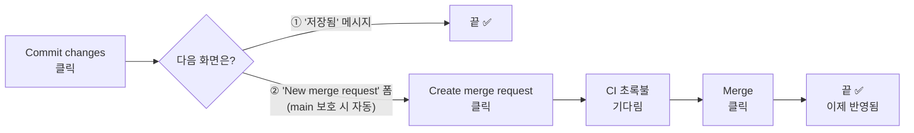
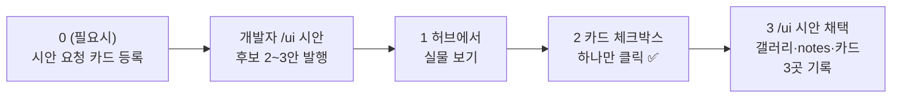
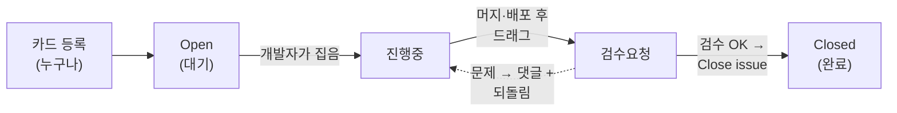

# GitLab 실전 가이드 — 카드 등록부터 완료까지 (클릭 순서)

> **Type:** Guide
> **대상:** GitLab을 처음 쓰는 비개발자 + 이슈 보드를 안 써본 개발자
> **전제:** 공통 개발자가 프로젝트 초기 설정(보드 열·라벨 생성, 계정 초대)을 마친 상태 (§8 참고)

> GitLab 화면 메뉴는 영어다. 이 가이드는 **영어 메뉴명 그대로** 쓰고 옆에 뜻을 단다.
> 버전에 따라 메뉴 위치가 조금 다를 수 있지만, 이름은 같으니 왼쪽 메뉴에서 그 이름을 찾으면 된다.
> 📚 **별책 4권 중 1권 — 웹 조작·카드·검수의 정본.** 전체 지도: [README](/README.md) · 형제: [Claude Code로 문서 올리기](AI_Working_Framework_Guide_ClaudeCode.md) · [개발자 ONBOARDING](ONBOARDING.md) · [공통 개발자 가이드](AI_Working_Framework_Guide_Leader.md)

---

## 0. 처음 한 번 — 화면에서 쓰는 곳은 세 곳뿐

브라우저로 GitLab 주소에 로그인 → 프로젝트(예: `our-app`) 클릭 → **왼쪽 세로 메뉴**가 기준점이다. (주소·내 계정·팀원 아이디는 **공통 개발자가 초대할 때 알려준다** — 없으면 요청)

**🔤 낯선 단어 몇 개만** — 몰라도 화면 버튼만 누르면 됩니다:

| 단어 | 뜻 |
| --- | --- |
| **커밋(Commit)** | 저장 |
| **푸시(push)** | 내가 저장한 것을 서버로 올리기 |
| **MR(Merge request)** | "합쳐달라"는 요청 — Merge(합치기)하면 팀의 공식 문서가 된다 |
| **Maintainer** | 당신의 권한 등급(공통 개발자가 초대 때 부여) — 문서 MR은 직접 Merge까지 가능 |
| **브랜치** | 작업용 사본 |
| **CI 초록불** | 자동 검사 통과 표시 |
| **main 보호** | main(공식 최신본)을 직접 못 바꾸게 막아둔 설정 — 켜져 있으면 저장이 자동으로 MR로 흐른다 |

| 왼쪽 메뉴 | 뜻 | 여기서 하는 일 |
| --- | --- | --- |
| **Plan → Issues** | 할 일 카드 목록 | 카드 등록·검색 |
| **Plan → Issue boards** | 카드판 (칸반 보드) | 카드 상태 보기·옮기기 |
| **Code → Repository** | 파일 탐색기 | (비개발자) docs/ 문서 **열람·직접 편집**(웹에서 바로 고치고 커밋 — §1·§7) |

이 세 곳을 **브라우저 즐겨찾기**로 잡아두면 이후로는 메뉴를 찾을 일도 없다. (검수를 맡는다면 **검수 서버 URL**도 함께 — 주소는 공통 개발자가 알려주고, 쓰는 법은 §5)

### 역할별 — 나는 어디부터 보면 되나 (지도)

| 나는… | 지금 상황 | 바로 갈 곳 |
| --- | --- | --- |
| 📘 기획·디자이너 | **프로젝트가 막 시작** — 내가 만든 요구사항·시안 문서를 전달 | **§1 문서 올리기** ← 제일 먼저 |
| 📘 기획·검수 | 일·버그·개선을 요청 | §2 카드 등록 |
| 📘 검수 담당 | 내게 "검수요청" 카드가 왔다 | §5 검수 |
| 📘 결정권자 | 내게 **"시안 선택" 카드**가 왔다 (화면 후보 중 고르기) | §5-1 시안 고르기 |
| 👩‍💻 개발자 | 카드를 집어 개발한다 | §4 개발자 |
| 🛡️ 공통 개발자 | 프로젝트 초기 세팅(보드·라벨·계정) | §8 공통 개발자 준비 |

### 0-1. 처음이라면 — 30분 따라하기 (연습 카드 한 장의 일생)

읽지만 말고 **연습 카드 한 장을 직접 굴려보는 것**이 가장 빠르다. 아래 다섯 걸음, 각 1~5분:

| 걸음 | 해보기 | 방법은 |
| --- | --- | --- |
| ① 등록 | 제목이 `[연습] 내 첫 카드`인 카드를 만들어본다 (내용은 아무거나) | 아래 §2 그대로 |
| ② 관찰 | 카드판에서 내 카드가 어느 열에 있는지 찾는다 | §3 |
| ③ 대화 | 내 카드에 댓글을 달고 `@공통개발자아이디` 멘션을 넣어본다 — 공통 개발자가 답글을 달아주면 **알림이 어디에 뜨는지**(오른쪽 위 🔔) 확인 | §3 |
| ④ 검수 흉내 | 공통 개발자(또는 개발자)에게 부탁해 연습 카드를 "검수요청" 열로 옮겨달라 하고, §5 순서대로 검수자 입장에서 훑어본다 | §5 |
| ⑤ 정리 | 연습 카드에 `무효` 라벨을 붙이고 닫는다(Close) — "연습이었음" 댓글 한 줄과 함께. **삭제하지 않고 닫는 것**, 이게 이 팀의 규칙이다 | §2-2 치트시트 |

> 💡 공통 개발자의 **파일럿 시연**(진짜 카드 하나가 등록→개발→배포→검수까지 흐르는 것을 팀 전원이 보는 자리)과 같은 날 하면 가장 좋다.
> 💡 개발자·공통 개발자는 CLI 쪽 튜토리얼이 따로 있다 — repo에서 `claude` 를 켜고 **`/start`** 라고 치면(또는 "뭐부터 해?"라고 물으면) AI가 상태를 진단해 차근차근 안내한다.

---

## 1. 프로젝트 맨 처음 — 요구사항·기획·시안 문서를 올린다 (시작 시 1회)

> 📘 **비개발자(기획·디자이너)가 프로젝트에서 가장 먼저 하는 일이다.** 내가 만든 문서를 개발이 시작되기 전에 GitLab `docs/` 에 **직접** 올린다. (당신은 `Maintainer` 권한이라 `docs/` 에 바로 올리고 고칠 수 있다 — 개발자를 거칠 필요가 없다.)

### 문서가 파일 한두 개일 때 — 웹에서 바로 (2분)
1. 왼쪽 메뉴 **Code → Repository** → 문서를 놓을 폴더로 들어간다 (⚠️ **그 폴더가 아직 없으면** — Upload는 폴더를 못 만든다: **New file**에서 경로째 적어 폴더를 먼저 만들거나, 여러 파일이면 Web IDE로)
2. 오른쪽 위 **＋ (Add) → Upload file**(이미 만든 파일 올리기) 또는 **New file**(웹에서 새로 작성)
3. **New file** 이면 파일명 칸에 **경로째** 적으면 폴더가 자동으로 생긴다 — 예: `docs/00_Project/ProjectCharter.md`
4. 맨 아래 **Commit message** 한 줄(`docs: 프로젝트 차터 등록`) → **Commit changes** 클릭. 그 다음은 둘 중 하나:
   - ① "저장됨" 메시지가 뜨면 → 끝.
   - ② **"New merge request" 작성 화면이 뜨면**(main 보호가 켜진 프로젝트는 자동) → 맨 아래 **Create merge request** 클릭 → 열린 MR 페이지에서 CI 초록불을 기다렸다가 → **Merge** 클릭 → 끝. ⚠️ 버튼을 안 누르고 창을 닫으면 올린 문서가 **반영되지 않은 채** 남는다(§7 경고와 같은 함정). ⚠️ **빨간불(실패)이면 Merge 누르지 말고** 공통 개발자를 호출한다.



> ⚠️ ②의 길에서 **중간에 창을 닫으면 반영 안 됨** — Merge까지가 한 세트다. (Web IDE로 올릴 때도 같은 흐름)

### 문서가 여러 파일·폴더일 때 → GitLab Web IDE (브라우저, 설치 0)
> 단일파일 **Edit**은 한 번에 하나씩이라, **폴더나 여러 파일**은 **Web IDE**(브라우저 속 편집기)가 편하다:
> 1. repo에서 **Code → Open in Web IDE**
> 2. 왼쪽 트리에서 **폴더·파일을 직접 만들고** 편집(여러 개 동시). 새 폴더는 우클릭 → New folder, 파일은 New file.
> 3. 왼쪽 **Source Control**(변경 목록, `Ctrl+Shift+G`)에서 한 번에 **Commit** (main이 보호돼 있으면 새 브랜치+MR 안내가 자동으로 뜸) → 안내를 따라 **Create merge request → (CI 초록불) → Merge**까지 눌러야 반영된다(§1의 ② 흐름과 동일)
>
> 스텝별 폴더(`docs/01_CurrentState/` 등)를 이렇게 직접 만들어 올리면 된다 — 공통 개발자 없이 혼자 된다.
>
> **내 컴퓨터의 폴더 뭉치를 구조 그대로 통째로** 올려야 하면: GitLab 웹은 폴더 통째 업로드가 안 되니 — **Claude Code**로 clone→넣기→올리기(별책 `AI_Working_Framework_Guide_ClaudeCode.md`)가 가장 확실하다.
>
> 이후 문서를 고치거나 한두 개 추가하는 것은 **§7 처럼 웹에서 직접**.

**어디에 두나** (프레임워크 표준 — 폴더 번호 = STEP 번호. 단 `00_Guide`는 STEP이 아닌 **가이드 전용 예외**이고, `00_Project`가 STEP 0):

| 문서 | 폴더 |
| --- | --- |
| 프로젝트 차터 | `docs/00_Project/` |
| 요구사항 | `docs/03_Requirement/` |
| 화면·시안 (내보낸 HTML·PNG) | `docs/05_UIUX/` |

> 폴더 이름이 헷갈리면 공통 개발자(의 AI)에게 맡겨도 된다 — 당신이 올린 걸 표준 위치로 정리해준다.

> 💡 **화면 시안을 고를 때** — 후보가 만들어지면 **"시안 선택" 카드**가 당신 앞으로 온다. 카드의 링크로 실물 화면을 보고 **체크박스 하나만 클릭**하면 끝 — 전체 순서는 **§5-1**이 정본이다.

**요구사항 문서에 담을 것** (영역별 파일 하나 — 예: `근태.md`, `예약.md`):
① 목적 두어 줄 ② **기능 요구 표** — `번호 | 요구 | 비고` (번호는 나중에 카드와 개발자가 인용합니다) ③ 비기능(속도·보안·접속 환경 등) ④ 범위 밖(이번에 안 만드는 것) ⑤ 미해결(개발팀에 묻고 싶은 것).

> 💡 **전 영역을 다 쓸 때까지 기다리지 마세요** — 한 영역(예: 근태)만 먼저 올려도 개발팀은 그 문서로 설계를 시작합니다. 조금씩 올리는 게 오히려 좋습니다.

> ⚠️ **용량 주의:** 포토샵(psd)·Figma **원본 파일은 올리지 말 것**(10MB 넘으면 저장소가 무거워진다). 원본은 공유 드라이브에 두고 **내보낸 결과물(HTML·PNG)만** 올린다. 기준: "개발자의 AI가 읽고 구현할 파일인가?" → 예면 `docs/`, 아니면 공유 드라이브.

> 🔒 **비밀번호·API 키·개인정보(주민번호 등)는 문서에 넣지 말 것** — 저장소에 한 번 들어가면 이력에 영원히 남는다. 접속 정보가 필요하면 문서엔 "별도 전달"이라고만 쓰고 채팅·구두로 전한다.

> 💡 GitLab이 처음이라 위 클릭이 낯설면, **§0-1 '30분 따라하기'로 연습 카드 한 장을 먼저 굴려보면** 금방 익는다.
> 💡 이미 개발이 시작된 뒤에 문서를 **고치는** 것은 §7을 본다 (이 절은 "처음 전달"용).
> 💡 **올린 문서가 개발팀에 닿았는지 확인하려면** — 문서 업로드엔 "읽음" 표시가 없다. 확실한 경로는 **카드를 함께 남기는 것**(§2 — 카드는 브리핑·멘션으로 반드시 닿는다). 문서가 소화되면 진행지도(`docs/_STEP_INDEX.md`)와 요약(digest)이 갱신되니 그걸 봐도 된다.

---

## 2. 카드(이슈) 등록하기 — 누구나, 1분

기획 요청이든 발견한 버그든, **일 하나 = 카드 한 장**이다.

1. 왼쪽 메뉴 **Plan → Issues** 클릭
2. 오른쪽 위 파란 버튼 **New issue** 클릭
3. **⚠️ Description 칸 위 `Choose a template → 카드`를 먼저 고른다** — 그러면 양식(무엇을·수용 기준·**검수자**·**위험도**·검수 방법)이 자동으로 채워진다. **이걸 안 고르면 빈칸으로 등록돼** 개발자·검수가 쓸 정보가 통째로 빠진다(가장 흔한 실수).
4. 양식을 채운다 — 특히:

| 칸 | 무엇을 쓰나 |
| --- | --- |
| **Title** (제목) | 한 줄 요약 (`게시판: 목록 화면에서 검색이 안 됨`) |
| 양식 **"무엇을 / 수용 기준"** | 무엇을 만드나 + "무엇이 완료인가"를 남이 화면에서 확인할 수 있게 |
| **Assignee** (담당자) | 그 모듈 소유자 — 모르면 비워두기(공통 개발자가 매일 점검에서 소유표를 보고 배정한다) |
| 양식 **"검수: @누구"** | 배포 화면을 확인할 사람. **다른 사람을 넣으면 더 좋다**(만든 사람이 못 본 걸 잡는다) — 다만 **필수는 아니다.** 사람이 없어 카드가 쌓이는 게 더 나쁘다. 본인이 검수해도 되지만 **화면을 직접 보고 확답**해야 하고, AI가 알아서 합격 처리하는 것은 금지다 |
| 양식 **"위험도"** | 로그인·결제·데이터 구조 변경(DB 마이그레이션)·공통 부품(shared)을 건드리면 `고위험` 라벨(대표 예 — 전체 기준은 §8 위험 라벨이 정본). **잘 모르겠으면 비워두세요 — 개발자가 판단해 붙입니다** |
| 그 외 칸 (정본 참조·의존·검수 상태 셋업 등) | **모르면 그대로 둬도 된다** — 개발자(의 AI)가 채운다 |

5. **Labels**에서 모듈 라벨(`모듈:board` 등) + 위험도가 고위험이면 `고위험` — 모르면 공통 개발자에게.
6. 맨 아래 **Create issue** 클릭 → 끝. 카드가 생기고 `#12` 같은 번호가 붙는다.

> ⚠️ **Labels 목록이 비어 있거나 카드가 열에서 안 옮겨지면** → 공통 개발자가 아직 라벨·보드를 안 만든 것(§8)이다. GitLab은 없는 라벨을 조용히 무시해 **등록·이동이 소리 없이 안 될 수** 있으니, 공통 개발자에게 알린다.

> 💡 스크린샷은 Description 입력칸에 **붙여넣기(Ctrl+V)** 하면 자동 업로드된다.
> 💡 카드 번호(`#12`)가 이 일의 이름표다. 채팅에서 언급할 때도 "#12요"라고 하면 된다.

### 2-1. 등록한 카드는 언제, 어떻게 개발자에게 닿나

**등록만 하면 끝이다. 개발자를 찾아가 말할 필요가 없다.** 개발자마다 AI 비서(Claude)가 붙어 있고, 그 AI가 보드를 대신 확인하기 때문이다.

| 시점 | 무슨 일이 일어나나 |
| --- | --- |
| 개발자가 AI를 켤 때 (아침 등) | 개발자의 AI가 **그 사람 담당의 새 카드를 자동으로 요약 브리핑**한다 — "밤사이 #15가 등록됐습니다. 내용은 ○○. 시작할까요?" |
| 개발자가 작업 하나를 끝낼 때 | 마무리 루틴 끝에 AI가 보드를 다시 확인하고 다음 카드를 제안한다. 카드 하나가 반나절~이틀 크기라, **보통 몇 시간 안에 닿는다** |
| 급할 때 | 카드 **댓글에 `@개발자아이디` 멘션**(알림이 감) + 팀 채팅으로 호출. 단, 하던 일을 멈추고 이걸 먼저 할지는 개발자가 결정한다 |

**기획 변경·추가 요구사항일 때 — 세 갈래로 구분:**

| 상황 | 하는 일 |
| --- | --- |
| 아직 시작 안 한 기능에 대한 변경 | `docs/` 문서 수정 (7절) + **새 카드** 등록 → 위 경로로 자연히 닿는다 |
| **지금 진행중인 작업**에 영향을 주는 변경 | 새 카드가 아니라 **진행중인 그 카드에 댓글**로 단다 (+ docs/ 수정) — 담당자에게 즉시 알림이 가고, 그 작업의 기록으로 남는다. 내용이 크게 바뀌면 개발자가 판단해 카드를 쪼갠다 |
| **이미 완료(Close)된 기능**에 수정·개선·버그 | **새 카드**를 만든다 — 제목에 `(#12 후속)` + 본문에 `#12` 링크(#12를 열면 후속이 다 보인다). **옛 카드는 다시 열지 않는다**(Reopen ❌ — 완료 이력 보존). 등록만 하면 담당 개발자가 규모에 맞게 처리한다 |

> 원칙: **변경은 반드시 문서(docs/)에 반영한다 — 진행중 작업에 영향이면 해당 카드 댓글도(위 표).** 말로만 전하면 개발자의 AI가 모르는 채로 옛 문서대로 만든다. (§7 끝의 원칙과 같은 것)

> 💡 **옛 문서에 `⚠️ 대체됨(날짜)` 표지판이 보이면** — 그 절은 **더 최신 문서가 정본**이라는 자동 안내판입니다(문서끼리 내용이 어긋나면 최신이 정답 — AI가 표지판을 붙이고 멘션으로 알려드려요). 지우거나 바로 고칠 필요 없고, 원문 정리는 원하실 때 하면 됩니다.

### 2-2. 카드 화면 조작 치트시트 — GitLab이 처음이면 여기부터

등록(위 1~6)과 보드 드래그(§3) 말고, **카드를 열었을 때** 자주 쓰는 조작 모음. 여기 없는 조작은 몰라도 된다.

| 하고 싶은 것 | 어디를 누르나 |
| --- | --- |
| **담당자 지정·변경** | 카드 오른쪽 사이드바 **Assignees → Edit** → 이름 검색·클릭. (사이드바가 안 보이면 오른쪽 위 접기 버튼으로 펼친다) |
| **라벨 달기·바꾸기** | 오른쪽 사이드바 **Labels → Edit** |
| **제목·본문 고치기** | 제목 옆 **Edit**(연필) — 등록한 뒤에도 언제든 고칠 수 있다 |
| **댓글 달기** | 본문 아래 입력칸에 쓰고 **Comment**. `@아이디`를 넣으면 그 사람에게 알림이 간다 |
| **체크박스 고르기** (시안 선택 등) | 본문의 체크박스를 **그냥 클릭** — 편집 모드에 들어갈 필요 없이 바로 저장된다 |
| **완료 처리(닫기)** | 댓글 입력칸 근처의 **Close issue** 버튼 (보드에서 Closed 열로 드래그해도 같은 뜻) |
| **실수로 닫았을 때** | 같은 자리의 **Reopen issue**. 단 **정말 끝난 카드는 다시 열지 않는다** — 후속 일은 새 카드(위 2-1 표) |
| **내 할 일 확인** | 오른쪽 위 **To-Do List**(체크 아이콘) — 나를 담당자로 지정하거나 `@멘션`한 것이 쌓인다. Issues 목록에서 **Assignee = 나** 필터도 같은 용도 |

> 💡 어느 조작이든 **잘못 눌러도 되돌릴 수 있다**(담당자·라벨·상태 전부 다시 바꾸면 그만). 지워지는 건 없으니 눌러보면서 익혀도 안전하다.

---

## 3. 보드 보기 — "지금 누가 뭘 하나"

왼쪽 메뉴 **Plan → Issue boards** 를 열면 카드판이 나온다.

```
┌─ Open (대기) ─┐  ┌─ 진행중 ─┐  ┌─ 검수요청 ─┐  ┌─ Closed (완료) ─┐
│  #14 카드     │  │ #12 카드 │  │  #9 카드   │  │  #7 카드        │
│  #15 카드     │  │ #13 카드 │  │            │  │  #8 카드        │
└───────────────┘  └──────────┘  └────────────┘  └─────────────────┘
```

- **카드를 마우스로 옆 열에 끌어다 놓으면 상태가 바뀐다.** 그게 전부다.
- 카드를 클릭하면 상세(설명·댓글)가 열린다. 질문·논의는 카드의 **댓글**에 단다 — 채팅과 달리 그 일의 기록으로 남는다.
- 댓글에서 `@아이디`를 쓰면 그 사람에게 알림이 간다.

> 🗂 **지난 것 돌아보기(기록철)** — 보드는 "지금"만 보여준다. 끝난 일까지 포함한 한 모듈의 역사는: **Plan → Issues → 필터 Label=`모듈:이름` → 탭 All**. 나온 카드 하나를 열면 등록→가정→반려→머지→검수가 타임라인으로 다 있다(이 화면 URL을 북마크해두면 그 모듈의 기록철). 코드 쪽 이력이 궁금하면 개발자에게 `/log 모듈명`을 부탁.
> 💡 **"언제쯤 끝나요?"** — 이 보드엔 마감일 필드가 없다(카드가 반나절~이틀 크기라 흐름으로 관리). 특정 카드의 예상이 궁금하면 **그 카드에 댓글로 물어보는 게 정답** — 담당자에게 알림이 가고 답이 기록으로 남는다.

---

## 4. 개발자 — 카드를 집고, 끝내는 법

### 4-1. 내 일 확인

- 보드에서 **Open(대기) 열의 내 모듈 라벨 카드** 또는 **Assignee가 나인 카드**를 본다.
- 오른쪽 위 **알림 아이콘(To-Do List)**: 누가 나를 담당자로 지정하거나 `@멘션`하면 여기 쌓인다. 하루 시작할 때 한 번 확인.

### 4-2. 작업 시작

1. 집은 카드를 열어 **Assignee를 나로** 지정 (아직 아니라면)
2. 보드에서 카드를 **진행중** 열로 드래그
3. 로컬에서 브랜치를 파고 개발 (상세 사이클은 [ONBOARDING](ONBOARDING.md) '매일' 절 — 브랜치 이름 규칙 `feature/카드번호-슬러그`는 `/dev`가 알아서 만든다)

### 4-3. 작업 끝 — 머지와 카드 이동

실제로는 **`/done 12` 한 번**이 이 전체를 처리한다 — 머지 전 검사 → MR(`관련: #12` 링크) → CI 초록불 → 머지 → 카드 `검수요청` 전환 → 작성자·검수자 멘션까지(상세 정본 = `/done` 스킬). 사람이 알아둘 것 둘:
- 머지 = 곧 **검수 서버 자동 배포** — 개발자 본인이 **배포 화면을 1분 직접 확인**한 뒤에야 검수요청으로 넘어간다
- 공통 영역(shared 등)을 건드린 변경이면 **코드에 손대기 전에** 채팅 공지가 이미 있었어야 한다(머지 직전이 아니라)

> 💡 화면에 안 나오는 작업(내부 정리, 문서 등)은 검수요청 없이 **셀프완료**한다: 카드 본문의 수용 기준 체크박스를 `[x]`로 갱신하고, **완료 증거(실행 결과·링크) + `셀프완료` 표식을 댓글**로 남기고 **라벨을 `진행중`→`셀프완료`로 전환**한 뒤 카드를 닫는다(카드 작성자가 남이면 완료 통보 @멘션 — 라벨이 기록의 정본이라 /metrics 가 이걸로 집계한다).
>
> ⚠️ **MR Description·커밋에 `Closes #12`(`Fixes`·`Resolves` 포함)는 쓰지 않는다 — 예외 없다(셀프완료도).** 머지되는 순간 GitLab이 그 카드를 자동으로 닫아 증거 댓글·라벨 정리·검수를 통째로 건너뛴다(수용 기준이 남은 카드가 머지와 동시에 닫혀 되돌린 사고 — bnsone 2026-08-05). MR 본문에는 `관련: #12`로 **링크만** 걸고, 닫는 것은 검수 담당(사람) 또는 셀프완료 절차가 명시적으로 한다.

---

## 5. 검수 — 배정받은 사람이 확인하고 완료 처리하는 법

> **검수 전담자는 따로 없다.** 검수는 **카드의 "검수" 필드에 지정된 사람**(비면 **카드 담당자 = 구현자 본인**)이 한다 — 개발자든 비개발자든. 다른 사람 지정은 선택이다. 기능·화면 카드는 기획이 맡는 식으로 카드마다 배정할 수 있다. 아래는 "검수를 맡은 사람"이 하는 일이다.
>
> ⚠️ 자기가 만든 걸 자기가 검수해도 된다. **막는 것은 "같은 사람"이 아니라 "사람이 안 본 것"** — 배포 화면을 직접 보지 않고 닫는 것만이 금지다.

1. 보드의 **검수요청 열**에 카드가 오면 (또는 To-Do 알림·멘션을 받으면 — 그게 "네가 이 카드 검수 담당"이라는 신호다)
2. **카드의 "검수 방법" 칸을 먼저 읽고**, **검수 서버 URL**을 브라우저로 열어 그 기능을 실제로 사용해 본다. **통과 기준 3개**:
   - ① **카드에 적힌 기대대로 동작하는가** — 카드의 수용 기준 중 〔검수확인〕 표시가 붙은 줄이 당신의 체크 목록이다
   - ② **PC와 모바일 둘 다 괜찮은가** — 모바일은 브라우저 창을 좁혀 보면 된다
   - ③ **이상한 입력에도 안 깨지는가** — 빈 값·아주 긴 글·연속 클릭
   - 브라우저만으로 확인할 수 없게 돼 있으면 그것 자체가 반려 사유다 — "검수 방법을 화면에서 되게 해주세요" 댓글로 되돌린다
   - **"내가 보는 게 최신인가" 확인**: 화면 맨 아래에 `<프로젝트> · abc1234 · 2026-08-07 00:14 KST 기동` 처럼 **커밋(7자리) · 기동 시각**이 작게 표시된다. 이 커밋이 카드에 걸린 MR의 머지 커밋과 같은지(MR 페이지에 해시가 있다), 기동 시각이 그 머지보다 뒤인지 보면 된다 — 다르면 아직 배포 전이니 잠시 뒤 새로고침, 계속 다르면 공통 개발자 호출. 커밋 자리에 `dev`가 보이면 git 정보 없이 띄운 화면이라 최신 여부를 판별할 수 없다(그 자체로 공통 개발자 호출 사유)
   - **검수는 검수자가 개발자든 비개발자든 "화면 기준"이다** — 코드 품질(로직·보안·중복)은 CI·AI 경고 리뷰·(고위험이면)증적 3종이 이미 봤으니, 검수는 "카드가 원한 대로 화면에서 되나"만 본다. 개발자 검수자라고 코드까지 다시 볼 필요 없다
3. 판정:

| 판정 | 하는 일 |
| --- | --- |
| ✅ 이상 없음 | **내 Claude 세션에 "이상 없음"이라고 말하면 AI가 대신 닫아준다**(확인 댓글·라벨 정리까지 — 반드시 검수 담당인 당신 세션에서. 2026-08-09부터). 웹이 편하면 카드 열고 아래 **Close issue** 버튼 클릭 — 어느 쪽이든 카드가 완료(Closed) 열로 이동. 끝 |
| ❌ 문제 있음 | 카드에 **댓글**로 문제를 적고(화면/했던 것/기대/실제/스크린샷), 카드를 **진행중** 열로 되돌린다 |
| 🆕 다른 문제 발견 | 그 카드는 정상 종료하고, **새 카드**로 등록 (2절) — 한 카드에 여러 문제를 섞지 않는다 |
| 📝 "스펙과 달라진 점" 댓글이 있음 | 개발자가 **더 나은 방안으로 기획과 다르게 만들고 문서도 같이 고친 것** — 화면과 문서 변경을 함께 보고 판단한다. 동의하면 Close(변경된 문서가 새 정본), 아니면 댓글 "원래 기획대로 해주세요" + 진행중으로 되돌림. **기획의 최종 판단은 여전히 당신 몫이다** |

세 가지 헷갈리는 상황의 기준:
- **반려했던 카드가 다시 왔을 때(재검수)**: 반려한 그 항목만 다시 확인 + 주변 1분 훑기(회귀 — 고치다가 옆이 새로 깨지지 않았나 확인) — 전체를 처음부터 다시 검수할 필요 없다
- **검수 중 이미 다른 카드로 등록돼 있는 문제를 또 만나면**: 반려 사유가 아니다 — 그 카드 번호를 댓글로 참조만 ("#15에서 처리 예정")
- **검수할 상태(데이터 3개 등록된 화면 등)를 화면만으로 못 만들겠으면**: 카드의 "검수 상태 셋업" 칸을 보고, 없으면 개발자에게 "셋업 좀 해주세요" 댓글로 요청해도 된다 — 그건 검수 실패가 아니다
- 참고: Close(닫기) = 보드의 "완료" 열과 같은 뜻이다 (메뉴 이름만 다름)

불안하거나 곤란할 때의 기준:
- **기한**: 며칠씩 묵히지만 않으면 된다 — **1~2일 내 권장.** 늦어지는 건 공통 개발자의 매일 점검(검수 적체)이 잡아주니 혼자 부담 갖지 말 것
- **합격시킨 게 나중에 문제로 밝혀지면?** — 검수는 **화면 확인이지 품질 보증이 아니다.** 이후 발견된 결함은 문책이 아니라 **새 카드**로 처리된다(코드 품질은 CI·AI 경고 리뷰·고위험 증적이 이미 봤다)
- **못 맡겠으면(내 전문 밖·너무 바쁨)**: 카드의 "검수:" 필드를 다른 사람으로 바꾸거나 공통 개발자에게 재배정을 요청한다 — 거절은 실례가 아니다(말없이 방치가 문제다)
- **검수 서버 자체가 안 열리면(에러 페이지·접속 불가)**: 반려 사유가 아니다 — 카드는 그대로 두고 **공통 개발자를 호출**한다

---

## 5-1. 화면 시안 — 보고 고르기 (기획/결정권자)

디자이너가 없어, 개발 **전에** 화면 후보(A/B/C)를 만들어 **고른다**. 코드가 아니라 **시안 허브**에서 진짜 화면으로 본다.

0. **(후보가 아직 없으면) 요청한다**: §2와 같은 방법으로 카드 한 장 — 제목 예: `출퇴근 화면 시안 요청`. 개발자를 직접 붙잡을 필요 없다 — 개발자(의 AI)가 후보 2~3안을 만들어 허브에 올리면 요청 카드는 닫히고, 고르는 **시안 선택 카드**가 결정권자 앞으로 온다(아래 1~3으로 이어짐).
1. **본다**: **시안 허브 URL**(`<시안허브URL>/<프로젝트>/`)을 연다 — 한 페이지에 **모든 화면의 모든 후보**가 쌓여 있다. 후보를 클릭하면 브라우저에서 **실물 HTML**(스크롤·버튼 동작 O — 이미지가 아니다). 개발자가 새 시안을 올리면 **30초 안에 자동 반영**된다.
2. **고른다**: 화면마다 **시안 선택 카드**가 있다 — 카드 본문의 **체크박스에서 원하는 안을 클릭**한다(한 번, 댓글 아님). GitLab이 누가 언제 골랐는지 남기고 담당 개발자에게 알림이 간다. (추가 의견이 있으면 댓글로 보조.)
   - ⚠️ GitLab 체크박스는 서로 배타가 아니라 **여러 개도 체크된다** — **하나만 체크**하세요. 여러 개 체크돼 있으면 개발자가 "아직 결정 전"으로 보고 확인을 요청합니다.
   - 💡 **"A안 뼈대에 B안 색"처럼 섞고 싶으면** — 더 가까운 안 **하나를 체크**하고 **댓글로 섞을 내용을 구체적으로** 적으세요("A 레이아웃 + B 색상"). 개발자가 혼합안을 새 후보로 추가해 다시 보여줍니다.
3. **확정**: 개발자가 체크된 안을 보고 `/ui 시안 채택`으로 확정하면 **① 허브 갤러리에 `선택: B안` 배지 ② 시안 노트(notes.md)에 이유·결정자·날짜 ③ 그 카드 닫힘**, 세 곳에 남는다. (체크로 끝이 아니라 이 확정으로 **근거가 기록에 남아야** 나중에 개발이 옛 안으로 돌아가지 않는다.)



> ⚙️ 시안 허브는 **공통 개발자가 인스턴스에 1회 세팅**한다(프로젝트마다 X — [sian-hub-setup.md](sian-hub-setup.md)). 사내 GitLab에 Pages가 정상이면 그게 1순위(허브 불필요).

> 🧭 **두 곳을 헷갈리지 말 것:**
>
> | | 시안 허브 | 검수 서버 |
> | --- | --- | --- |
> | 언제 보나 | 만들기 **전** | 만든 **후** |
> | 무엇이 있나 | 화면별 **후보**(연결·실데이터 없음) | **진짜 앱**(로그인·이동·실데이터) |
> | 거기서 할 일 | 고른다 — 체크박스(§5-1) | 검수한다(§5) |
>
> 후보끼리 이어붙여 앱처럼 보여주는 기능은 없다 — 합쳐진 모습은 선택안이 구현·머지된 뒤 검수 서버에서 본다.

---

## 6. 카드의 일생 — 한 장으로



---

## 7. 비개발자 — 이미 있는 문서를 바꾸는 법 (웹에서 직접 편집)

> §1이 "처음 전달"이라면, 이 절은 **개발이 이미 시작된 뒤 문서를 고치거나 한두 개 추가할 때**다.

비개발자(`Maintainer`)는 **문서를 웹에서 바로 고칠 수 있다** — 개발자를 거칠 필요도, 브랜치·MR을 배울 필요도 없다.

1. 왼쪽 메뉴 **Code → Repository → `docs/`** 에서 고칠 문서를 연다
2. 오른쪽 **Edit**(연필 아이콘) 클릭 → 내용을 고친다
3. 맨 아래 **Commit message** 에 무엇을 바꿨는지 한 줄 (`docs: 공지 요구사항 글자수 100자로 변경`)
4. 맨 아래 **Commit changes** → 끝. (main이 보호돼 있으면 GitLab이 "새 브랜치로 커밋 + Merge request" 화면을 대신 띄운다 — §1처럼 그대로 진행하고, 뜨는 MR에서 **Merge**만 누르면 된다. 관련 카드가 있으면 커밋 메시지에 `관련 #12`.)

> ⚠️ **Merge까지 눌러야 반영된다** — MR 화면에서 멈추고 나가면 변경이 main에 안 들어가 **아무도 못 본다**(개발은 옛 문서대로 진행됨). Merge 버튼이 안 보이거나 헷갈리면 공통 개발자에게 물어보면 된다.

> 🧯 **"Merge conflict(충돌)" 화면이 뜨면** — 나와 다른 사람이 같은 부분을 거의 동시에 고친 것. 당황할 것 없다: ①내가 쓴 내용을 복사해 메모장에 보관 ②화면은 그대로 두고 **공통 개발자를 호출**(카드 댓글이나 채팅) — 푸는 데 5분이면 된다. 억지로 버튼을 눌러 진행하지 않는다.

> ⚠️ **당신이 만지는 곳은 `docs/` 뿐이다.** 코드 파일·`.gitlab-ci.yml`·프로젝트 설정은 건드리지 않는다 — 실수로 바꾸면 빌드·배포가 깨질 수 있다. (배경·안전장치는 §8과 [ADR-0001](/docs/adr/0001-비개발자-docs-직접푸시.md) 참고.)
> 이미 **docs 밖이 바뀌어버렸다면** — 스스로 고치려 하지 말고 **그대로 멈추고 공통 개발자를 호출**한다(직접 만지면 복구가 더 어려워진다. 되돌리기는 개발자·공통 개발자의 일이고, CI 빨간불이 떠도 놀랄 것 없다 — 감지 장치가 정상 작동한 것).

> 💡 변경이 크거나 팀과 논의가 필요하면, 문서만 고치지 말고 **카드도 한 장 남긴다**(§2) — 왜 바꿨는지가 기록으로 남고 담당 개발자에게 알림이 간다.

> 원칙: **변경은 반드시 문서(docs/)에 반영한다.** 말로만 전하면 개발자의 AI가 모르는 채로 옛 문서대로 만든다.

---

## 8. 공통 개발자 — 처음 한 번만 하는 보드 준비 (5분)

이 가이드가 전제하는 설정 — **공통 개발자가 `/setup-gitlab` 한 번으로** 세팅한다(수동 클릭 불필요 — 라벨·설정 명세의 정본은 그 스킬). 아래는 무엇이 세팅되는지와 확인 기준이다.

1. **계정 초대**: Manage → Members → Invite members. 개발자는 `Developer`, **기획/디자이너는 `Maintainer`**(이슈·댓글·읽기 + `docs/` 직접 편집·커밋 가능). 이 팀은 기획/디자이너가 **`docs/` 에 직접 문서를 올리고 고치는** 방식(§1·§7)이라 push 권한이 필요하다.
   - ⚠️**권한과 함께 규율을 명확히 하라**: 비개발자는 **`docs/` 만** 만지고 **코드·`.gitlab-ci.yml`·프로젝트 설정은 건드리지 않는다.** 사내 GitLab(CE)은 "docs만 허용/코드 보호" 같은 **경로별 사전 차단이 안 되므로**(유료 기능), 실질 백스톱(마지막 안전장치)은 **① 이 가이드의 명시 ② CI가 'docs 밖을 비개발자가 바꿨는지' 사후 감지하는 잡(planner-guard — `PLANNER_EMAILS` 등록으로 켜짐)**이다. 배경·결정은 [ADR-0001](/docs/adr/0001-비개발자-docs-직접푸시.md) 참조.
2. **라벨·보드 확인**: 상태(`진행중`·`검수요청`)·`무효`(기획 변경으로 닫힌 카드)·`대기(불명확)`(수용 기준 모호)·`고위험`(인증·결제·DB 마이그레이션·shared 승격·핫스팟〔전원이 함께 쓰는 예민한 파일 — 설정·라우팅 등〕 — 머지 전 AI 경고 리뷰+증적)·모듈 라벨이 있고, 보드에 대기/진행중/검수요청/완료 4열이 보이면 OK. ★라벨이 없으면 카드 등록·이동이 **조용히 실패**한다(GitLab은 없는 라벨을 자동 생성 안 함) — 빠졌으면 `/setup-gitlab` 재실행
   - ⚠️**`고위험` = 경고 레인의 세부 규칙**(정본 = repo `CLAUDE.md` '머지 등급' 절): **본인이 게이트를 실행하고 머지한다** — MR에 `셀프승인` 라벨을 붙이고 새 파이프라인을 돌린 뒤 잡을 실행한다. 대신 **증적 3종**(①fresh-context AI 리뷰 ②본인 diff 확인 ③카드 댓글에 "셀프 승인"+사유+리뷰 결과+확인 범위)이 다 남아야 하고, 증적 없이 조용히 머지하면 무승인이다.
   - **동료 승인은 선택**이다 — 민감하다 싶으면 요청한다(제3자 눈이 더 낫다는 사실은 변함없다). 다만 **없다고 멈추지 않는다**: 동료 승인 필수는 소규모 팀에서 병목이었고, 실제로도 안 지켜졌다(2026-08-06 실측 — 게이트 24건 중 18건을 본인이 실행).
3. 팀원 전원에게 **즐겨찾기** 안내: 이슈 보드 · docs/ 폴더 · 검수 서버 URL · (화면 시안을 쓰면) **시안 허브 URL**
4. **(화면 시안을 쓸 프로젝트면) 시안 허브 세팅** — 비개발자가 화면 후보를 브라우저로 보고 고르게 하는 정적 서버. **인스턴스에 1회**만 띄우면 이후 프로젝트는 경로만 추가한다. 절차·매니페스트는 [sian-hub-setup.md](sian-hub-setup.md). (사내 GitLab에 Pages가 정상이면 이 단계 대신 각 프로젝트 CI의 `pages` 잡을 켠다.)

---

## 9. 자주 묻는 것

| 질문 | 답 |
| --- | --- |
| 카드를 잘못 만들었어요 | 카드 열고 제목 옆 **Edit**로 수정하거나, 점 3개 메뉴 → Close issue로 닫으면 된다. 지울 필요 없음 |
| 완료된 카드를 다시 열 수 있나요 | **실수로 닫았을 때만** 닫힌 카드 열고 **Reopen issue**. 새 수정·개선이면 Reopen 말고 **새 카드**(`(#12 후속)`)로 — 완료 이력을 덮지 않게 (§2-1) |
| 채팅으로 말하면 안 되나요 | 급한 호출은 채팅 OK. 단 **작업·결함의 정본은 반드시 카드로** — 채팅은 흘러가서 누락되고, AI에게도 닿지 않는다 |
| 이메일이 너무 와요 | 오른쪽 위 프로필 → Preferences → Notifications에서 프로젝트별 수준 조절 (`Participate` 권장 — 내가 관련된 것만) |
| 카드가 너무 커요 | 반나절~이틀에 끝나는 크기로 쪼갠다. "게시판 전체" ❌ → "게시판 목록 화면", "게시판 글쓰기" ⭕ |
