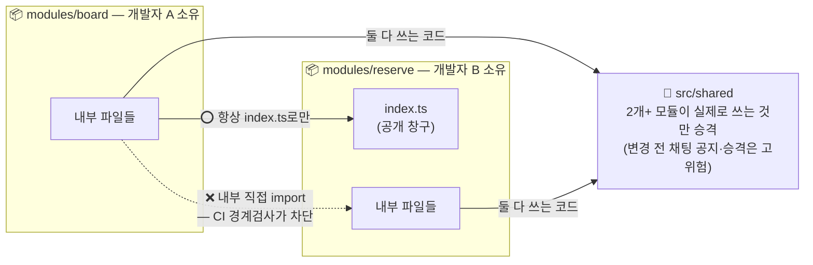
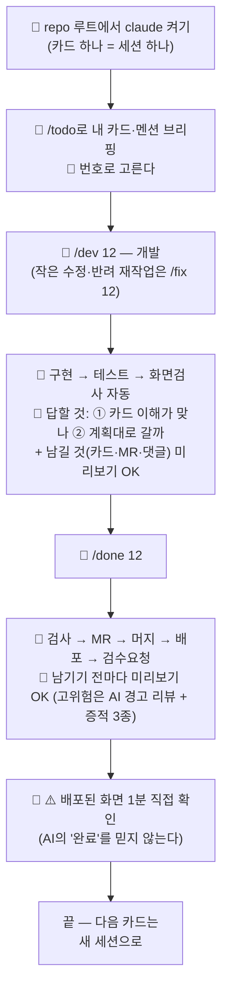

# 일 시작하는 법 — 역할별 1장 (이것만 읽으면 됨)

> 📚 **별책 4권 중 1권 — 개발자·공통 개발자의 첫날+매일.** 전체 지도: [README](/README.md) · 형제: [GitLab 실전 가이드](AI_Working_Framework_Guide_GitLab.md)(웹 조작·카드·검수 정본) · [Claude Code로 문서 올리기](AI_Working_Framework_Guide_ClaudeCode.md)(비개발자용) · [공통 개발자 가이드](AI_Working_Framework_Guide_Leader.md)

## 🗺️ 먼저: 프로젝트는 이렇게 굴러간다

먼저 용어 하나 — 이 팀의 작업 단위는 **"카드"**다 (GitLab 메뉴 이름은 '이슈(Issue)'지만, 버그라는 뜻이 아니다). "게시판 목록 화면 만들기" 같은 **신규 기능 개발이 카드의 대부분**이고, 버그·기획 변경·리팩토링도 전부 카드다. 그래서:

> **"일을 진행한다" = 보드의 카드를 하나씩 처리한다.**
> 기능 하나 = 카드 여러 장. 카드를 처리할 때마다 제품이 자라고, 보드가 곧 계획표이자 진행률이다.

| 단계 | 무슨 일이 일어나나 | 누가 |
| --- | --- | --- |
| 준비① 기획 | 만들 것을 `docs/`에 문서화(요구사항·화면 설계·시안) → **기능을 반나절~이틀 크기 카드로 분해해 보드에 쌓음** | 기획자 (+공통 개발자·AI가 분해 도움) |
| 준비② 골격 | 실행되는 앱 뼈대 + 본보기 모듈 1개 + 이 킷 — 팀이 올라탈 레일 | 공통 개발자 |
| **개발 (본편)** | 각자 자기 모듈의 카드를 위에서부터 처리 — 아래 "매일" 루프의 반복이 **곧 제품이 만들어지는 과정** | 개발자 전원 |
| 상시 | 기획 변경 → docs 수정+카드 / 완성된 것 → 검수 / 배포 → 자동 | 전원 |

**보드가 비어 있으면?** 그게 신호다 — 기획자·공통 개발자와 함께 `docs/`의 요구사항에서 다음 카드들을 뽑는 것부터 한다 (`/card <요구사항 문서> 분해` 하면 AI가 카드 초안 여러 장을 만들어 확인 후 등록해준다).

### 🎬 자세히 — 누가 만든 게 누구에게 넘어가나 (+ 어떤 스킬로)

한 프로젝트가 처음부터 끝까지 어떻게 **손바뀜**하는지, 실제 치는 명령까지 붙여서 봅니다. **내 앞 단계는 누가, 내 다음은 누구**인지 여기서 확인하세요.

```
① 기획자 →[요구·화면]→ ② 공통 개발자 →[앱 레일]→ ③ 기획+공통 개발자 →[카드]→ ④ 개발자 →[배포 화면]→ ⑤ 검수자
   ⑥ 뭔가 바뀌면 → /change 로 카드 재정리 → 다시 ③  (계속 순환)
```

**① 기획자 — "무엇을 만들지"를 문서로** (STEP 0~5 — STEP은 프레임워크 단계 번호, docs 폴더 번호와 같음)
- 무엇을: 요구사항·화면·업무 흐름을 `docs/`에 정리.
- 이렇게: **GitLab 웹에서 `docs/`에 직접 올린다**(기본 — [GitLab 가이드 §1](AI_Working_Framework_Guide_GitLab.md#1-프로젝트-맨-처음--요구사항기획시안-문서를-올린다-시작-시-1회)이 클릭 단위로 안내). 요약(digest)·진행지도 마무리는 공통 개발자가 인자 없이 `/docs`로. *(Claude Code를 쓰는 기획자는 `/docs C:\받은문서\기획` 한 번이면 배치·요약까지 자동)*
- 다음 사람: 정리된 요구 → **공통 개발자**가 읽는다.

**② 공통 개발자 — "어떻게 만들지" 레일 깔기** (STEP 6 + 골격 주간)
- 무엇을: 기술 설계(스택·DB·모듈 분할 **+ 공통 코드 추출**) → 앱 뼈대·자동검사(CI)·규칙·보드 + **본보기 모듈 1개**(다른 개발자가 베낄 기준).
- 이렇게: **`/design`**(설계 결정 + shared 추출) → **`/scaffold`**(앱 뼈대·`src/shared`) → **`/setup-gitlab`**(라벨·보드·권한). 누가 어느 모듈 주인인지 정할 땐 **`/assign-module board 홍길동`**.
- 다음 사람: 팀이 올라탈 "레일"(뼈대+규칙+보드) → **개발자 전원**.

**③ 기획자 + 공통 개발자 — 요구를 "카드"로 쪼개기**
- 무엇을: 큰 요구를 반나절~이틀짜리 **카드 여러 장**으로 분해해 보드에 쌓기.
- 이렇게: **`/card docs/03_Requirement/게시판.md 분해`** → AI가 카드 초안 여러 장 → 확인하면 등록. **담당자·검수자는 소유표(모듈별 주인 명단 — CLAUDE.md의 표)에서 자동**으로 붙는다.
- 다음 사람: 보드의 카드 → **개발자** (각자 `/todo`에 자기 카드가 뜬다).

**④ 개발자 — 카드 하나씩 처리** (매일 반복하는 본편)
- 무엇을: 내 카드를 위에서부터 개발 → 배포.
- 이렇게: **`/todo`**(오늘 뭐 하지?) → **`/dev 12`**(카드 12 개발 — 화면이면 `/ui`·`/inspect`가 자동으로 붙음) → **`/done 12`**(테스트→합치기→배포→검수요청까지 자동).
- 다음 사람: 배포된 화면 + "검수 부탁" 멘션 → **검수자**.

**⑤ 검수자 — 화면 확인 → 완료 또는 반려** (카드마다 배정된 사람 — 개발자든 기획자든)
- 무엇을: 검수 서버에서 카드 기대대로 되는지 **브라우저로** 확인.
- 이렇게: 이상 없으면 **카드 닫기(완료)**. 문제면 **반려 댓글 + 진행중으로 되돌림** → 개발자가 **`/fix 12`**(반려 사유대로 재작업) → 다시 `/done`.

**⑥ 뭔가 바뀌면 — 언제든** (상시)
- 무엇을: 요구가 바뀌거나 기능이 없어짐.
- 이렇게: 기획자가 **docs를 웹에서 수정** → 개발자·공통 개발자가 **`/change 익명 게시판 삭제`** → 영향받는 카드를 자동 정리(새 카드/수정/무효). 되돌리기 어려운 결정은 **`/adr`** 로 남긴다.
- 다음: **③으로 순환** (새 카드가 다시 개발 루프로).

#### 🔗 이음매 — 어떻게 끊김 없이 이어지나
- **docs ↔ 카드**: 카드는 항상 `docs/`의 요구를 가리킨다(정본 참조). 그래서 요구가 바뀌면 **docs부터 고치고** `/change`.
- **카드 색(상태) = 지금 누구 차례**: `대기`(착수 가능) → `진행중`(개발자가 잡음) → `검수요청`(개발자 `/done` 끝) → `완료`(검수자 확인). 보드 색만 봐도 흐름이 보인다.
- **멘션이 손바뀜 신호**: 넘길 땐 `@상대`를 멘션 → 상대의 `/todo`에 뜬다. **채팅으로만 말하면 AI가 모른다** — 반드시 카드·멘션으로.

#### 🧩 공통 코드와 모듈 사이 — 개발자끼리의 협업 (규칙 정본 = CLAUDE.md 소유 경계 — 여긴 사람용 요약)
- **공통(shared)은 처음에 다 못 뽑는다 — 자란다.** 공통 개발자가 `/design`에서 **뻔한 것만** 먼저 `src/shared`로(인증·권한 · 공통 UI〔테이블·폼·모달·토스트〕 · 포맷·날짜 유틸 · API 클라이언트 · 네비). 나머지는 개발하며 나온다.
- **승격 규칙**: **2개 이상 모듈이 실제로 쓸 때** 그 코드를 `shared`로 올린다(하나만 쓰면 그 모듈에). "둘째가 필요해진 순간"이 승격 시점 — 미리 넘겨짚어 만들지 않는다.
- **shared는 조심 구역**: 어떤 변경이든 **코드에 손대기 전 팀 채팅 공지**(허락이 아니라 알림). 그중 **승격·공개 API 변경은 `고위험`**이라 AI 경고 리뷰 + 증적 3종 + 스냅샷 테스트가 지킨다. (공통 개발자는 "비슷한 컴포넌트 2개 = 승격 놓침"을 신호로 잡아 통합)
- **모듈 A가 B 기능이 필요하면**: B를 직접 고치지 말고 **`/card`로 B 소유자에게 요청**(원하는 함수 시그니처〔함수 이름과 입출력〕 명시). 두 모듈에 걸친 계약은 착수 *전에* **`/adr`**로 못 박는다(서로 다른 가정으로 만들면 합칠 때 깨진다).



#### 🚦 처음이라면 딱 이것만
- **기획자**: 웹으로 docs 올리기·카드 등록 — **브라우저면 충분**(GitLab 가이드). Claude Code를 쓰면 `/docs`·`/card`
- **공통 개발자**: `/design` → `/scaffold` → `/setup-gitlab` (레일 깔기)
- **개발자**: `/todo` → `/dev` → `/done` (매일 반복)
- 나머지는 몰라도 됨 — AI가 매 응답 끝에 **`▶ 다음: /명령`** 으로 다음 걸 알려준다.

### 📖 예시 시나리오 — 실제로 이렇게 흘러갑니다 (기획자 A·B / 개발자 A·B)

가상의 한 주. **공통 개발자 1 · 기획자 A·B · 개발자 A·B**가 어떻게 손발을 맞추는지 — 같은 역할이 여럿일 때 특히.

**〔준비〕 병렬로 시작**
- **기획자 A**: 게시판 요구를 `/docs 게시판_기획.zip` · **기획자 B**: *동시에* 예약 요구를 `/docs 예약_기획.zip` — 서로 안 기다림
- **공통 개발자**: `/design`(모듈=게시판·예약, 공통=인증·테이블·폼 결정) → `/scaffold`(뼈대·`src/shared`) → `/setup-gitlab`(보드) → `/assign-module board 개발자A` · `/assign-module reserve 개발자B`

**〔카드 분해〕**
- **공통 개발자+기획자 A**: `/card docs/03_Requirement/게시판.md 분해` → 카드 여러 장(담당=개발자A 자동, 검수=기획자A). 예약도 같은 식 → 개발자B 앞으로

**〔모듈 시작 — 첫날 1회〕**
- **개발자 A·B**: 각자 `/module board` · `/module reserve` 로 본보기와 같은 구조의 빈 모듈을 만든 뒤 첫 카드로 진입 (막막하면 `/start` 가 다음 걸음을 짚어준다)

**〔개발 — 병렬〕**
- **개발자 A**: `/todo` → `/dev 12`(게시판 목록 — 화면이라 `/ui`·`/inspect`가 자동으로 붙어 스타일·기계검사까지) → `/done 12` → "@기획자A 검수 부탁"
- **개발자 B**: *동시에* 다른 워크트리(같은 repo를 폴더 하나 더 만들어 병렬 작업하는 git 기능)에서 `/dev 20`(예약 신청) — A와 안 부딪힘(각자 모듈·포트·DB)

**〔개발자끼리 협업 — 핵심〕**
- 개발자 A 화면에 **개발자 B 모듈의 "내 예약" 함수**가 필요해짐 → B 코드 직접 수정 ❌
- → 개발자 A가 먼저 **`/log reserve`**로 그 모듈 최근 변경을 확인한 뒤, **`/card`로 개발자 B에게 요청**("reserve에 `myReservations(userId)` 노출해줘") + 두 모듈 계약은 **`/adr`**로 먼저 못 박음 → 개발자 B가 노출 → 개발자 A 이어감

**〔공통이 자람〕**
- 개발자 A·B 둘 다 "날짜 선택기"를 각자 만들 뻔 → **2개 모듈이 쓰니 `shared`로 승격** → shared 변경은 **고위험** → **AI 경고 리뷰 + 증적 3종 남기고 본인이 게이트 통과** 후 머지(동료 승인은 선택 — 스냅샷 테스트가 기존 사용처 안 깨지나 확인)

**〔검수 — 다른 사람이〕**
- **기획자 A**가 개발자 A의 카드를 검수 서버에서 확인 → 이상 없으면 완료, 문제면 **반려 댓글** → 개발자 A `/fix 12`로 재작업

**〔변경 — 상시〕**
- **기획자 B**: "예약에 회의실도 추가" → docs 웹에서 수정 → 개발자 B `/change 예약에 회의실 추가` → 영향 카드 자동 정리 → 다시 개발 루프

**〔주말 — 공통 개발자 점검〕**
- **공통 개발자**: `/metrics` 로 이번 주 4지표 — 리드타임(착수→완료 시간)·반려율·리버트(되돌린 머지 횟수)·반려 사유 분포 — 를 뽑아 병목을 확인 → 다음 주 카드 배분·규칙을 조정 (주 1회)

> **핵심**: 같은 역할이 여럿이어도 **각자 자기 모듈 카드를 병렬로** 돌리고, **겹치는 지점(공통 코드·모듈 간 함수)만 카드·`/adr`·AI 경고 리뷰(고위험)로** 맞춘다 → 서로 기다리는 시간이 최소.

---

## 👩‍💻 개발자

**원칙: 일은 스킬(명령)로 시작한다.** 자연어로 길게 설명하는 건 질문·탐색·문제 진단할 때만 — 작업은 아래 명령으로 진입해야 팀 전원이 같은 절차(테스트·양식·공지·검수)를 탄다. 자연어로 시켜도 AI가 맞는 명령으로 안내해준다.

**외울 건 사실 `/start` 하나다** (그마저 "뭐부터 해?"라고 물으면 됨) — AI가 **모든 작업 응답의 마지막 줄에 `▶ 다음: /명령`을 붙여주므로**, 나머지 명령은 그때그때 화면에 떠 있는 걸 그대로 치면 된다.

> 🧭 **처음 왔다면 읽는 순서**: ① 아래 **"첫날 셋업"**(30분) → ② **"내 모듈 처음 시작할 때"**(한 번) → ③ **"매일"** 루틴. 그 사이의 명령표는 참조용 — 외울 필요 없다.

**개발자 명령은 13개 — 전부 짧은 단어**(`/`만 치면 목록이 뜬다):
`/start` `/todo` `/card` `/dev` `/fix` `/ui` `/inspect` `/done` `/module` `/docs` `/change` `/log` `/adr`
— 각각의 **예시·결과(어디에 무엇이 남는지) 표 = [repo README §4](/README.md#4-스킬--하나씩)가 정본.**

> **명령 쓰는 법 (실전):**
> - **번호 뒤에 지시를 덧붙일 수 있다** — `/dev 12 로그인은 소셜만` · `/fix 12 버튼만 회색으로`. AI가 그 지시까지 스펙에 반영한다.
> - **여러 단어 인자는 문장 그대로** — `/card 게시판 목록에 정렬 추가` · `/change 익명 게시판 삭제` (따옴표 없이 OK).
> - **경로·값에 공백이 있으면 따옴표로 묶기** — `/docs "inbox/2월 기획.zip"`.
> - **사람은 GitLab username으로** — 담당자·소유자 지정은 **골뱅이 없이** (`/assign-module board 담당자아이디`), 댓글에서 부를 땐(알림) **골뱅이 붙여** (`@담당자아이디`). 화면의 한글 이름(표시명) 말고 **로그인 계정 아이디**를 쓴다. (헷갈리면 골뱅이 없이 `담당자아이디` — AI가 담당자엔 그대로, 멘션엔 `@`를 붙여 처리)
> - 인자를 안 붙이면 대부분 AI가 되물어 준다. 헷갈리면 `/start`.

> 팀 명령 외에 **Claude Code에 원래 깔려 있는 명령** 중 알아둘 것:
> `/rewind`(AI가 잘못 뒤엎었을 때 파일+대화를 이전 시점으로 되돌림 — 단 터미널 명령으로 지운 건 못 되돌림) ·
> `/compact`(대화 압축 — 꽉 차서 자동 압축되길 기다리면 늦다. 세션이 무거워지면 테스트 통과 직후 같은 **단계 경계**에서 `/compact 카드 #12에 집중`처럼 지시를 붙여 누르는 게 요령: 중요한 맥락부터 보존된다) · `/context`(대화 용량 확인) · `/security-review`(로그인·업로드 등 민감한 카드 마무리 전 보안 점검)

> **모든 작업은 카드 번호로 시작한다 — 카드가 없으면 먼저 만든다 (1분).**
> 문득 발견한 버그, 하고 싶은 리팩토링, 기획에 없던 개선 — 전부 `/card 한 줄 요약` 이면 양식(수용 기준·검수 방법)까지 갖춘 카드가 생기고, 그 번호로 `/dev`·`/fix` 하면 된다. 카드 없이 코드를 고치면 무슨 일이 왜 있었는지 아무도(다음 세션의 AI도) 모른다.

**첫날 셋업 (30분, 한 번만)** — 1~5는 **필수**(하나라도 빠지면 훅·권한·GitLab 연동이 조용히 안 돈다) · 7은 권장.
> 🤖 **당신이 직접 하는 건 clone·2·3과 4의 로그인뿐** — 설치 프로그램·시스템 설정·계정 인증은 AI가 대신 못 한다. **나머지(1의 의존성 설치·4의 glab 설치·5·6)는 3번까지 마치고 `/start` 한 번이면 AI가 대신 실행**하고 확인 주소를 알려준다. 명령을 외우거나 복사해 칠 필요 없다.
1. repo clone → **의존성 설치(`npm install`)는 `/start`가 대신 실행**(3번 신뢰 수락 후) — 팀 규칙·훅(hook — git·AI 동작 직전에 자동 실행되는 안전장치)은 `.claude/` 에 동봉돼 있고 아래 3번(신뢰 수락) 때 발효된다
   (git 훅을 쓰는 프로젝트면 install 때 husky〔git 훅을 전원에게 자동 설치해주는 도구〕가 깔린다)
   — ★**개인 설정 한 줄(처음 한 번)**: `~/.claude/settings.json` 에 `"sandbox": {"network": {"allowLocalBinding": true}}` — 킷은 AI 명령을 **울타리(샌드박스) 안에서 묻지 않고** 돌리는데(프로젝트 `.claude/settings.json` `sandbox`), 개발 서버가 **포트를 여는 것만은 개인 설정으로만** 풀린다(공식: 프로젝트 설정 불가 · 2026-09-08 실측 EPERM). 안 넣으면 `npm run dev`·테스트 서버가 울타리 안에서 실패하고 «울타리 밖에서 다시 할까» 질문이 매번 뜬다.
   — **(권장) Python 3 설치** — 킷의 `security-guidance` 플러그인 훅이 Python 3을 쓴다. 없으면 매 작업마다 `no working Python 3 interpreter found` 같은 **비차단 에러**가 뜬다(작업은 되나 노이즈·보안 리마인더 누락). [python.org](https://python.org)에서 설치(Windows는 Microsoft Store판 말고 python.org판). 안 쓸 팀이면 `.claude/settings.json`의 `enabledPlugins`에서 이 플러그인을 빼도 된다(권한 파일이라 **사람이** 편집 — AI는 못 고침)
2. **(Windows 필수) 시스템 환경변수 `CLAUDE_CODE_GIT_BASH_PATH`** = Git Bash 경로(보통 `C:\Program Files\Git\bin\bash.exe`) 등록
   (Windows 검색 → "시스템 환경 변수 편집" → 환경 변수 → 새로 만들기. 막히면 AI에게 "환경변수 등록 도와줘")
   — 팀 훅(check-push 등)이 bash 스크립트라, 이게 없으면 **훅이 조용히 안 돌아서** 안전장치가 빠진 채 일하게 된다
3. **repo 루트에서 `claude` 첫 실행 → "이 저장소를 신뢰합니까?" 수락** ← 이걸 해야 팀 권한·훅이 발효
   — 발효 확인 10초: `claude` 안에서 `/hooks` 를 쳐서 팀 훅(check-push)이 목록에 보이면 OK (안 보이면 켠 폴더가 repo 루트가 아닌 것)
4. glab(터미널용 GitLab 도구) 설치 `winget install glab.glab` — **`/start`가 대신 실행**한다
   → 이어지는 `glab auth login --hostname <사내GitLab주소>` 는 **당신이 직접**(토큰을 입력하는 대화형 인증이라 AI가 대행 못 함 — AI가 어디를 클릭할지 짚어준다) (GitLab 토큰 — ⚠️사내 GitLab은 hostname을 꼭 지정, 안 하면 gitlab.com에 붙으려다 실패. **토큰 만드는 법** = GitLab 프로필 → Access Tokens → scope `api` → Create — 클릭 상세는 [Claude Code 별책 §1](AI_Working_Framework_Guide_ClaudeCode.md))
5. (프로젝트에 `.env.example`이 있으면) **`.env` 복사 생성 — `/start`가 대신 해준다** (커밋 안 되는 개인 파일. 없으면 직접 기동이 조용히 막힌다) → 앱 기동 `<기동명령>` (CLAUDE.md '실행·테스트' 절 — 그 절이 모든 명령의 정본) — **`/start`가 대신 띄우고 확인 주소를 알려준다.** 당신은 그 주소를 브라우저로 열어 앱 뜨는 것만 확인
6. `CLAUDE.local.md` — **`/start`가 없으면 물어보고 만들어준다**(직접 만들어도 됨 — 양식: 로컬 포트·로컬 DB명·개인 메모).
   ⚠️ **두 파일 구별**: `CLAUDE.md` = **팀 전원 공통 규칙**(커밋됨, 전원의 AI에 적용 — 고치려면 채팅 공지+카드) / `CLAUDE.local.md` = **나만의 값**(커밋 안 됨, 내 PC 전용). 팀 규칙을 local에 적으면 나만 다르게 일하게 되고, 개인 포트를 CLAUDE.md에 적으면 전원에게 퍼진다 — 반대로 넣지 말 것

   **어디에 있나** — 내 클론 폴더를 탐색기로 열면 이렇다 (🔀 = 커밋됨·전원 동일 / 🔒 = 내 것만·커밋 안 됨):

   ```
   💻 개발자 A의 PC — 클론 폴더 (예: E:\bnsone\)
   ├─ CLAUDE.md              🔀 팀 공통 규칙 — 전원 이 한 파일을 공유
   ├─ CLAUDE.local.md        🔒 나만의 값 — ★repo 루트에 딱 1개, 여기가 자리
   ├─ .claude/rules/
   │   ├─ shared.md          🔀 공통 코드 규칙 (커밋됨 — "shared용 local" 아님)
   │   ├─ module-board.md    🔀 board 모듈 규칙 (커밋됨)
   │   └─ module-reserve.md  🔀 reserve 모듈 규칙 (커밋됨)
   ├─ src/modules/board/     ← 내 모듈 폴더 — 이 안에 local 없음 ❌
   ├─ src/modules/reserve/   ← B의 모듈 폴더 — 이 안에도 없음 ❌
   └─ src/shared/            ← 공통 코드 — 이 안에도 없음 ❌
   ```

   - **모듈·shared 폴더 안에 local을 두는 개념 자체가 없다** — 언제나 repo 루트에 1개.
   - **개발자 B의 PC**에도 같은 트리가 한 벌 있고, 그 루트에 **B 자신의** `CLAUDE.local.md`가 있다(내 것과 무관 — 같은 포트여도 다른 PC라 안 겹침). 공통 개발자도 마찬가지(개인 값용 — shared 전용 local은 없다).
   - **워크트리**(이슈 병렬용, 예: `E:\issue-13\`)도 트리 한 벌이라 그 루트에 자기 `CLAUDE.local.md` 1개(트리 전용 포트·DB).
   - 그래서 **총 개수 = 사람 수 + 활성 워크트리 수** — 서로 안 보이고 동기화도 안 한다.
7. 본보기 모듈(`src/modules/<본보기모듈>`) 코드를 한 번 훑어보기 — 우리 팀의 정석

**내 모듈 처음 시작할 때 (한 번만)**
1. `/module board` (내 모듈 이름으로) — 본보기와 같은 구조의 빈 모듈이 생성됨
2. 본보기 모듈과 내 모듈을 나란히 열어두고, 보드에서 **내 모듈의 첫 카드**(보통 목록 화면)를 `/dev`로 시작
3. 막히면 "본보기에서는 이걸 어떻게 했지?"를 먼저 본다 — 그래도 모호하면 카드에 질문 댓글 (그 질문이 본보기·문서를 개선시킨다)

**매일 (이게 전부)** — 길을 잃었으면 언제든 `/start` (상태를 진단해 다음 한 걸음을 알려줌). 🙋 = 내가 치는 것(하루 4~5번) · 🤖 = AI가 알아서:



> 💡 (선택) 내일도 이어갈 카드라면 `claude -n issue-12`처럼 **이름을 붙여** 시작해 두면, 다음 날 `claude --resume issue-12`로 그 대화 맥락에 바로 복귀할 수 있다. 당일에 끝낼 카드면 그냥 `claude`로 충분.
- 공통(shared)을 고칠 땐 **코드에 손대기 전에** 팀 채팅에 한 줄 공지(허락이 아니라 알림) — push 때 뜨는 확인창은 "공지했나?" 재확인일 뿐이다
- **파일 충돌·마이그레이션은 대부분 AI가 규칙대로 처리해준다**(겹친 정의 합치기·마이그레이션 순서 재정렬) — 너는 미리보기에 **OK만** 하면 된다(pull은 /done만이 아니라 /dev·/fix 시작 때도 나므로 어디서든 같은 규칙으로 처리된다). **사람이 직접 할 일은 둘**: ①**DB 스키마를 바꾸는 카드**에서 AI가 **"다른 사람이 먼저 건드리고 있다"고 알리면 그때 팀 채팅에 한 줄 공지**(마이그레이션은 전역 직렬 자산이라 둘이 동시에 만들면 순서가 꼬인다. 2026-08-31부터 AI가 먼저 조회해 충돌이 없으면 공지 없이 진행한다 — 무조건 공지는 실제로 안 지켜져 없앴다) ②AI가 **"DB를 리셋해야 한다"며 멈추면** — 데이터가 날아가는 파괴적 작업이라 **AI가 일부러 막혀 있다** — **네가 확인 후 직접 실행**한다(AI가 그 자리에서 명령을 알려준다)
- 급한 호출을 받으면: 하던 걸 멈출지는 내가 결정. 반영은 `/fix N` — 스킬이 카드 댓글까지 읽는다
- 동료가 **고위험 승인**을 부탁해오면(멘션이 온다) → `/todo`가 바뀐 내용 요약부터 보여준다 — 확인하고 "승인" 한마디면 끝(또는 요청 댓글의 ▶ 링크 1클릭)
- **며칠 자리를 비울 땐**(휴가·출장) 떠나기 전에 ①진행중 브랜치 push(로컬에만 두지 않기) ②카드에 "어디까지 했고 뭐가 남았는지" 댓글 ③@공통개발자 한 줄 통지 — 그래야 카드를 대기로 되돌리거나 다른 사람이 이어받을 수 있다
- **검수가 반려한 카드**(진행중으로 되돌아옴 + 댓글)도 `/fix N` 으로 재작업 — 반려 사유 댓글이 곧 스펙

**카드 여러 장짜리 큰 기능을 만들 때** — 매 머지가 검수 서버에 배포되므로, 미완성 상태가 검수자에게 보이지 않게 **플래그(flags 파일 — repo에 커밋되는 설정 파일 하나, 위치는 CLAUDE.md 소유 경계 표의 "flags 파일")로 메뉴·라우트를 가리고** 개발한다(상세 절차는 `/dev`가 그때 안내). 플래그를 만들면 **제거 카드도 같이 등록**(AI가 챙겨줌)하고, **플래그 해제(키 삭제)는 그 제거 카드에서만** 한다 — 마지막 기능 카드는 제거 카드를 의존으로. 검수자는 `?preview=플래그명` 주소로 미리 볼 수 있다(카드 검수 방법 칸에 적힘).

**다른 모듈과 연동이 필요할 때 (예: 내 화면에 B모듈 데이터가 필요)**
1. 다른 모듈은 그 모듈의 `index.ts`(공개 인터페이스)로만 쓴다 — 내부 파일 직접 import는 CI가 막는다
2. 필요한 기능이 상대 `index.ts`에 없으면: `/card` 로 **그 모듈 소유자 앞 카드 등록** — 카드에 **원하는 함수 이름과 입출력(시그니처)**을 적는다 ("B모듈: `getUserSummary(userId) → {name, dept}` 노출해주세요")
3. 소유자가 노출해주면(보통 반나절 내 작은 카드) 이어서 개발. 급하면 채팅으로 시그니처를 먼저 합의하고 — **합의는 빨리, 기록(카드)은 반드시**
4. 두 모듈에 걸친 큰 기능은: **인터페이스(계약)를 먼저 합의(되돌리기 어려운 계약이면 `/adr`로 기록) → 카드를 모듈별로 쪼갬 → 각자 병렬 개발** — 계약만 지키면 서로 기다릴 필요가 없다

## 📘 기획/검수 (비개발자 — 브라우저만 있으면 됨)

**첫날 셋업 (10분)**: 즐겨찾기 3개 등록 — ①이슈 보드(=카드판) ②docs/ 폴더(읽고 **직접 편집** — §7) ③검수 서버 <검수서버URL>
> 클릭 순서 상세: **[GitLab 실전 가이드](AI_Working_Framework_Guide_GitLab.md)** 참고 (카드 등록 1분 컷 — [§2 등록](AI_Working_Framework_Guide_GitLab.md#2-카드이슈-등록하기--누구나-1분)·[§2-2 조작 치트시트](AI_Working_Framework_Guide_GitLab.md#2-2-카드-화면-조작-치트시트--gitlab이-처음이면-여기부터))
> **처음이라면**: 같은 가이드의 **0-1절 "30분 따라하기"** — 연습 카드 한 장을 등록→댓글→검수→닫기까지 직접 굴려보는 튜토리얼

**매일**
- 기획 → 할 일·요구를 **카드로 등록** (⚠️ Description 위 **템플릿 `카드`를 먼저 선택** — 안 고르면 빈칸 등록, GitLab 가이드 §2). **docs 문서는 웹에서 직접 쓰고 고친다**(GitLab 가이드 §7 — Edit → Commit이면 끝. **MR 화면이 뜨면 Merge까지** — §1 ② 흐름). 코드에 영향이 있으면 카드도 남긴다
- 검수 → **내가 검수로 지정된**(멘션이 온) 카드를 검수 서버에서 직접 써보고: 이상 없으면 Close, 문제면 댓글+진행중으로 되돌림 (검수는 전담이 아니라 카드마다 배정 — 개발자가 검수하는 카드도 있다)
- 급한 변경 → 진행중 카드에 댓글 + `@개발자` 멘션 (채팅으로만 전하면 AI가 모른다)
- **여러 파일·폴더로 올릴 때** → **GitLab Web IDE**(브라우저에서 폴더·파일 만들고 커밋 — §1, 혼자 됨). 내 PC의 폴더 뭉치를 구조째 통째로 올려야 하면 **Claude Code**([별책 가이드](AI_Working_Framework_Guide_ClaudeCode.md))가 확실. 단일 문서는 웹에서 바로(§1)
- "스펙과 달라진 점" 댓글이 있는 카드 → 화면과 문서를 같이 보고 승인/반려 (기획 판단은 당신 몫)
- **요구사항이 바뀌거나 없어졌을 때** → **docs 정본을 웹에서 직접 고친다**(§7 — 그 diff가 곧 변경 통지). 영향이 크면 **카드도 남겨** 개발자(AI)가 `/change`로 영향받는 카드를 정리(새 카드/수정/무효 닫기)한다. **없어진 기능의 문서는 지우지 말고 "Removed" 표시** — 지우면 나중에 아무도 이유를 모른다

## 🛡️ 공통 개발자

공통 개발자 문서는 **[공통 개발자 실전 가이드](AI_Working_Framework_Guide_Leader.md)** 하나다 — 여기선 길만 가리킨다:
- **구축(첫 주)**: 공통 개발자 가이드 **§0~1** (Day 0~6 — `/design`·`/scaffold`·`/setup-gitlab` 스킬로). 어디까지 했는지 헷갈리면 `/start`가 진단해 이어갈 Day를 짚어준다.
- **운영(매일 10분·사건 대응)**: 매일 **`/start`**(main·대기열·검수적체·셀프완료·공통변경 자동 브리핑) — 상세·사건 대응은 공통 개발자 가이드 **§3**. (main 깨지면 revert 먼저 → 원인은 카드로.)

---

**전원 공통 규칙 3개**: ①main(공식 최신본)이 깨지면(자동 검사 빨간불) 리버트(문제 생긴 변경을 되돌리기)가 만사 우선 — 실행은 개발자·공통 개발자가 ②변경은 반드시 카드나 docs에 글로(말로만 ❌) ③같은 유형의 버그를 검수자가 반복해서 잡으면 → CI 검사로 승격
